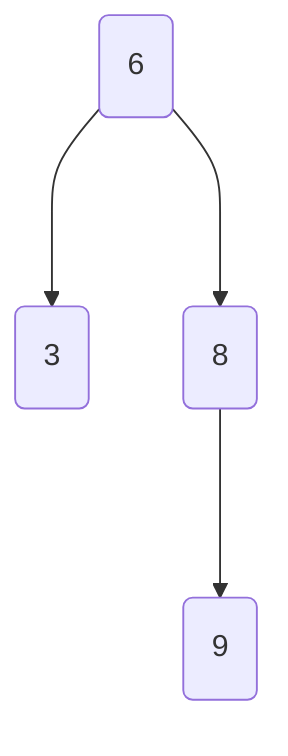
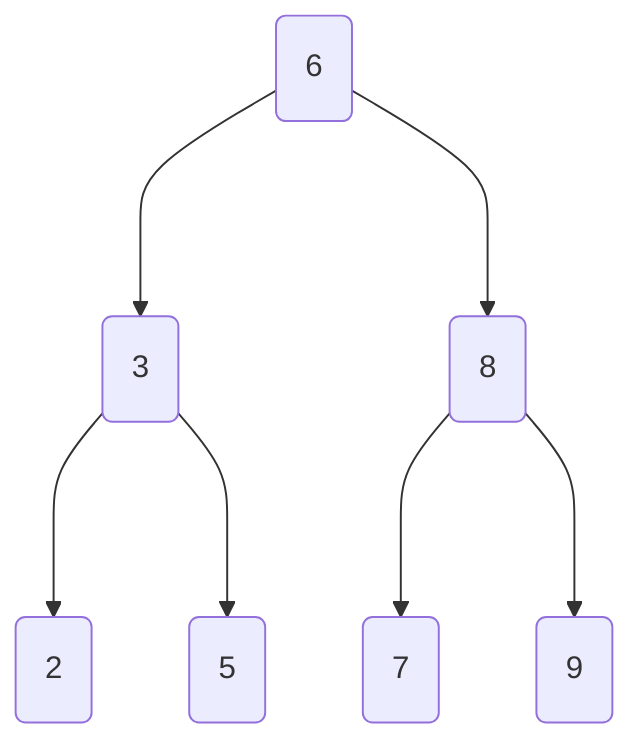
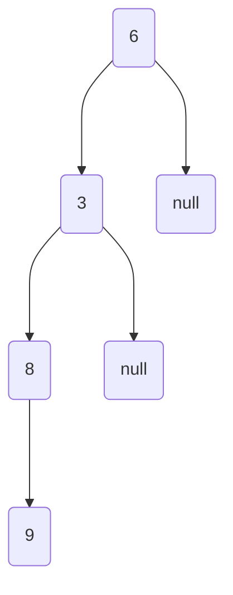
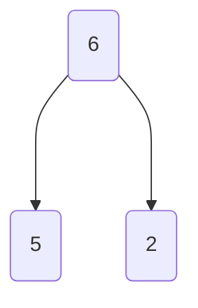

# Binary Tree

- A binary tree has two children
- A binary search tree (bst) has the property that the left subtree values are <= than the root and the right subtree values are greater than the root
- Unlike a hashmap a bst's values are ordered

| Operation | Complexity (if balanced / worst csae)
|-----------|------------|
| insert    | O(log n) / O(n)   |
| remove    | O(log n) / O(n)   |
| search    | O(log n) / O(n)   |



- Notice the full tree of height h where h = 3 has 2<sup>3</sup> = 8, and 8 - 1 = 7 values
- A binary tree of height h, holds 2<sup>h</sup> - 1 = max tree values



- Unbalanced binary tree: O(n) time complexity for insert, remove, search -- degenerates down to a linked list



> Tree traversals, using a simple binary tree



**DFS Traversals**
- Preorder Traversal (N L R): 6, 5, 2 (hugs inner nodes)
- Inorder Traversal (L N R): 5, 6, 2
- Postorder Traversal (L R N): 5, 2, 6 (hugs leaves)

**BFS Traversal**: 6, 5, 2 (level order traversal)


> Tree traversals, using a bigger tree and a bst


**DFS Traversals**
- Preoder Traversal (N L R): 6, 3, 2, 5, 8, 7, 9 (hugs inner nodes)
- Inorder Traversal (L N R): 2, 3, 5, 6, 7, 8, 9  (sorted order if tree is BST)
- Postorder Traversal (L R N): 2, 5, 3, 7, 9, 8, 6 (hugs leaves)

**BFS Traversal**: 6, 3, 8, 2, 5, 7, 9 (level order traversal)

[Code](https://github.com/brpandey/leetcode/blob/2c33ed02621fd2035bbf7711db289b16c72f2e24/rust/src/p0297_serialize_and_deserialize_binary_tree.rs)

```rust
// Essentially preorder is N L R, so the root node is always the first element in a serialized output
// also easy to generate subtrees just take the node value set it as value of subtree node and set l and r
// subtrees recursively!

/*
let c = Codec::new();
let root = TreeNode::from_list(vec![1,2,3,i32::MIN,i32::MIN,4,5]);
let root2 = root.as_ref().map(Rc::clone);
let output = c.deserialize(c.serialize(root2));
assert_eq!(root, output);
*/

impl Codec {
    fn new() -> Self {
        Codec {}
    }

    // convert nodes to a string containing the values separated by commas
    // null is marked as !, using a dfs preorder (NLR) approach
    pub fn serialize(&self, root: Option<Rc<RefCell<TreeNode>>>) -> String {
        let mut result = String::with_capacity(20);
        Self::dfs1(root, &mut result);

        result
    }

    fn dfs1(node: Option<TreeNodeRef>, output: &mut String) {
        // Base case root is None
        if node == None {
            output.push_str("!,");
            return
        }

        let val = TreeNode::value(&node).to_string();

        output.push_str(&val);
        output.push_str(",");

        Self::dfs1(TreeNode::left(&node), output);
        Self::dfs1(TreeNode::right(&node), output);
    }

    // Split data up into elements utilizing comma delim
    // Pull root node off, and build rest of the subtrees recursively
    pub fn deserialize(&self, data: String) -> Option<Rc<RefCell<TreeNode>>> {
        let input: Vec<&str> = data.split_terminator(",").collect();

        if "!" == input[0] {
            return None
        }

        let mut index: usize = 0;

        Self::dfs2(&mut index, &input)
    }

    fn dfs2(index: &mut usize, input: &[&str]) -> Option<TreeNodeRef> {
        // do DFS search using preorder traversal (NLR) to build up sub trees

        if input[*index] == "!" {
            *index += 1;
            return None
        }

        let val: i32 = input[*index].parse().unwrap();
        let node = TreeNode::new(val);

        *index += 1;

        node.as_ref().borrow_mut().left = Self::dfs2(index, input);
        node.as_ref().borrow_mut().right = Self::dfs2(index, input);

        return Some(node);
    }
}
```
