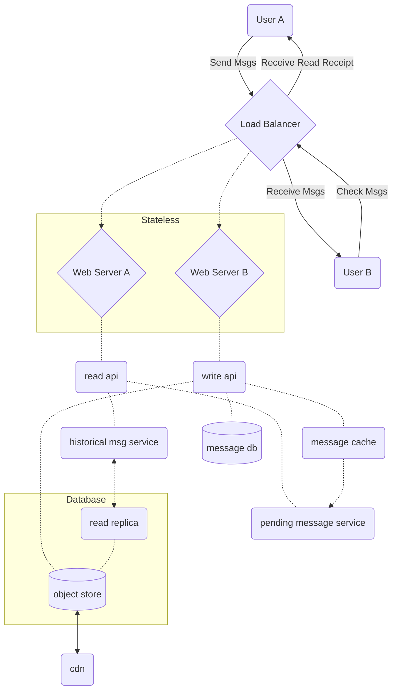

```mermaid
flowchart TB;
    id1(User A) -- Send Msgs --> id3{Load Balancer}
    id2(User B) -- Check Msgs --> id3
    id3 -.-> id4
    id3 -.-> id5
    id3 -- Receive Read Receipt --> id1
    id3 -- Receive Msgs --> id2
    subgraph Stateless
        id4{Web Server A}
        id5{Web Server B}
    end
    id4 -.- id7
    id7(read api) -.- id8 & id10
    id8(historical msg service) <-.-> id9
    id9(read replica)
    id10(pending message service)
    id5 -.- id11
    id11(write api) -.- id12 & id13 & id14
    id12(message cache) -.-> id10
    id13[(message db)]
    id14[(object store)] <--> id15
    id15(cdn)
    id9 -.- id14
    subgraph Database 
      id9
      id14
    end
```
