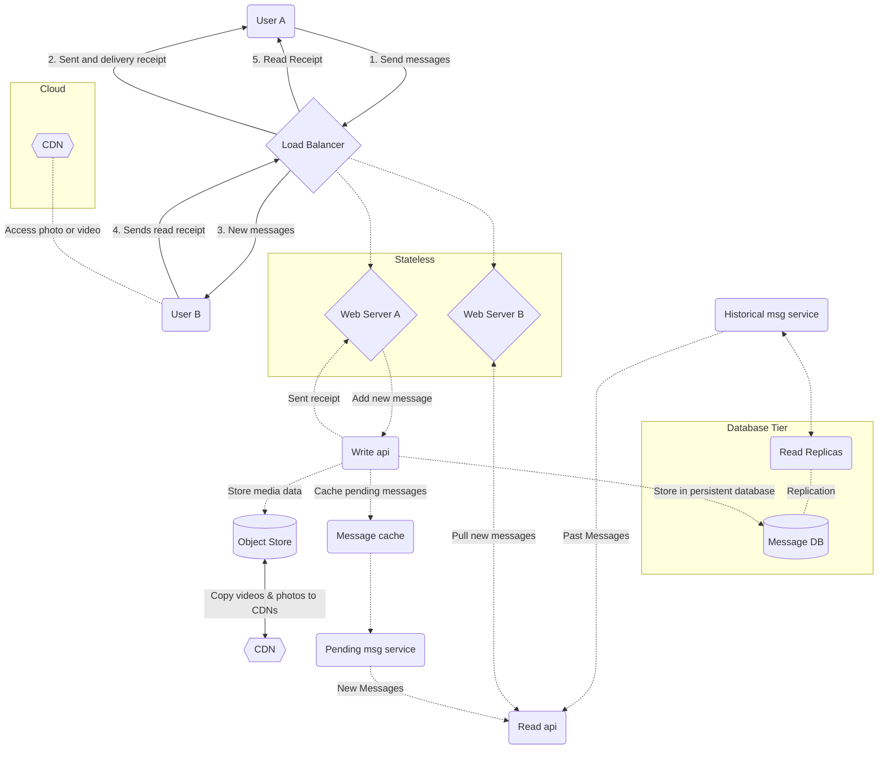

```mermaid
flowchart TB;
    id1(User A) -- 1. Send messages --> id3{Load Balancer}
    id2(User B) -- 4. Sends read receipt --> id3
    id3 -.-> id4
    id3 -.-> id5
    id3 -- 5. Read Receipt --> id1
    id3 -- 2. Sent and delivery receipt --> id1
    id3 -- 3. New messages --> id2
    subgraph Stateless
        id4{Web Server B}
        id5{Web Server A}
    end
    id4 <-. Pull new messages .-> id7
    id7(Read api)
    id8(Historical msg service) <-.-> id9
    id8 -. Past Messages .-> id7
    id9(Read Replicas) -. Replication .- id13
    id10(Pending msg service) -. New Messages .-> id7
    id5 -. Add new message .-> id11
    id11(Write api) -. Cache pending messages .-> id12
    id11 -. Store in persistent database .-> id13
    id11 -. Store media data .-> id14
    id11 -. Sent receipt .-> id5
    id12(Message cache) -.-> id10
    id13[(Message DB)]
    id14[(Object Store)] <-- Copy videos & photos to CDNs--> id15
    id15{{CDN}}
    subgraph Database Tier
      id9
      id13
    end
    subgraph Cloud
      id16{{CDN}}
    end
    id16 -. Access photo or video .- id2

```
