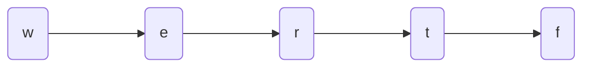
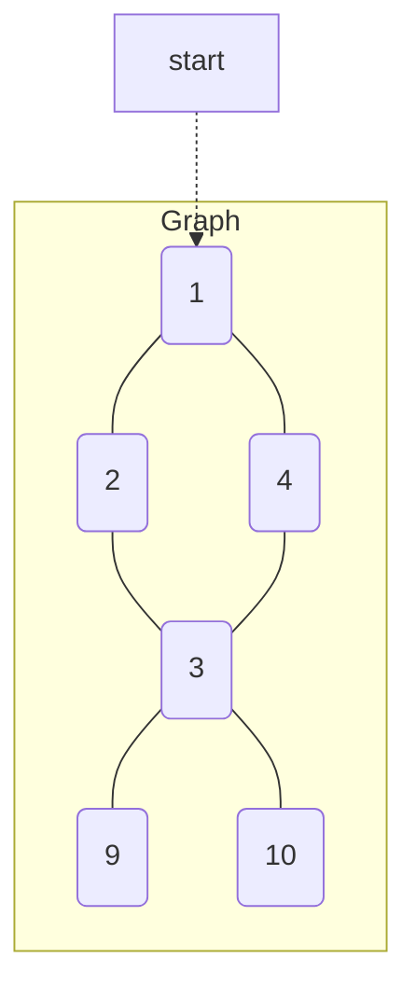
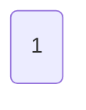
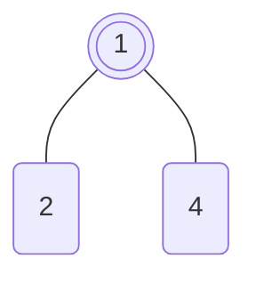
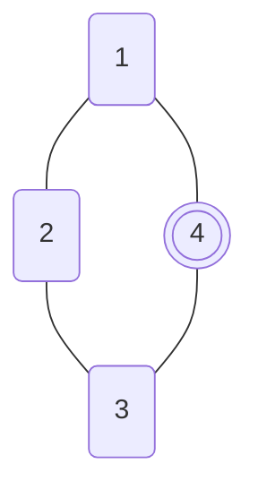
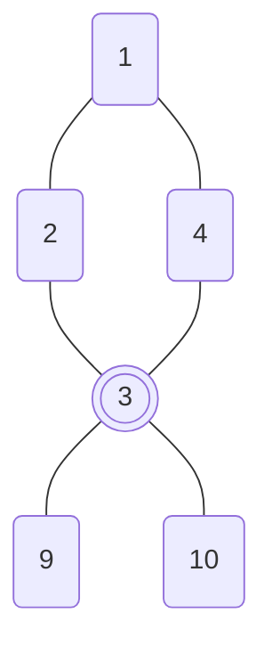
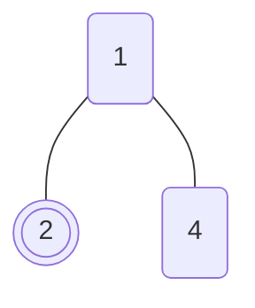
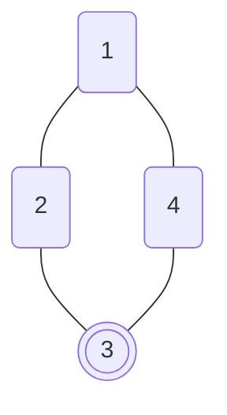
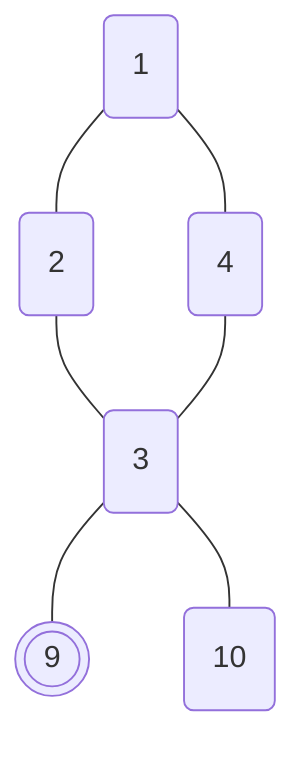

# Graphs 

* Graphs are represented by nodes and edges (to other nodes or neighbors)
* Graphs are best modeled with adjacency lists e.g.

Alien Dictionary problem

* from "wrt"and"wrf", we can get 't'<'f'
* from "wrt"and"er", we can get 'w'<'e'
* from "er"and"ett", we can get 'r'<'t'
* from "ett"and"rftt", we can get 'e'<'r'
   


[Code 1](https://github.com/brpandey/leetcode/blob/32153a07df8af658a96a3eee65df8c7bb190e4c1/rust/src/p0269_alien_dictionary.rs)

[Code 2](https://github.com/brpandey/leetcode/blob/32153a07df8af658a96a3eee65df8c7bb190e4c1/rust/src/p0207_course_schedule.rs)

```rust
    // n is the number of courses or vertices
    // prerequisites are a well-formed list of edges
    pub fn run(n: u16, edges: &Vec<[u16; 2]>) -> bool {
        let mut count: u16 = 0;
        let mut in_degrees = vec![0; n as usize];

        // Set the in degrees of the vertices
        // NOTE: If prerequisites is [[1,0]], the graph looks like: 0 -> 1 or SRC -> DEST or [[DEST, SRC]]
        // Essentially the second or dst element of the edge is what the edge is pointing to so increment
        // that vertex's indegree count
        for e in edges {
            in_degrees[e[DST] as usize] += 1;
        }

        let mut queue: VecDeque<u16> = VecDeque::new();

        // Find all the vertices which have an in degree of 0 (meaning no dependencies or back arrows) and seed the queue
        for i in 0..in_degrees.len() {
            if in_degrees[i] == 0 {
                queue.push_back(i as u16);
            }
        }

        // process the in degrees of the vertices
        while !queue.is_empty() {
            let current = queue.pop_front().unwrap(); // remove from the queue and update indegree count(s)
            count += 1; // every time we dequeue, we increment count (as we know it has no prereqs or dependencies)

            // loop through the "graph" again search for if the vertex with nothing pointing at it has directed edges towards
            // destination vertices (atleast 1 must exist)
            for e in edges {
                // if current is equal to the edge src vertex, and since we've removed current from the queue already,
                // decrement the edge dest's vertex indegree, since we no longer have a vertex pointing towards it
                if current == e[SRC] {
                    in_degrees[e[DST] as usize] -= 1;
                    // if the edge destination vertex has no vertices pointing to it, add it to the queue
                    if in_degrees[e[DST] as usize] == 0 {
                        queue.push_back(e[DST]);
                    }
                }
            }
        }

        n == count
    }
```

[Code 3](https://github.com/brpandey/leetcode/blob/32153a07df8af658a96a3eee65df8c7bb190e4c1/rust/src/p0417_pacific_atlantic_water_flow.rs)

```rust
pub fn pacific_atlantic(heights: Vec<Vec<i32>>) -> Vec<Vec<i32>> {

        let max_rows = heights.len() as i32;
        let max_cols = heights[0].len() as i32;
        let max = (max_rows, max_cols);

        let (mut atlantic, mut pacific) = (HashSet::new(), HashSet::new());

        let prev = -1;

        // horizontal bars
        for n in 0..max_cols as i32 {
            Solution::dfs(0, n, prev, &mut pacific, &heights, max); // Case 2
            Solution::dfs(max_rows-1, n, prev, &mut atlantic, &heights, max); // Case 1
        }

        // vertical bars
        for m in 0..max_rows as i32 {
            Solution::dfs(m, 0, prev, &mut pacific, &heights, max); // Case 3
            Solution::dfs(m, max_cols-1, prev, &mut atlantic, &heights, max); // Case 4
        }

        let mut v = atlantic.intersection(&pacific).into_iter().map(|cell| vec![cell.0, cell.1]).collect::<Vec<Vec<i32>>>();
        v.sort(); // helps with test asserts
        v
    }

    // DFS explores the heights grid space, marking if reachable from given ocean
    pub fn dfs(row: i32, col: i32, prev: i32, reachable: &mut HashSet<(i32, i32)>, heights: &Vec<Vec<i32>>, max: (i32, i32))  {

        let (max_rows, max_cols) = max;
        let (r, c) = (row as usize, col as usize);

        // Make sure hasn't been processed before
        // Ensure current height >= prev property is true otherwise return (climbing up the hill )
        // Sanity check the row/col values
        if reachable.contains(&(row,col)) || row < 0 || row >= max_rows || col < 0 || col >= max_cols || heights[r][c] < prev {
            return
        }

        // Reaching this point indicates that the current cell is reachable from an ocean
        // Since heights[row][col] >= prev

        // reachable is either atlantic or pacific
        reachable.insert((row, col));

        // search in the four directions around cells N, S, W, E (see if next ocean is reachable)
        Solution::dfs(row-1, col, heights[r][c], reachable, heights, max);
        Solution::dfs(row+1, col, heights[r][c], reachable, heights, max);
        Solution::dfs(row, col-1, heights[r][c], reachable, heights, max);
        Solution::dfs(row, col+1, heights[r][c], reachable, heights, max);
    }
```

Diagrams

| node | neigbhors |
|------|-----------|
| 1    | 4, 2       |
| 2    | 1, 3       |
| 3    | 2, 4, 9, 10  |
| 4    | 1, 3       |
| 9    | 3         |
| 10   | 3         |



> A BFS approach of above graph could be:

Initial Step: Start with seed element, add it to queue

| 1 |
|---|



* BFS Traversal Path: 1
* Iteration 1: Grab element from queue -- 1, visit it, its neighbors are 4 and 2, add it to queue

| ~~1~~ | 4 | 2 |
|---|---|---|



* BFS Traversal Path: 1, 4
* Iteration 2: Grab next element from queue -- 4, visit it, its neighbors are 1 (already visited) and 3, add it to queue

| ~~1~~ | ~~4~~ | 2 | 3 |
|---|---|---| --- |



* BFS Traversal Path: 1, 4, 2
* Iteration 3: Grab next element from queue -- 2, visit it, its neighbors are 1 (already visited) and 3 (already visited)

| ~~1~~ | ~~4~~ | ~~2~~ | 3 |
|---|---|---| --- |

* BFS Traversal Path: 1, 4, 2, 3
* Iteration 4: Grab next element from queue -- 3, visit it, its neighbors are 2 (already visited), 4 (already visited), 9, and 10, add it to queue

| ~~1~~ | ~~4~~ | ~~2~~ | ~~3~~ | 9 | 10 |
|---|---|---| --- | ---| --- |



* BFS Traversal Path: 1, 4, 2, 3, 9
* Iteration 5: Grab next element from queue - 9, visit it, its neighbors are only 3 (already visited)

| ~~1~~ | ~~4~~ | ~~2~~ | ~~3~~ | ~~9~~ | 10 |
|---|---|---| --- | ---| --- |

* BFS Traversal Path: 1, 4, 2, 3, 9, 10
* Iteration 6: Grab next element from queue - 10, visit it, its neighbors are only 3 (already visited)

| ~~1~~ | ~~4~~ | ~~2~~ | ~~3~~ | ~~9~~ | ~~10~~ |
|---|---|---| --- | ---| --- |

Done


> A DFS approach of above graph could be:

* DFS Traversal Path: 1
* Initial Step: Start with seed element 1, visit one of its neighbors, e.g. 4 or 2, save 1 onto stack (start exploring 2, ignore 4 for now)

| Stack |
|-------|
|       |
|       |
|       |
| 1     |




* DFS Traversal Path: 1, 2
* Iteration 1: Visit one of 2's neighbors, e.g. 1 (already visited) or 3, save 2 onto stack (start exploring 3)

| Stack |
|-------|
|       |
|       |
| 2     |
| 1     |




* DFS Traversal Path: 1, 2, 3
* Iteration 2: Visit one of 3's neighbors, e.g. 2 (already visited) or 4 or 9 or 10, save 3 onto stack (start exploring 9)

| Stack |
|-------|
|       |
| 3     |
| 2     |
| 1     |




* DFS Traversal Path: 1, 2, 3, 9
* Iteration 3: Visit one of 9's neighbors -- no unvisited neighbors! Pop from stack, get 3, check non-visited neighbors of 3, explore 10, save 3 again!

| Stack |
|-------|
|       |
|       |
| 2     |
| 1     |


| Stack |
|-------|
|       |
| 3     |
| 2     |
| 1     |

* DFS Traversal Path: 1, 2, 3, 9, 10
* Iteration 4: Visit one of 10's neighbors -- no unvisited neighbors! Pop from stack, get 3, explore

| Stack |
|-------|
|       |
|       |
| 2     |
| 1     |


* DFS Traversal Path: 1, 2, 3, 9, 10
* Iteration 5: Visit one of 3's neighbors -- e.g. 4! explore 4

| Stack |
|-------|
|       |
|       |
| 2     |
| 1     |

* DFS Traversal Path: 1, 2, 3, 9, 10, 4
* Iteration 6: Vist one of 4's neighbor's -- no unvisited neighbors (1,3)! Pop from stack, get 2, explore

| Stack |
|-------|
|       |
|       |
|       |
| 1     |

* Iteration 7: Visit one of 2's neighbors -- no unvisited neighbors! Pop from stack, get 1, explore

| Stack |
|-------|
|       |
|       |
|       |
|       |

* Iteration 8: Visit one of 1's neighbors -- no unvisited neighbors! Stack empty

Done
