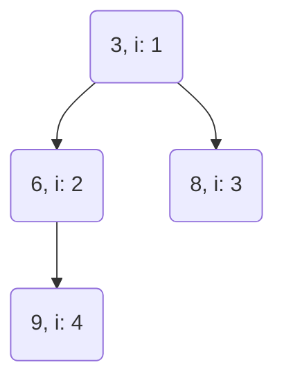

| Operation | Time Complexity |
|-----------|-----------------|
| insert    | O(log n)        |
| remove    | O(log n)        |
| heapify   | O(n)            |
| top       | O(1)            |

Notes
* Efficient to access max or min element - top is 0(1), remove min/max worst case is O(log n)
* Order property: Min always going to be root and children always going to be greater, ditto for max with children less than
* each layer of the tree always filled in
* heapify takes O(n) time given all n elements are already present beforehand
* if the elements are not available all at once e.g. via a stream, then insertion of n elements takes O(n log n)
* Visualized as trees, but heap implementation as an array:

| 0 | 1 | 2 | 3 | 4 |
|---|---|---|---|---|
| X | 3 | 6 | 8 | 9 |

* left = 2i
* right = 2i + 1





```rust
// Rust example using min heap from network delay time

// acc is {2: [(1, 1), (3, 1)], 3: [(4, 1)]}
        // println!("acc is {:?}", &adjlist);

        let mut acc_t = 0;
        let mut visited: HashSet<i32> = HashSet::new();
        let mut min_heap: BinaryHeap<Reverse<(i32, i32)>> = BinaryHeap::new(); // entry is (time, vertex)

        // seed min heap with start vertex k
        min_heap.push(Reverse((0, k))); // the time value is first in the tuple so heap can compare properly

        while !min_heap.is_empty() {
            // time path current, vertex current
            let Reverse((t, v)) = min_heap.pop().unwrap(); // this is greedy part, look at smallest time path node

            if visited.contains(&v) { // if neighbor v has been visited
                continue
            }

            if let Some(current_neighbors) = adjlist.get(&v) {
                for (vn, tn) in current_neighbors { // vertex n, time n -- do bfs of neighbors
                    if !visited.contains(&vn) {
                        min_heap.push(Reverse((t + tn, *vn))); // only push neighbor if unvisited
                    }
                }
            }

            visited.insert(v); // mark visited since vertex has been processed
            acc_t = std::cmp::max(acc_t, t); // updated acc_t as min 
        }


```
