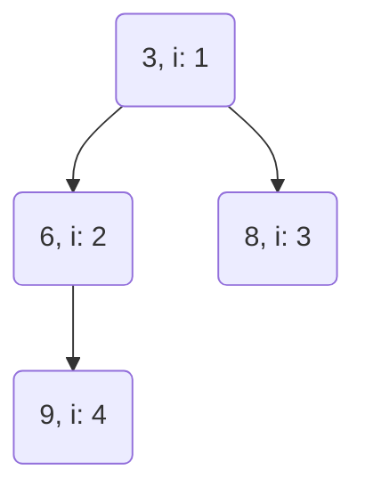

| Operation | Time Complexity |
|-----------|-----------------|
| push/insert    | O(log n)        |
| pop/remove min/max   | O(log n)        |
| from/heapify   | O(n)            |
| peek/access min/max       | O(1)            |


[BinaryHeap](https://doc.rust-lang.org/stable/std/collections/struct.BinaryHeap.html)
* methods: 
    * clear, BinaryHeap::from (array or vec), into_vec, is_empty, iter, len, BinaryHeap::new, peek, peek_mut, pop, push, reserve, with_capacity
```rust
use std::collections::BinaryHeap;

// Type inference lets us omit an explicit type signature (which
// would be `BinaryHeap<i32>` in this example).
let mut heap = BinaryHeap::new();

// We can use peek to look at the next item in the heap. In this case,
// there's no items in there yet so we get None.
assert_eq!(heap.peek(), None);

// Let's add some scores...
heap.push(1);
heap.push(5);
heap.push(2);

// Now peek shows the most important item in the heap.
assert_eq!(heap.peek(), Some(&5));

// We can check the length of a heap.
assert_eq!(heap.len(), 3);

// We can iterate over the items in the heap, although they are returned in
// a random order. NOTE: Can't do iter_mut because that violates heap sort invariant
for x in heap.iter() {
    println!("{x}");
}

// If we instead pop these scores, they should come back in order.
assert_eq!(heap.pop(), Some(5));
assert_eq!(heap.pop(), Some(2));
assert_eq!(heap.pop(), Some(1));
assert_eq!(heap.pop(), None);

// We can clear the heap of any remaining items.
heap.clear();

// The heap should now be empty.
assert!(heap.is_empty())

//A BinaryHeap with a known list of items can be initialized from an array:


let heap = BinaryHeap::from([1, 5, 2]);

// Min-heap
// Either core::cmp::Reverse or a custom Ord implementation can be used to 
// make BinaryHeap a min-heap. 
// This makes heap.pop() return the smallest value instead of the greatest one.

use std::collections::BinaryHeap;
use std::cmp::Reverse;

let mut heap = BinaryHeap::new();

// Wrap values in `Reverse`
heap.push(Reverse(1));
heap.push(Reverse(5));
heap.push(Reverse(2));

// If we pop these scores now, they should come back in the reverse order.
assert_eq!(heap.pop(), Some(Reverse(1)));
assert_eq!(heap.pop(), Some(Reverse(2)));
assert_eq!(heap.pop(), Some(Reverse(5)));
assert_eq!(heap.pop(), None);
```

Notes
* Efficient to access max or min element - peek is 0(1), remove min/max worst case is O(log n)
* Order property: Min always going to be root and children always going to be greater, ditto for max with children less than
* each layer of the tree always filled in
* heapify takes O(n) time given all n elements are already present beforehand
* if the elements are not available all at once e.g. via a stream, then insertion of n elements takes O(n log n)
* Visualized as trees, but heap implementation as an array:

| 0 | 1 | 2 | 3 | 4 |
|---|---|---|---|---|
| X | 3 | 6 | 8 | 9 |

* left = 2i
* right = 2i + 1





```rust
// Rust example using min heap from network delay time

// acc is {2: [(1, 1), (3, 1)], 3: [(4, 1)]}
        // println!("acc is {:?}", &adjlist);

        let mut acc_t = 0;
        let mut visited: HashSet<i32> = HashSet::new();
        let mut min_heap: BinaryHeap<Reverse<(i32, i32)>> = BinaryHeap::new(); // entry is (time, vertex)

        // seed min heap with start vertex k
        min_heap.push(Reverse((0, k))); // the time value is first in the tuple so heap can compare properly

        while !min_heap.is_empty() {
            // time path current, vertex current
            let Reverse((t, v)) = min_heap.pop().unwrap(); // this is greedy part, look at smallest time path node

            if visited.contains(&v) { // if neighbor v has been visited
                continue
            }

            if let Some(current_neighbors) = adjlist.get(&v) {
                for (vn, tn) in current_neighbors { // vertex n, time n -- do bfs of neighbors
                    if !visited.contains(&vn) {
                        min_heap.push(Reverse((t + tn, *vn))); // only push neighbor if unvisited
                    }
                }
            }

            visited.insert(v); // mark visited since vertex has been processed
            acc_t = std::cmp::max(acc_t, t); // updated acc_t as min 
        }


```
