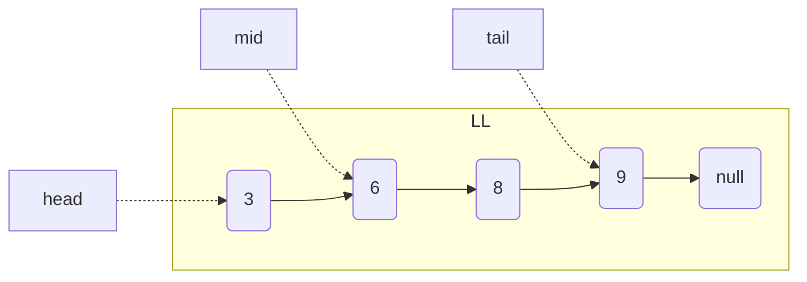

Linked List - [rust](https://doc.rust-lang.org/std/collections/struct.LinkedList.html#)

| Operations | with pointer, Time Complexity | regular Time Complexity | 
|------------|-----------------|-----------------|
| Access or Search  | - | O(n) |
| Insert End | with tail ptr, O(1) | O(n) |
| Remove End | with tail ptr, O(1) | O(n) |
| Insert Mid | with mid ptr, O(1)  | O(n) |
| Remove Mid | with mid ptr, O(1)  | O(n) |



* Linked list values are not contiguous in RAM
* No ability to directly index into a given node in linked list like a contiguous array
* But easy to remove elements without having to shift the other elements!

```mermaid
flowchart LR
    subgraph RAM
        id1[[0x008: 6]] -.- id2
        id2[[0x105: 3]] -.- id3
        id3[[0x792: 9]] -.- id4
        id4[[0x910: 8]]
    end
 ```
 
 [Example](https://github.com/brpandey/leetcode/blob/0e31aabff9b42b13c99bb286e5d3fb29c87242d5/rust/src/p0002_add_two_numbers.rs)
 
 ```rust
    pub fn add_two_numbers_list(list1: &LinkedList<&u32>, list2: &LinkedList<&u32>) -> LinkedList<u32> {
        let mut output: LinkedList<u32> = LinkedList::new();
        let mut iter1 = list1.iter(); //.peekable();
        let mut iter2 = list2.iter(); //.peekable();
        let mut n1 = iter1.next();
        let mut n2 = iter2.next();

        let mut carry: u32 = 0;
        let mut sum: u32;
        let mut temp_sum: u32 = 0;

        while n1.is_some() || n2.is_some() {
            if let Some(&v1) = n1 {
                temp_sum += v1;
                n1 = iter1.next();
            }

            if let Some(&v2) = n2 {
                temp_sum += v2;
                n2 = iter2.next();
            }

            sum = (temp_sum + carry) % 10;
            carry = (temp_sum + carry) / 10;

            temp_sum = 0;
            output.push_back(sum);
        }

        output
    }


    pub fn add_two_numbers(list1: &Vec<u32>, list2: &Vec<u32>) -> Vec<u32> {
        let l1: LinkedList<_> = list1.iter().collect::<LinkedList<_>>();
        let l2: LinkedList<_> = list2.iter().collect::<LinkedList<_>>();
        let output = Solution::add_two_numbers_list(&l1, &l2);
        output.into_iter().collect::<Vec<_>>()
    } 
 ```
