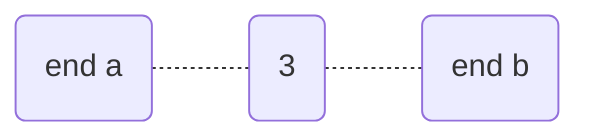
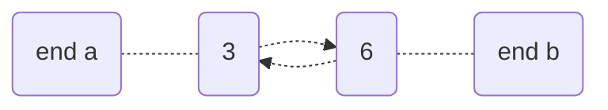
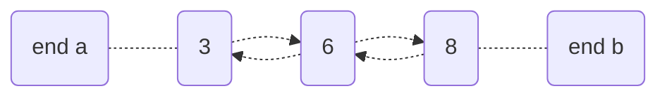
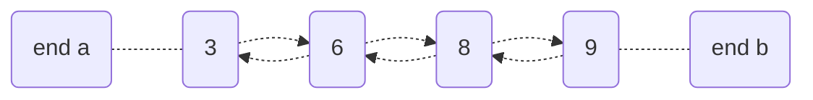
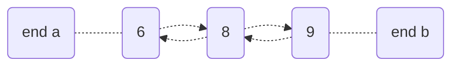
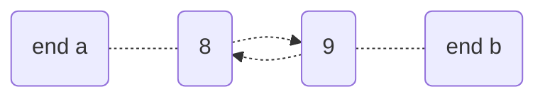
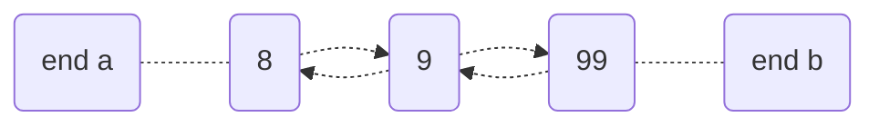

Queue

| Operations | Time Complexity |
|------------|-----------------|
| Front/Peek top/left | O(1) |
| Push front (left) | O(1) |
| dequeue/Pop front (left) | O(1) |
| enqueue/Push back (right) | O(1) |
| Pop back (right) | O(1) |
| Access with index | O(n) |
| Search | O(n) |
| Remove with index | O(n) |

[VecDeque](https://doc.rust-lang.org/std/collections/struct.VecDeque.html)
* methods:
     *  capacity, clear, VecDeque::from (array or vec), front, front_mut, get, get_mut, insert, is_empty, iter, iter_mut, VecDeque::new, pop_back, pop_front, push_back, push_front, remove, reserve, swap
```rust
/*
A double-ended queue implemented with a growable ring buffer.

The “default” usage of this type as a queue is to use push_back 
to add to the queue, and pop_front to remove from the queue. 
extend and append push onto the back in this manner, 
and iterating over VecDeque goes front to back.
*/

// A VecDeque with a known list of items can be initialized from an array:

use std::collections::VecDeque;

let deq = VecDeque::from([-1, 0, 1]);


let mut d = VecDeque::new();
d.push_back(1);
d.push_back(2);

assert_eq!(d.pop_front(), Some(1));
assert_eq!(d.pop_front(), Some(2));
assert_eq!(d.pop_front(), None);
```

Notes
* Queues typically used to process a set of elements in the same order they were added
* For example, 3, then 6, then 8, then 9 are added to queue and then processed in that order (first in first out - FIFO)

* Double-ended queues e.g. deques, allow pushing on both ends and/or popping on both ends (hence can also model last in first out - LIFO - or stack)  

Example: 

Push back 3



Push back 6



Push back 8



Push back 9



Pop front 3



Pop front 6



Push back 99



Pop back 99


[Code](https://github.com/brpandey/leetcode/blob/9e0307e896995d7d2674a11465d265c02fb09204/rust/src/p0239_sliding_window_maximum.rs)

```rust
/* Queue at various points 
 * (queue as indices):
 * [0]
 * [1]
 * [1,2]
 * [1,2,3]
 * [4]
 * [4,5]
 * [6]
 * [7]
 *
 * (queue as values)
 *
 * [1]
 * [3]
 * [3,-1]
 * [3,-1,-3]
 * [5]
 * [5,3]
 * [6]
 * [7]
 *
 *
 * grab max value from front of queue o(1) -> [a,b,c] <-- push new value onto back of queue o(1) 
 */

    // assert_eq!(vec![3,3,5,5,6,7], Solution::max_sliding_window(vec![1,3,-1,-3,5,3,6,7], 3));

    pub fn max_sliding_window(nums: Vec<i32>, k: i32) -> Vec<i32> {
        // queue of indices, left has the index of those values that are of greater value
        let mut queue: VecDeque<usize> = VecDeque::new();
        let mut output: Vec<i32> = Vec::new();
        let mut l = 0;

        for r in 0..nums.len() {
            // while elements in the queue back are less than the current num r in nums, discard
            while !queue.is_empty() && nums[*queue.back().unwrap()] < nums[r] {
                queue.pop_back();
            }

            queue.push_back(r); // add current num r's index (which is r)

            // if the l marker has a higher index than the max value index in the queue, the max
            // value index is old, since its not part of the current window, so pop front in queue
            if l > queue[0] {
                queue.pop_front();
            }

            // if the window size is atleast k, grab the max element from queue
            // max in queue is always at beginning (don't pop just copy)
            // update sliding_window;
            if r - l + 1 >= k as usize {
                output.push(nums[queue[0]]);
                l += 1;
            }
        }

        output
    }

```
