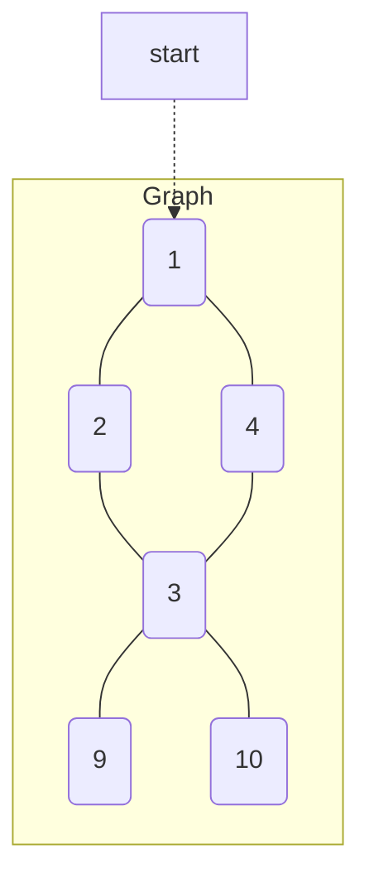
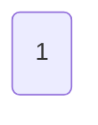
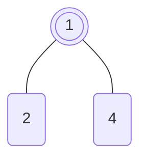
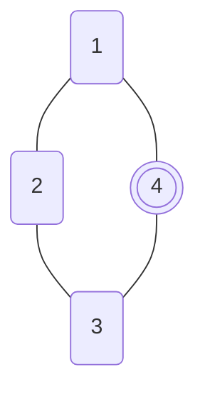
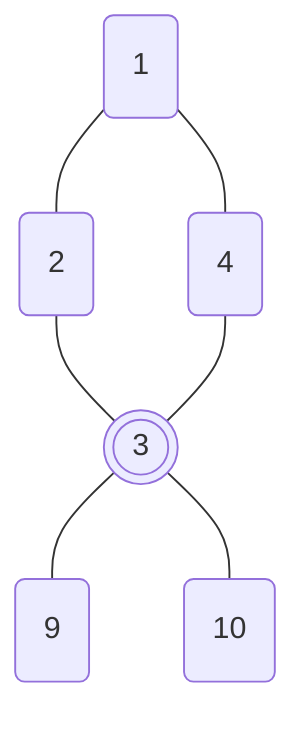

Graphs

Complexity 

* Graphs are represented by nodes and edges (to other nodes or neighbors)
* Graphs are best modeled with adjacency lists e.g.

| node | neigbhors |
|------|-----------|
| 1    | 4, 2       |
| 2    | 1, 3       |
| 3    | 2, 4, 9, 10  |
| 4    | 1, 3       |
| 9    | 3         |
| 10   | 3         |

* A BFS approach of above graph could be:

Initial Step: Start with seed element, add it to queue

| 1 |
|---|

Iteration 1: Grab element from queue -- 1, visit it, its neighbors are 4 and 2, add it to queue

| ~~1~~ | 4 | 2 |
|---|---|---|

Iteration 2: Grab next element from queue -- 4, visit it, its neighbors are 1 (already visited) and 3, add it to queue

| ~~1~~ | ~~4~~ | 2 | 3 |
|---|---|---| --- |

Iteration 3: Grab next element from queue -- 2, visit it, its neighbors are 1 (already visited) and 3 (already visited)
| ~~1~~ | ~~4~~ | ~~2~~ | 3 |
|---|---|---| --- |

Iteration 4: Grab next element from queue -- 3, visit it, its neighbors are 2 (already visited), 4 (already visited), 9, and 10, add it to queue
| ~~1~~ | ~~4~~ | ~~2~~ | ~~3~~ | 9 | 10 |
|---|---|---| --- | ---| --- |

Iteration 5: Grab next element from queue - 9, visit it, its neighbors are only 3 (already visited)
| ~~1~~ | ~~4~~ | ~~2~~ | ~~3~~ | ~~9~~ | 10 |
|---|---|---| --- | ---| --- |

Iteration 6: Grab next element from queue - 10, visit it, its neighbors are only 3 (already visited)
| ~~1~~ | ~~4~~ | ~~2~~ | ~~3~~ | ~~9~~ | ~~10~~ |
|---|---|---| --- | ---| --- |

Done

* A DFS approach of above graph could be:

Initial Step: Start with seed element 1, visit one of its neighbors, e.g. 4 or 2, save 1 onto stack (start exploring 2, ignore 4 for now)

| Stack |
|-------|
|       |
|       |
|       |
|       |
| 1     |

Iteration 1: Visit one of 2's neighbors, e.g. 1 (already visited) or 3, save 2 onto stack (start exploring 3)

| Stack |
|-------|
|       |
|       |
|       |
| 2     |
| 1     |

Iteration 2: Visit one of 3's neighbors, e.g. 4,2 (already visited) or 9 or 10, save 3 onto stack (start exploring 9)

| Stack |
|-------|
|       |
|       |
|       |
| 2     |
| 1     |
