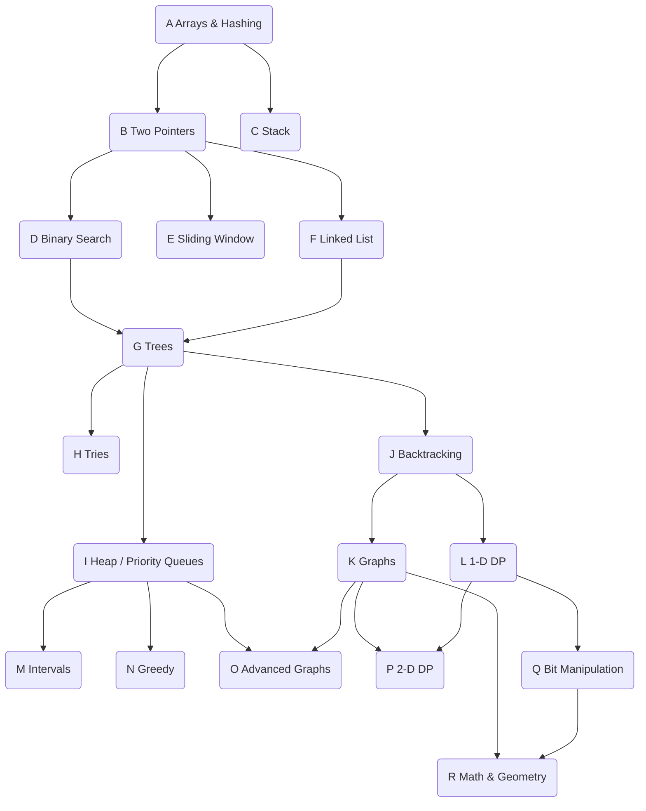

> Leetcode Problems: Easy - E, Medium - M, Hard - H


### A) Arrays & Hashing ~~9~~

1. [Contains Duplicate](https://github.com/brpandey/leetcode/blob/master/rust/src/p0217_contains_duplicate.rs) 217 E
2. [Valid Anagram](https://github.com/brpandey/leetcode/blob/master/rust/src/p0242_valid_anagram.rs) 242 E
3. [Two Sum](https://github.com/brpandey/leetcode/blob/master/rust/src/p0001_two_sum.rs) 1 E
4. [Group Anagrams](https://github.com/brpandey/leetcode/blob/master/rust/src/p0049_group_anagrams.rs)	49 M
5. [Top K Frequent Elements](https://github.com/brpandey/leetcode/blob/master/rust/src/p0347_top_k_frequent_elements.rs) 347 M
6. [Product of Array Except Self](https://github.com/brpandey/leetcode/blob/master/rust/src/p0238_product_of_array_except_self.rs)	238 M
7. [Valid Sudoku](https://github.com/brpandey/leetcode/blob/master/rust/src/p0036_valid_sudoku.rs)	36 M
8. [Encode and Decode Strings](https://github.com/brpandey/leetcode/blob/master/rust/src/p0271_encode_and_decode_strings.rs)	271 M
9. [Longest Consecutive Sequence](https://github.com/brpandey/leetcode/blob/master/rust/src/p0128_longest_consecutive_sequence.rs) 128 M

### B) Two Pointers ~~5~~

1. [Valid Palindrome](https://github.com/brpandey/leetcode/blob/master/rust/src/p0125_valid_palindrome.rs) 125 E
2. [Two Sum II Input Array Is Sorted](https://github.com/brpandey/leetcode/blob/master/rust/src/p0167_two_sum_ii.rs) 167 M
3. [3Sum](https://github.com/brpandey/leetcode/blob/master/rust/src/p0015_3sum.rs) 15 M
4. [Container With Most Water](https://github.com/brpandey/leetcode/blob/master/rust/src/p0011_container_most_water.rs) 11 M
5. [Trapping Rain Water](https://github.com/brpandey/leetcode/blob/master/rust/src/p0042_trapping_rain_water.rs) 42 H

### E) Sliding Window ~~5~~
> [Playlist](https://www.youtube.com/watch?v=1pkOgXD63yU&list=PLot-Xpze53leOBgcVsJBEGrHPd_7x_koV)

```rust
pub fn best_time_to_buy_sell(nums: &[i32]) -> i32 {
        if nums.len() < 1 { return 0 }
        let (mut sell, mut min_buy);
        let mut profit_max = 0;

        min_buy = nums[0];

        // 7,1,5,3,6,4, first iter sell = 1, min_buy 7, second iter sell = 5, min_buy 1
        for i in 1..nums.len() {
            sell = nums[i]; // enumerate through the list with sell being current element
            profit_max = cmp::max(sell - min_buy, profit_max); // keep highest
            min_buy = cmp::min(sell, min_buy) // keep lowest buy stock
        }

        profit_max
    }
```

1. [Best Time to Buy and Sell a Stock](https://github.com/brpandey/leetcode/blob/master/rust/src/p0121_best_time_to_buy_sell.rs) 121 E
2. [Longest Substring Without Repeating Characters](https://github.com/brpandey/leetcode/blob/master/rust/src/p0003_longest_substr_no_repeat.rs) 3 M
3. [Longest Repeating Character Replacement](https://github.com/brpandey/leetcode/blob/master/rust/src/p0424_longest_repeating_char_replacement.rs) 424 M
4. Permutation in String [567](https://leetcode.com/problems/permutation-in-string/) M
5. [Minimum Window Substring](https://github.com/brpandey/leetcode/blob/master/rust/src/p0076_minimum_window_substring.rs) 76 H
6. [Sliding Window Maximum - Monotonic Queue](https://github.com/brpandey/leetcode/blob/master/rust/src/p0239_sliding_window_maximum.rs) 239 H

### C) Stack ~~3~~

1. Valid Parentheses [20](https://leetcode.com/problems/valid-parentheses/) E
2. Min Stack [155](https://leetcode.com/problems/min-stack/) M
3. Evaluate Reverse Polish Notation [150](https://leetcode.com/problems/evaluate-reverse-polish-notation/) M
4. [Generate Parentheses](https://github.com/brpandey/leetcode/blob/master/rust/src/p0022_generate_parens.rs) 22	M
5. [Daily Temperatures](https://github.com/brpandey/leetcode/blob/master/rust/src/p0739_daily_temperatures.rs) 739 M
6. [Car Fleet](https://github.com/brpandey/leetcode/blob/master/rust/src/p0853_car_fleet.rs) 853 M
7. Largest Rectangle In Histogram [84](https://leetcode.com/problems/largest-rectangle-in-histogram/) H

### D) Binary Search ~~6~~
> [Playlist](https://www.youtube.com/playlist?list=PLot-Xpze53leNZQd0iINpD-MAhMOMzWvO)

```rust
    pub fn search(nums: Vec<i32>, target: i32) -> i32 {
        let mut pivot;

        let mut lo = 0;
        let mut hi = nums.len() - 1;  // 5

        while lo < hi {

            pivot = lo + (hi - lo) / 2; // 2.5 or 2

            if nums[pivot] == target {
                return pivot as i32
            }

            if target < nums[pivot] {
                hi = pivot - 1
            } else {
                lo = pivot + 1
            }
        }

        return -1
    }
 ```
1. [Binary search](https://github.com/brpandey/leetcode/blob/master/rust/src/p0704_binary_search.rs) 704 E
2. Search a 2D Matrix [74](https://leetcode.com/problems/search-a-2d-matrix/) M
3. [Koko eating bananas](https://github.com/brpandey/leetcode/blob/master/rust/src/p0875_koko_eating_bananas.rs) 875 M
4. [Find minimum in rotated sorted array](https://github.com/brpandey/leetcode/blob/master/rust/src/p0153_find_minimum_in_rotated_sorted_array.rs) 153 M
5. [Search in rotated sorted array](https://github.com/brpandey/leetcode/blob/master/rust/src/p0033_search_in_rotated_sorted_array.rs) 33 M
6. [Time based key value store](https://github.com/brpandey/leetcode/blob/master/rust/src/p0981_time_based_key_value_store.rs) 981 M
7. [Median two sorted arrays](https://github.com/brpandey/leetcode/blob/master/rust/src/p0004_median_two_sorted_arrays.rs) 4 H

### F) Linked List ~~9~~

1. [Reverse Linked List](https://github.com/brpandey/leetcode/blob/master/rust/src/p0206_reverse_linked_list.rs) 206 E
2. [Merge Two Sorted Lists](https://github.com/brpandey/leetcode/blob/master/rust/src/p0021_merge_two_sorted_lists.rs) 21 E	
3. [Linked List Cycle](https://github.com/brpandey/leetcode/blob/master/rust/src/p0141_linked_list_cycle.rs) 141 E
4. [Reorder List](https://github.com/brpandey/leetcode/blob/master/rust/src/p0143_reorder_list.rs) 143 M	
5. [Remove Nth Node From End of List](https://github.com/brpandey/leetcode/blob/master/rust/src/p0019_remove_nth_list.rs) 19 M
6. Copy List With Random Pointer	[138](https://leetcode.com/problems/copy-list-with-random-pointer/) M
7. [Add Two Numbers](https://github.com/brpandey/leetcode/blob/master/rust/src/p0002_add_two_numbers.rs) 2 M
8. [Find The Duplicate Number](https://github.com/brpandey/leetcode/blob/master/rust/src/p0287_find_the_duplicate_number.rs) 287 M
9. [LRU Cache](https://github.com/brpandey/leetcode/blob/master/rust/src/p0146_lru_cache.rs) 146 M
10. [Merge K Sorted Lists](https://github.com/brpandey/leetcode/blob/master/rust/src/p0023_merge_k_sorted_lists.rs) 23 H
11. Reverse Nodes In K Group [25](https://leetcode.com/problems/reverse-nodes-in-k-group/) H

### G) Trees (DFS & BFS) ~~11~~
> [Playlist](https://www.youtube.com/watch?v=OnSn2XEQ4MY&list=PLot-Xpze53ldg4pN6PfzoJY7KsKcxF1jg&index=2&t=0s)

1. [Invert Binary Tree](https://github.com/brpandey/leetcode/blob/master/rust/src/p0226_invert_binary_tree.rs) 226 DFS E
2. [Maximum Depth of Binary Tree](https://github.com/brpandey/leetcode/blob/master/rust/src/p0104_maximum_depth_of_binary_tree.rs) 104 E
3. Diameter of a Binary Tree [543](https://leetcode.com/problems/diameter-of-binary-tree/) E
4. Balanced Binary Tree [110](https://leetcode.com/problems/balanced-binary-tree/) E
5. [Same Tree](https://github.com/brpandey/leetcode/blob/master/rust/src/p0100_same_tree.rs) 100 E
6. [Subtree of Another Tree](https://github.com/brpandey/leetcode/blob/master/rust/src/p0572_subtree_of_another_tree.rs) 572 E
7. [Lowest Common Ancestor of a Binary Search Tree](https://github.com/brpandey/leetcode/blob/master/rust/src/p0235_lowest_common_ancestor_of_a_binary_tree.rs) 235 M
8. [Binary Tree Level Order Traversal](https://github.com/brpandey/leetcode/blob/master/rust/src/p0102_binary_tree_level_order_traversal.rs) 102 BFS M
9. Binary Tree Right Side View [199](https://leetcode.com/problems/binary-tree-right-side-view/) BFS M
10. Count Good Nodes In Binary Tree [1448](https://leetcode.com/problems/count-good-nodes-in-binary-tree/) M
11. [Validate Binary Search Tree](https://github.com/brpandey/leetcode/blob/master/rust/src/p0098_validate_binary_search_tree.rs) 98 DFS M
12. [Kth Smallest Element in a BST](https://github.com/brpandey/leetcode/blob/master/rust/src/p0230_kth_smallest_element_in_bst.rs) 230 M
13. [Construct Binary Tree from Inorder and Preorder Traversal](https://github.com/brpandey/leetcode/blob/master/rust/src/p0105_construct_binary_tree_from_preorder_and_inorder_traversal.rs) 105 M
14. [Binary Tree Maximum Path Sum](https://github.com/brpandey/leetcode/blob/master/rust/src/p0124_binary_tree_max_path_sum.rs) 124 H
15. [Serialize and Deserialize Binary Tree - Preorder Traversal](https://github.com/brpandey/leetcode/blob/master/rust/src/p0297_serialize_and_deserialize_binary_tree.rs) 297 H


### H) Tries ~~3~~
1. [Implement Trie (Prefix Tree)](https://github.com/brpandey/leetcode/blob/master/rust/src/p0208_implement_trie.rs) 208 M
2. [Design Add and Search Words Data Structure](https://github.com/brpandey/leetcode/blob/master/rust/src/p0211_add_and_search_word.rs) 211 M
3. [Word Search II - Backtracking Trie](https://github.com/brpandey/leetcode/blob/master/rust/src/p0212_word_search_ii.rs) 212 H


### I) Heap / Priority Queue ~~3~~
1. Kth Largest Element In a Stream [703](https://leetcode.com/problems/kth-largest-element-in-a-stream/) E
2. Last Stone Weight [1046](https://leetcode.com/problems/last-stone-weight/) E
3. K Closest Points to Origin	[973](https://leetcode.com/problems/k-closest-points-to-origin/) M
4. [Kth Largest Element In An Array](https://github.com/brpandey/leetcode/blob/master/rust/src/p0215_kth_largest_element_in_array.rs) 215 M
5. [Task Scheduler](https://github.com/brpandey/leetcode/blob/master/rust/src/p0621_task_scheduler.rs) 621 M
6. Design Twitter	[355](https://leetcode.com/problems/design-twitter/) M
7. [Find Median From Data Stream](https://github.com/brpandey/leetcode/blob/master/rust/src/p0295_find_median_from_data_stream.rs) 295 H


### J) **Backtracking** ~~7~~
> [Playlist](https://www.youtube.com/watch?v=pfiQ_PS1g8E&list=PLot-Xpze53lf5C3HSjCnyFghlW0G1HHXo)

1. [Subsets](https://github.com/brpandey/leetcode/blob/master/rust/src/p0078_subsets.rs) 78 M
2. [Combination Sum](https://github.com/brpandey/leetcode/blob/master/rust/src/p0039_comb_sum_i.rs) 39 M
3. [Permutations](https://github.com/brpandey/leetcode/blob/master/rust/src/p0046_permutations.rs) 46 M
4. Subsets II [90](https://leetcode.com/problems/subsets-ii/) M
5. [Combination Sum II](https://github.com/brpandey/leetcode/blob/master/rust/src/p0040_combination_sum_ii.rs) 40 M
6. [Word Search](https://github.com/brpandey/leetcode/blob/master/rust/src/p0079_word_search.rs) 79 M
7. Palindrome Partitioning [131](https://leetcode.com/problems/palindrome-partitioning/) M
8. [Letter Combinations of a Phone Number](https://github.com/brpandey/leetcode/blob/master/rust/src/p0017_letter_comb_phone.rs) 17 M
9. [N-Queens](https://github.com/brpandey/leetcode/blob/master/rust/src/p0051_n_queens.rs) 51 H


### K) Graphs ~~8~~
> [Playlist](https://www.youtube.com/watch?v=EgI5nU9etnU&list=PLot-Xpze53ldBT_7QA8NVot219jFNr_GI&index=1&t=0s)

> DFS, BFS, Union Find - UF, Topological Sort - TS, Minimum Spanning Tree (prim / kruskal) - MST, 
> Shortest Path (source to all vertices - dijkstra) SP1, Shortest Path (from every vertex to every other vertex - floyd warshall) SP2

1. [Number of Islands](https://github.com/brpandey/leetcode/blob/master/rust/src/p0200_number_of_islands.rs) 200 M
2. [Clone Graph](https://github.com/brpandey/leetcode/blob/master/rust/src/p0133_clone_graph.rs) 133 DFS M
3. Max Area of Island [695](https://leetcode.com/problems/max-area-of-island/) M
4. [Pacific Atlantic Water Flow](https://github.com/brpandey/leetcode/blob/master/rust/src/p0417_pacific_atlantic_water_flow.rs) 417 M
5. Surrounded Regions [130](https://leetcode.com/problems/surrounded-regions/) M
6. Rotting Oranges [994](https://leetcode.com/problems/rotting-oranges/) M
7. Walls and Gates [286](https://leetcode.com/problems/walls-and-gates/) BFS M
8. [Course Schedule](https://github.com/brpandey/leetcode/blob/master/rust/src/p0207_course_schedule.rs) 207 M
9. [Course Schedule II](https://github.com/brpandey/leetcode/blob/master/rust/src/p0210_course_schedule_ii.rs) 210 TS M
10. Redundant Connection [684](https://leetcode.com/problems/redundant-connection/) UF M
11. [Number of Connected Components in an Undirected Graph](https://github.com/brpandey/leetcode/blob/master/rust/src/p0323_number_of_connected_components_in_undirected_graph.rs) 323 UF M
12. [Graph Valid Tree](https://github.com/brpandey/leetcode/blob/master/rust/src/p0261_graph_valid_tree.rs) 261 M
13. [Word Ladder](https://github.com/brpandey/leetcode/blob/master/rust/src/p0127_word_ladder.rs) 127 BFS H

### L) Dynamic Programming 1-D ~~10~~
> [Playlist](https://www.youtube.com/watch?v=g0npyaQtAQM&list=PLot-Xpze53lcvx_tjrr_m2lgD2NsRHlNO)

> Fibonacci Numbers (FIB), 0/1 Knapsack (01K), Unbounded Knapsack (UNK), Palindrome (PAL), Longest common subsequence (LCS)
> [Fibonacci Number](https://github.com/brpandey/leetcode/blob/master/rust/src/p0509_fibonacci_number.rs) FIB 509 E

1. [Climbing Stairs](https://github.com/brpandey/leetcode/blob/master/rust/src/p0070_climbing_stairs.rs) FIB 70 E
2. Min Cost Climbing Stairs [746](https://leetcode.com/problems/min-cost-climbing-stairs/) FIB E 
3. [House Robber](https://github.com/brpandey/leetcode/blob/master/rust/src/p0198_house_robber.rs) FIB 198 M
4. [House Robber II](https://github.com/brpandey/leetcode/blob/master/rust/src/p0213_house_robber_ii.rs) FIB 213 M
5. [Longest Palindromic Substring](https://github.com/brpandey/leetcode/blob/master/rust/src/p0005_longest_palindrome_substring.rs) PAL 5 M
6. [Palindromic Substrings](https://github.com/brpandey/leetcode/blob/master/rust/src/p0647_palindromic_substrings.rs) PAL 647 M
7. Decode Ways [91](https://leetcode.com/problems/decode-ways/) M
8. [Coin Change](https://github.com/brpandey/leetcode/blob/master/rust/src/p0322_coin_change.rs) UNK 322 M
9. [Maximum Product Subarray](https://github.com/brpandey/leetcode/blob/master/rust/src/p0152_maximum_product_subarray.rs) 152 M
10. [Word Break](https://github.com/brpandey/leetcode/blob/master/rust/src/p0139_word_break.rs) 139 M
11. [Longest Increasing Subsequence](https://github.com/brpandey/leetcode/blob/master/rust/src/p0300_longest_increasing_subsequence.rs) LCS 300 M
12. [Partition Equal Subset Sum](https://github.com/brpandey/leetcode/blob/master/rust/src/p0416_partition_equal_subset_sum.rs) 01K 416 M

### M) Intervals ~~5~~

1. [Meeting Rooms](https://github.com/brpandey/leetcode/blob/master/rust/src/p0252_meeting_rooms_i.rs) 252 E
2. [Insert Interval](https://github.com/brpandey/leetcode/blob/master/rust/src/p0057_insert_interval.rs) 57 M	
3. [Merge Intervals](https://github.com/brpandey/leetcode/blob/master/rust/src/p0056_merge_intervals.rs) 56 M	
4. [Non Overlapping Intervals](https://github.com/brpandey/leetcode/blob/master/rust/src/p0435_non_overlapping_intervals.rs) 435 M
5. [Meeting Rooms II](https://github.com/brpandey/leetcode/blob/master/rust/src/p0253_meeting_rooms_ii.rs) 253 M
6. Minimum Interval to Include Each Query [1851](https://leetcode.com/problems/minimum-interval-to-include-each-query/) H

### N) Greedy ~~4~~

1. [Maximum Subarray](https://github.com/brpandey/leetcode/blob/master/rust/src/p0053_max_subarray.rs) 53 M
2. [Jump Game](https://github.com/brpandey/leetcode/blob/master/rust/src/p0055_jump_game.rs) 55 M
3. [Jump Game II](https://github.com/brpandey/leetcode/blob/master/rust/src/p0045_jump_game_ii.rs) 45 M
4. Gas Station	[134](https://leetcode.com/problems/gas-station/) M
5. Hand of Straights	[846](https://leetcode.com/problems/hand-of-straights/) M
6. Merge Triplets to Form Target Triplet	[1899](https://leetcode.com/problems/merge-triplets-to-form-target-triplet/) M
7. [Partition Labels](https://github.com/brpandey/leetcode/blob/master/rust/src/p0763_partition_labels.rs) 763 M
8. Valid Parenthesis String [678](https://leetcode.com/problems/valid-parenthesis-string/) M

### O) Advanced Graphs ~~3~~

> DFS, BFS, Union Find - UF, Topological Sort - TS, Minimum Spanning Tree (prim / kruskal) - MST, 
> Shortest Path (source to all vertices - dijkstra / bellman ford) SP1, Shortest Path (from every vertex to every other vertex - floyd warshall) SP2

1. Min Cost to Connect All Points [1584](https://leetcode.com/problems/min-cost-to-connect-all-points/) M
2. [Network Delay Time](https://github.com/brpandey/leetcode/blob/master/rust/src/p0743_network_delay_time.rs) 743 SP1 M
3. [Cheapest Flights within K Stops](https://github.com/brpandey/leetcode/blob/master/rust/src/p0787_cheapest_flights_within_k_stops.rs) 787 SP1 M
4. Reconstruct Itinerary [332](https://leetcode.com/problems/reconstruct-itinerary/) H
5. Swim in Rising Water [778](https://leetcode.com/problems/swim-in-rising-water/) SP1 H
6. [Alien Dictionary](https://github.com/brpandey/leetcode/blob/master/rust/src/p0269_alien_dictionary.rs) 269 TS H

### P) Dynamic Programming 2-D ~~5~~

> Fibonacci Numbers (FIB), 0/1 Knapsack (01K), Unbounded Knapsack (UNK), Palindrome (PAL), Longest common subsequence (LCS)

1. [Unique Paths](https://github.com/brpandey/leetcode/blob/master/rust/src/p0062_unique_paths.rs) 62 M
2. [Longest Common Subsequence](https://github.com/brpandey/leetcode/blob/master/rust/src/p1143_longest_common_subsequence.rs) LCS 1143 M 
3. Best Time to Buy And Sell Stock With Cooldown [309](https://leetcode.com/problems/best-time-to-buy-and-sell-stock-with-cooldown/) 309 M
4. [Coin Change II](https://github.com/brpandey/leetcode/blob/master/rust/src/p0518_coin_change_ii.rs) UNK 518 M
5. [Target Sum](https://github.com/brpandey/leetcode/blob/master/rust/src/p0494_target_sum.rs) 01K 494 M
6. Interleaving String [97](https://leetcode.com/problems/interleaving-string/) M
7. Longest Increasing Path In a Matrix [329](https://leetcode.com/problems/longest-increasing-path-in-a-matrix/) H
8. Distinct Subsequences [115](https://leetcode.com/problems/distinct-subsequences/) LCS H
9. Edit Distance [72](https://leetcode.com/problems/edit-distance/) 72 LCS H
10. Burst Balloons [312](https://leetcode.com/problems/burst-balloons/) 312 H
11. [Regular Expression Matching](https://github.com/brpandey/leetcode/blob/master/rust/src/p0010_regular_expr_match.rs) 10 H

### Q) Bit Manipulation ~~6~~

1. Single Number [136](https://leetcode.com/problems/single-number/) E
2. [Number of 1 Bits](https://github.com/brpandey/leetcode/blob/master/rust/src/p0191_number_of_1_bits.rs) 191 E
3. [Counting Bits](https://github.com/brpandey/leetcode/blob/master/rust/src/p0338_counting_bits.rs) 338 E
4. [Reverse Bits](https://github.com/brpandey/leetcode/blob/master/rust/src/p0190_reverse_bits.rs) 190 E
5. [Missing Number](https://github.com/brpandey/leetcode/blob/master/rust/src/p0268_missing_number.rs) 268	E
6. [Sum of Two Integers](https://github.com/brpandey/leetcode/blob/master/rust/src/p0371_sum_of_two_integers.rs) 371 M
7. [Reverse Integer](https://github.com/brpandey/leetcode/blob/master/rust/src/p0007_reverse_int.rs) 7 M


### R) Math & Geometry ~~3~~

1. Happy Number [202](https://leetcode.com/problems/happy-number/) E
2. Plus One [66](https://leetcode.com/problems/plus-one/) E
3. [Rotate Image](https://github.com/brpandey/leetcode/blob/master/rust/src/p0048_rotate_image.rs) 48 M	
4. [Spiral Matrix](https://github.com/brpandey/leetcode/blob/master/rust/src/p0054_spiral_matrix.rs) 54 M
5. [Set Matrix Zeroes](https://github.com/brpandey/leetcode/blob/master/rust/src/p0073_set_matrix_zeroes.rs) 73 M	
6. Pow(x, n) [50](https://leetcode.com/problems/powx-n/) M
7. Multiply Strings [43](https://leetcode.com/problems/multiply-strings/) M
8. Detect Squares [2013](https://leetcode.com/problems/detect-squares/) M


