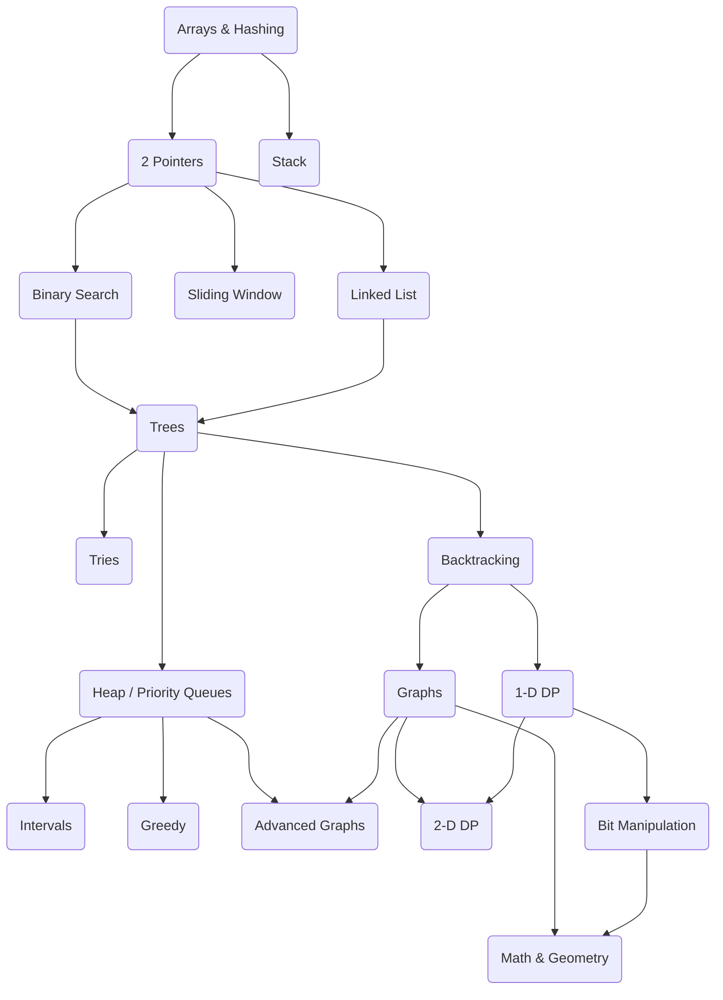

## Arrays & Hashing

1. Easy - [Contains Duplicate](https://github.com/brpandey/leetcode/blob/master/rust/src/p0217_contains_duplicate.rs)
2. Easy - [Valid Anagram](https://github.com/brpandey/leetcode/blob/master/rust/src/p0242_valid_anagram.rs)
3. Easy - [Two Sum](https://github.com/brpandey/leetcode/blob/master/rust/src/p0001_two_sum.rs)
4. Medium - [Group Anagrams](https://github.com/brpandey/leetcode/blob/master/rust/src/p0049_group_anagrams.rs)	
5. Medium - [Top K Frequent Elements](https://github.com/brpandey/leetcode/blob/master/rust/src/p0347_top_k_frequent_elements.rs)
6. Medium - [Product of Array Except Self](https://github.com/brpandey/leetcode/blob/master/rust/src/p0238_product_of_array_except_self.rs)	
7. Medium - [Valid Sudoku](https://github.com/brpandey/leetcode/blob/master/rust/src/p0036_valid_sudoku.rs)	
8. Medium - [Encode and Decode Strings](https://github.com/brpandey/leetcode/blob/master/rust/src/p0271_encode_and_decode_strings.rs)	
9. Medium - [Longest Consecutive Sequence](https://github.com/brpandey/leetcode/blob/master/rust/src/p0128_longest_consecutive_sequence.rs)

## Two Pointers

1. Easy - [Valid Palindrome](https://github.com/brpandey/leetcode/blob/master/rust/src/p0125_valid_palindrome.rs)
2. Medium - [Two Sum II Input Array Is Sorted](https://github.com/brpandey/leetcode/blob/master/rust/src/p0167_two_sum_ii.rs)
3. Medium - [3Sum](https://github.com/brpandey/leetcode/blob/master/rust/src/p0015_3sum.rs)
4. Medium - [Container With Most Water](https://github.com/brpandey/leetcode/blob/master/rust/src/p0011_container_most_water.rs)
5. Hard - [Trapping Rain Water](https://github.com/brpandey/leetcode/blob/master/rust/src/p0042_trapping_rain_water.rs)

## Sliding Window
> [Playlist](https://www.youtube.com/watch?v=1pkOgXD63yU&list=PLot-Xpze53leOBgcVsJBEGrHPd_7x_koV)

```rust
pub fn best_time_to_buy_sell(nums: &[i32]) -> i32 {
        if nums.len() < 1 { return 0 }
        let (mut sell, mut min_buy);
        let mut profit_max = 0;

        min_buy = nums[0];

        // 7,1,5,3,6,4, first iter sell = 1, min_buy 7, second iter sell = 5, min_buy 1
        for i in 1..nums.len() {
            sell = nums[i]; // enumerate through the list with sell being current element
            profit_max = cmp::max(sell - min_buy, profit_max); // keep highest
            min_buy = cmp::min(sell, min_buy) // keep lowest buy stock
        }

        profit_max
    }
```

1. [Best Time to Buy and Sell a Stock](https://github.com/brpandey/leetcode/blob/master/rust/src/p0121_best_time_to_buy_sell.rs)
2. [Longest Substring Without Repeating Characters](https://github.com/brpandey/leetcode/blob/master/rust/src/p0003_longest_substr_no_repeat.rs)
3. [Longest Repeating Character Replacement](https://github.com/brpandey/leetcode/blob/master/rust/src/p0424_longest_repeating_char_replacement.rs)
4. Permutation in String - Leetcode 567
5. [Minimum Window Substring](https://github.com/brpandey/leetcode/blob/master/rust/src/p0076_minimum_window_substring.rs)
6. [Sliding Window Maximum - Monotonic Queue](https://github.com/brpandey/leetcode/blob/master/rust/src/p0239_sliding_window_maximum.rs)

## Stack

1. Easy - Valid Parentheses [Problem](https://leetcode.com/problems/valid-parentheses/)
2. Medium - Min Stack [Problem](https://leetcode.com/problems/min-stack/)
3. Medium - Evaluate Reverse Polish Notation [Problem](https://leetcode.com/problems/evaluate-reverse-polish-notation/)
4. Medium - [Generate Parentheses](https://github.com/brpandey/leetcode/blob/master/rust/src/p0022_generate_parens.rs)	
5. Medium - [Daily Temperatures](https://github.com/brpandey/leetcode/blob/master/rust/src/p0739_daily_temperatures.rs)
6. Medium - [Car Fleet](https://github.com/brpandey/leetcode/blob/master/rust/src/p0853_car_fleet.rs)
7. Hard - Largest Rectangle In Histogram [Problem](https://leetcode.com/problems/largest-rectangle-in-histogram/)

## Binary Search
> [Playlist](https://www.youtube.com/playlist?list=PLot-Xpze53leNZQd0iINpD-MAhMOMzWvO)

```rust

    pub fn search(nums: Vec<i32>, target: i32) -> i32 {
        let mut pivot;

        let mut lo = 0;
        let mut hi = nums.len() - 1;  // 5

        while lo < hi {

            pivot = lo + (hi - lo) / 2; // 2.5 or 2

            if nums[pivot] == target {
                return pivot as i32
            }

            if target < nums[pivot] {
                hi = pivot - 1
            } else {
                lo = pivot + 1
            }
        }

        return -1
    }
 ```
1. [Binary search](https://github.com/brpandey/leetcode/blob/master/rust/src/p0704_binary_search.rs)
2. Search a 2D Matrix [Problem](https://leetcode.com/problems/search-a-2d-matrix/)
3. [Koko eating bananas](https://github.com/brpandey/leetcode/blob/master/rust/src/p0875_koko_eating_bananas.rs)
4. [Find minimum in rotated sorted array](https://github.com/brpandey/leetcode/blob/master/rust/src/p0153_find_minimum_in_rotated_sorted_array.rs)
5. [Search in rotated sorted array](https://github.com/brpandey/leetcode/blob/master/rust/src/p0033_search_in_rotated_sorted_array.rs)
6. [Time based key value store](https://github.com/brpandey/leetcode/blob/master/rust/src/p0981_time_based_key_value_store.rs)
7. [Median two sorted arrays](https://github.com/brpandey/leetcode/blob/master/rust/src/p0004_median_two_sorted_arrays.rs)

## Linked List

1. Reverse Linked List	
2. Merge Two Sorted Lists	
3. Linked List Cycle	
4. Reorder List	
5. Remove Nth Node From End of List	
6. Copy List With Random Pointer	
7. Add Two Numbers	
8. Find The Duplicate Number	
9. LRU Cache	
10. Merge K Sorted Lists	
11. Reverse Nodes In K Group

## Trees
> [Playlist](https://www.youtube.com/watch?v=OnSn2XEQ4MY&list=PLot-Xpze53ldg4pN6PfzoJY7KsKcxF1jg&index=2&t=0s)

> Topics
> - Breadth First Search (BFS)
> - Depth First Search (DFS)

1. Easy - [Invert Binary Tree - DFS](https://github.com/brpandey/leetcode/blob/master/rust/src/p0226_invert_binary_tree.rs)
2. Easy - [Maximum Depth of Binary Tree](https://github.com/brpandey/leetcode/blob/master/rust/src/p0104_maximum_depth_of_binary_tree.rs)
3. Easy - Diameter of a Binary Tree [Problem](https://leetcode.com/problems/diameter-of-binary-tree/)
4. Easy - Balanced Binary Tree [Problem](https://leetcode.com/problems/balanced-binary-tree/)
5. Easy - [Same Tree](https://github.com/brpandey/leetcode/blob/master/rust/src/p0100_same_tree.rs)
6. Easy - [Subtree of Another Tree](https://github.com/brpandey/leetcode/blob/master/rust/src/p0572_subtree_of_another_tree.rs)
7. Medium - [Lowest Common Ancestor of a Binary Search Tree](https://github.com/brpandey/leetcode/blob/master/rust/src/p0235_lowest_common_ancestor_of_a_binary_tree.rs)
8. Medium - [Binary Tree Level Order Traversal - BFS](https://github.com/brpandey/leetcode/blob/master/rust/src/p0102_binary_tree_level_order_traversal.rs)
9. Medium - Binary Tree Right Side View - BFS [Problem](https://leetcode.com/problems/binary-tree-right-side-view/)
10. Medium - Count Good Nodes In Binary Tree [Problem](https://leetcode.com/problems/count-good-nodes-in-binary-tree/)
11. Medium - [Validate Binary Search Tree - DFS](https://github.com/brpandey/leetcode/blob/master/rust/src/p0098_validate_binary_search_tree.rs)
12. Medium - [Kth Smallest Element in a BST](https://github.com/brpandey/leetcode/blob/master/rust/src/p0230_kth_smallest_element_in_bst.rs)
13. Medium - [Construct Binary Tree from Inorder and Preorder Traversal](https://github.com/brpandey/leetcode/blob/master/rust/src/p0105_construct_binary_tree_from_preorder_and_inorder_traversal.rs)
14. Hard - [Binary Tree Maximum Path Sum](https://github.com/brpandey/leetcode/blob/master/rust/src/p0124_binary_tree_max_path_sum.rs)
15. Hard - [Serialize and Deserialize Binary Tree - Preorder Traversal](https://github.com/brpandey/leetcode/blob/master/rust/src/p0297_serialize_and_deserialize_binary_tree.rs)


# Tries
1. Medium - [Implement Trie (Prefix Tree)](https://github.com/brpandey/leetcode/blob/master/rust/src/p0208_implement_trie.rs)
2. Medium - [Design Add and Search Words Data Structure](https://github.com/brpandey/leetcode/blob/master/rust/src/p0211_add_and_search_word.rs)
3. Hard - [Word Search II - Backtracking Trie](https://github.com/brpandey/leetcode/blob/master/rust/src/p0212_word_search_ii.rs)


# Heap / Priority Queue
1. Easy - Kth Largest Element In a Stream	
2. Easy - Last Stone Weight	
3. Medium - K Closest Points to Origin	
4. Medium - [Kth Largest Element In An Array](https://github.com/brpandey/leetcode/blob/master/rust/src/p0215_kth_largest_element_in_array.rs)
5. Medium - [Task Scheduler](https://github.com/brpandey/leetcode/blob/master/rust/src/p0621_task_scheduler.rs)	
6. Medium - Design Twitter	
7. Hard - [Find Median From Data Stream](https://github.com/brpandey/leetcode/blob/master/rust/src/p0295_find_median_from_data_stream.rs)


## Backtracking
> [Playlist](https://www.youtube.com/watch?v=pfiQ_PS1g8E&list=PLot-Xpze53lf5C3HSjCnyFghlW0G1HHXo)

1. [Subsets - Backtracking](https://github.com/brpandey/leetcode/blob/master/rust/src/p0078_subsets.rs)
2. [Combination Sum - Backtracking](https://github.com/brpandey/leetcode/blob/master/rust/src/p0039_comb_sum_i.rs)
3. [Permutations](https://github.com/brpandey/leetcode/blob/master/rust/src/p0046_permutations.rs)
4. Subsets II [Problem](https://leetcode.com/problems/subsets-ii/)
5. [Combination Sum II - Backtracking](https://github.com/brpandey/leetcode/blob/master/rust/src/p0040_combination_sum_ii.rs)
6. [Word Search - Backtracking](https://github.com/brpandey/leetcode/blob/master/rust/src/p0079_word_search.rs)
7. Palindrome Partitioning - Backtracking - Leetcode 131 
8. [Letter Combinations of a Phone Number - Backtracking](https://github.com/brpandey/leetcode/blob/master/rust/src/p0017_letter_comb_phone.rs)
9. [N-Queens - Backtracking](https://github.com/brpandey/leetcode/blob/master/rust/src/p0051_n_queens.rs)


## Graphs
> [Playlist](https://www.youtube.com/watch?v=EgI5nU9etnU&list=PLot-Xpze53ldBT_7QA8NVot219jFNr_GI&index=1&t=0s)

> Topics
> - Shortest Path from source to all vertices **Dijkstra**
> - Shortest Path from every vertex to every other vertex **Floyd Warshall**
> - To detect cycle in a Graph **Union Find**
> - Minimum Spanning tree **Prim**
> - Minimum Spanning tree **Kruskal**
> - Topological Sort

1. Medium - [Number of Islands](https://github.com/brpandey/leetcode/blob/master/rust/src/p0200_number_of_islands.rs)
2. Medium - [Clone Graph - Depth First Search](https://github.com/brpandey/leetcode/blob/master/rust/src/p0133_clone_graph.rs)
3. Medium - Max Area of Island - Leetcode 695
4. Medium - [Pacific Atlantic Water Flow](https://github.com/brpandey/leetcode/blob/master/rust/src/p0417_pacific_atlantic_water_flow.rs)
5. Medium - Surrounded Regions - Graph - Leetcode 130
6. Medium - Rotting Oranges - Leetcode 994
7. Medium - Walls and Gates - Multi-Source BFS - Leetcode 286 
8. Medium - [Course Schedule - Graph Adjacency List](https://github.com/brpandey/leetcode/blob/master/rust/src/p0207_course_schedule.rs)
9. Medium - [Course Schedule II - Topological Sort](https://github.com/brpandey/leetcode/blob/master/rust/src/p0210_course_schedule_ii.rs)
10. Medium - Redundant Connection - Union Find - Leetcode 684
11. Medium - [Number of Connected Components in an Undirected Graph - Union Find](https://github.com/brpandey/leetcode/blob/master/rust/src/p0323_number_of_connected_components_in_undirected_graph.rs)
12. Medium - [Graph Valid Tree](https://github.com/brpandey/leetcode/blob/master/rust/src/p0261_graph_valid_tree.rs)
13. Hard - [Word Ladder - Breadth First Search](https://github.com/brpandey/leetcode/blob/master/rust/src/p0127_word_ladder.rs)


Advanced Graphs
- [Word Search - Backtracking](https://github.com/brpandey/leetcode/blob/master/rust/src/p0079_word_search.rs)
- Island Perimeter - Graph - Leetcode 463 
- [Word Search II - Backtracking Trie](https://github.com/brpandey/leetcode/blob/master/rust/src/p0212_word_search_ii.rs)
- Prim's Algorithm - Minimum Spanning Tree - Min Cost to Connect all Points - Leetcode 1584
- Count Sub Islands - DFS - Leetcode 1905
- Longest Increasing Path in a Matrix - Leetcode 329

1. Medium - Min Cost to Connect All Points [Problem](https://leetcode.com/problems/min-cost-to-connect-all-points/)
2. Medium - [Network Delay Time - Dijkstra's algorithm](https://github.com/brpandey/leetcode/blob/master/rust/src/p0743_network_delay_time.rs)
3. Medium - [Cheapest Flights within K Stops - Bellman-Ford](https://github.com/brpandey/leetcode/blob/master/rust/src/p0787_cheapest_flights_within_k_stops.rs)
4. Hard - Reconstruct Itinerary - Leetcode 332
5. Hard - Swim in Rising Water - Dijkstra's Algorithm - Leetcode 778
6. Hard - [Alien Dictionary - Topological Sort](https://github.com/brpandey/leetcode/blob/master/rust/src/p0269_alien_dictionary.rs)


## Dynamic Programming 1-D
> [Playlist](https://www.youtube.com/watch?v=g0npyaQtAQM&list=PLot-Xpze53lcvx_tjrr_m2lgD2NsRHlNO)

> Topics
> > Fibonacci Numbers, 0/1 Knapsack, Unbounded Knapsack, Palindrome, LCS - Longest common subsequence

1. Easy - (Fibonacci) [Climbing Stairs](https://github.com/brpandey/leetcode/blob/master/rust/src/p0070_climbing_stairs.rs)
2. Easy - (Fibonacci) Min Cost Climbing Stairs [Problem](https://leetcode.com/problems/min-cost-climbing-stairs/)
3. (Fibonacci) [House Robber](https://github.com/brpandey/leetcode/blob/master/rust/src/p0198_house_robber.rs)
4. (Fibonacci) House Robber II
- (Fibonacci) [Fibonacci Number](https://github.com/brpandey/leetcode/blob/master/rust/src/p0509_fibonacci_number.rs)
5. Medium - (Palindrome) [Longest Palindromic Substring](https://github.com/brpandey/leetcode/blob/master/rust/src/p0005_longest_palindrome_substring.rs)
6. Medium - (Palindrome) [Palindromic Substrings](https://github.com/brpandey/leetcode/blob/master/rust/src/p0647_palindromic_substrings.rs)
7. Medium - Decode Ways
8. Medium - (Unbounded Knapsack) [Coin Change](https://github.com/brpandey/leetcode/blob/master/rust/src/p0322_coin_change.rs)
9. Medium - Maximum Product Subarray
10. Medium - Word Break
11. Medium - (LCS) [Longest Increasing Subsequence](https://github.com/brpandey/leetcode/blob/master/rust/src/p0300_longest_increasing_subsequence.rs)
12. Medium - (0/1 Knapsack) [Partition Equal Subset Sum](https://github.com/brpandey/leetcode/blob/master/rust/src/p0416_partition_equal_subset_sum.rs)


## Dynamic Programming 2-D

> Topics
> > Fibonacci Numbers, 0/1 Knapsack, Unbounded Knapsack, Palindrome, LCS - Longest common subsequence

1. Medium - Unique Paths	
2. Medium - (LCS) [Longest Common Subsequence](https://github.com/brpandey/leetcode/blob/master/rust/src/p1143_longest_common_subsequence.rs)
3. Medium - Best Time to Buy And Sell Stock With Cooldown	
4. Medium - Unbounded Knapsack -- [Coin Change II](https://github.com/brpandey/leetcode/blob/master/rust/src/p0518_coin_change_ii.rs)
5. Medium - Zero / One Knapsack -- [Target Sum](https://github.com/brpandey/leetcode/blob/master/rust/src/p0494_target_sum.rs)
6. Medium - Interleaving String	
7. Hard - Longest Increasing Path In a Matrix	
8. Hard - LCS - Distinct Subsequences	
9. Hard - LCS - Edit Distance	
10. Hard - Burst Balloons	
11. Hard - Regular Expression Matching


## Greedy (All Medium Problems)

1. Maximum Subarray	
2. [Jump Game](https://github.com/brpandey/leetcode/blob/master/rust/src/p0055_jump_game.rs)
3. [Jump Game II](https://github.com/brpandey/leetcode/blob/master/rust/src/p0045_jump_game_ii.rs)	
4. Gas Station	
5. Hand of Straights	
6. Merge Triplets to Form Target Triplet	
7. [Partition Labels](https://github.com/brpandey/leetcode/blob/master/rust/src/p0763_partition_labels.rs)	
8. Valid Parenthesis String

## Intervals

1. Easy - Meeting Rooms   	
2. Medium - Insert Interval	
3. Medium - Merge Intervals	
4. Medium - Non Overlapping Intervals	
5. Medium - Meeting Rooms II   	
6. Hard - Minimum Interval to Include Each Query

## Math & Geometry

1. Easy - Happy Number	
2. Easy - Plus One	
3. Medium - Rotate Image	
4. Medium - Spiral Matrix	
5. Medium - Set Matrix Zeroes	
6. Medium - Pow(x, n)	
7. Medium - Multiply Strings	
8. Medium - Detect Squares

## Bit Manipulation

1. Easy - Single Number	
2. Easy - Number of 1 Bits	
3. Easy - Counting Bits	
4. Easy - Reverse Bits	
5. Easy - Missing Number	
6. Medium - Sum of Two Integers	
7. Medium - Reverse Integer
