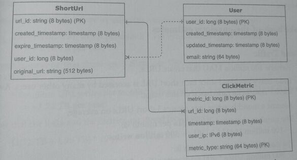
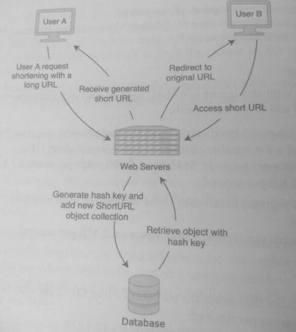
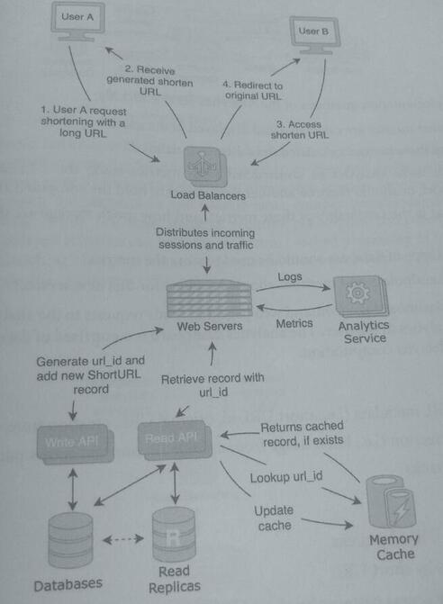
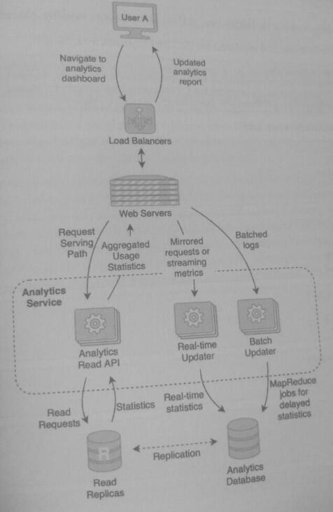

### 24. Design a URL Shortener

> Url Shortener simplifies and transforms a long URL to a shorter more compact url with just a domain name
> (e.g. tinyurl and bitly) and a compact URL path id token

Long Url
> https://www.walmart.com/ip/Acer-Aspire-5-15-6-Full-HD-IPS-Display-11th-Gen-Intel-Core-i7-1165G7-12GB-DDR4-512GB-NVMe-SSD-Pure-Silver-Windows-11-Home-A515-56-79N0/2809390326

Short Url
> http://tinyurl.com/xd32ab98

> http://goo.gl/2zabckd9

In addition to a more compact form, since the generated url goes through an intermediary shortener service (tinyurl, bitly), url tracking and
statistics are possible e.g.
* track analytics
* audience clicks
* referrals
* ad campaigns

1. ### Clarify problem and scope use cases ###
   1. #### Use Cases
      1. Create shortened url - Users enter long url and receive short url
      2. When accessed, short url redirects to orignal url ([redirect codes](https://developer.mozilla.org/en-US/docs/Web/HTTP/Redirections) 301 Permanent, 307 Temporary)
      3. Short url has configurable lifespan, with a default setting
      4. Url tracking possible, can be done in either real-time mode or offline/delayed processing
   2. #### Requirements
      1. High availability, if one server is down, that shouldn't stop the service from functioning properly
      2. Highly performant, with minimum latency
      3. Generated short URL must be unique and not have been generated before
   3. #### Clarifying Questions
      1. How many anticipated users of service?
      2. What should the default lifespan for the generated url be? A few hours? A few days? A few months? Years?
      3. Is anonymous access important?
      4. Should the system maintain analytics for users and links?
      5. Should the service allow custom links
      6. Who is the intended end user? Should ad campaign/referral linking features be added?
      7. What should the max length of the shortened url generated token be?

2. ### Data model
      1. Short url record ~ 544 bytes, User record ~ 88 bytes, Click metric ~ 160 bytes
      2. 


* Given n different characters and string length is k, n^k possible strings that can be generated.  See two examples:
  *  A binary string of length 3, has two values 0 or 1 for each binary value so 2^3 = 8, or 8 possible string values
  *  For a short url using 26 letters (a-z) and 10 digits (0-9) => 36 characters
  *  Given a length of 8, this would mean 36^8 ~ 2.8 billion possible short urls

Approaches - Generating short url generated id
* Snowflake
* Cryptographic Hash
* GUID generator

3. ### Back-of-the-envelope Calculations
    1. Assume 100 million (10^8) MAU - monthly active users that creates urls
    2. Assume read heavy workload - writes are infrequent.  
       1. Most people just accessing short urls, not creating them.
       2. 200:1 read:write ratio
    3. Assume monthly active user creates 3 short urls on average
    4. Number of created short urls: 100 million MAU * 3 urls = 300 million (3 * 10^8) writes
    5. Number of reads per month: 300 million MAU * 200 read/write ratio = 20 billion reads/month

4. ### High-level design
    1. This design doesn't handle scalability
        1. Without a load balancer, client connections will be unevenly distributed
        2. The database is a single point of failure (SPOF), even if web servers are added, as requests are passed to same DB
        3. Non-scalable design 
    2. This design is improved as it has a few additions to handle scalability e.g. 100 million mau (monthly active users)
        1. Workload split into read and write services, as they both scale independently, 200:1 r:w
        2. Memory cache [Redis](https://redis.com/) added for frequently accessed generated short urls, storing long -> short mapping
        3. Load balancer has been added to distributed requests to web servers more uniformly
        4. Read replicas added to better handle read load
        5. Scalable design 
        6. As a takeaway, read requests don't require complex joins or relationship driven queries
           1. Just copy short url table and stick it in NoSQL key value database (cassandra, dynamo) and use token as PK
6. ### Detailed design - Focusing on a new analytics service
    1. High-level
       * What metrics do we want to track, what metrics do we want to show the interested user
       * Which metrics are calculated real-time and which are delayed
       * Does the ClickMetric record need to be augmented with another data model
       * How to deal with aggregate data
       * What type of data store to handle metrics? (e.g. InfluxDB, TimeScale)
       * What endpoints for new analytics service
       
   The analytics service also powers a front end dashboard page that sends requests to the analytics service and displays url analytics.
   These analytics are either real-time and delayed computations.
   
   Real-time
   * Short URL metadata
     * info about urls: short url tokens generated for user and the long urls they correspond to, expiration times
   * Fraud detection
     * Unusual access patterns
     * Lot of traffic (burst) from a single IP and then silence (e.g. from a script)
     * DDOS attacks
   
   Delayed & Aggregate computations:
   * Most clicked short url
   * Total clicks for each short url
   * Access patterns for short url - e.g. time of day patterns
   * Most common device type and browser type (as gleaned from http request headers in logs) for short urls
   * Most commonly occuring location accessing short urls
   
   Add an aggregate new data model to represent rolled up computations, put them into a Statistic data record table
   
   ```mermaid
   erDiagram
       Statistic {
        u64 statistic_id
        string statistic_type
        u64 user_id
        u64 timestamp
        u64 value
    }
    ```
   
    2. More detailed flow showing real-time and delayed processing aspects of analytics flow 
       * The analytics service stitches together smaller services, either:
         * Real-time updater - replicate requests as they are issued, dropping request payload but capturing header info and storing in Analytics DB
         * Batch updater - at regular intervals, retrieving web server logs, processing logs via a MapReduce setup of multiple workers to compute statistics and storing in Analytics DB
         * Analytics read api, which powers the analytics dashboard reading out of analytics read replicas and pushing statistics out
         * Analytics DB which could suffice with a NoSQL database.  NoSQL provides higher throughput than relational databases.
           * No strong use case for strong consistency.  Eventual consistency for short URLs suffices.
           * No complex relationships within the data models
       * 

7. ### Identify potential scaling problems and bottlenecks
   1. Some generated short urls can experience burst requests.
      * For example, a celebrity posts a short URL on their twitter feed and there may be millions of read requests in a short time. More than the 20:1 R:W ratio.  The database replica shard that holds the generated short url may become hot and be overloaded, dropping requests (Hotspotting [1](https://intmain.co/what-is-database-sharding-and-how-is-it-done/) [2](https://cloud.google.com/blog/products/databases/hotspots-and-performance-debugging-in-cloud-bigtable)).
      * Solution 1: Replicate database with read replicas and caches to distribute read requests
      * Solution 2: Add a load balancer between web servers and databases using a waterfall algorithm (so no single database is overloaded).
      * Solution 3: A fan out service can be used to pre-emptively copy generated short urls into caches assuming they will be accessed soon after
      * Solution 4: If a user is marked as a celebrity, always cache its generated short urls or atleast monitor if a short url request needs to be cached
