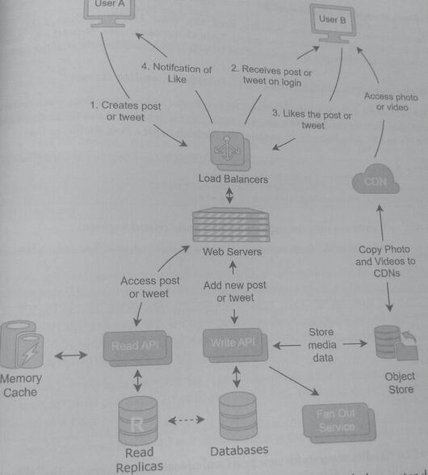
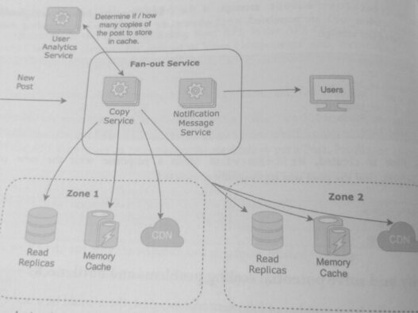

## 25. Design a Social Media Application with Post Sharing

Modern applications such as Twitter or Instagram, operate on a tremendous scale: 
they're able to serve millions or even billions of users and handle a peak
burst throughput up to hundreds of billions of QPS. 

They serve photos, make recommendations from machine learning algorithms, and push notifications.

These applications are backed by hundreds or thousands of microservices and, hence, 
it's not possible to design the entirety of a large application during an interview. 

If you do receive a system design question that is broad, clarify which parts of the 
application the interviewer wants you to focus on.

Design the scalable backend services of a social media application that shares posts. A sharable post consists
of text, photos, and/or videos. This should efficiently scale those services to billions of users.

Instagram allows users to upload photos and videos to share publicly or privately with their followers. 
Hashtags and geolocations can be added to posts, and users can filter content by tags and locations. Users
can like photos, follow other users, add their own content, and mark posts to disappear after 24 hours.

Twitter alows users to post messages, aka tweets, that are publicly visible by default. 
Tweets can consist of messages restricted to 280 characters, images, videos or a combination
of them. Users can create tweets, like tweets, retweet another user's tweet, and follow
other users.

### 1. Clarify the problem and scope the use cases

#### Use Cases:
* A user creates a tweet or post.
* A user follows other users.
* A user can like, favorite, and interact with tweets or posts with a type of reaction.
* There are both registered and unregistered users.
* A user is notified when there is a new post from someone he or she follows.

#### Requirements:
* The service should have high availability.
* Notifications of a new post should be delivered to all of the user's followers within
minutes.
* Popular users could have hundreds of millions of users. There could be heavy burst usage, where a single
post is accessed by millions of users within a minute.
There should be eventual consistency in the posts. While users can view posts that
have been modified or deleted, changes should be propagated to all data sources on
the scale of minutes.

#### Clarifying questions to ask:
* How many users will use the service?
* Should the app be able to handle images and videos? If so, should there be limits to
the size and length of the images and videos?
* Should notifications be customized?

### 2. Define the data models
```
Profile
profile_id: long (8 bytes) (PK)
user_id: long (8 bytes)
username: string (512 bytes)
profile_type: int (4 bytes)
profile_img_url: string (512 bytes)
bio text: string (2048 bytes)
update_timestamp: timestamp (8 bytes)
created_timestamp: timestamp (8 bytes)
num_followers: long (8 bytes)

Post
post_id: long (8 bytes) (PK)
profile_id: long (8 bytes)
created_timestamp: timestamp (8 bytes)
text: string (2048 bytes)
num_likes: long (8 bytes)
num hearts: long (8 bytes)
image_url: string (512 bytes)
video_uri: string (512 bytes)

User
user_id: long (8 bytes) (PK)
name: string (128 bytes)
email: string (512 bytes)
created_timestamp: timestamp (8 bytes)
login_timestamp: timestamp (8 bylos)

Edge
profile_id: long (8 bytes) (CPK)
target profile id long (8 bytes) (CPK)
edge_type: int (8 bytes)
created_timestamp: timestamp (8 bytes)
is pending boolean (1 bit)
notification on: boolean (1 bit)

Action
profile_id: long (8 bytes) (CPK)
post_id: long (8 bytes) (CPK)
action type: int (4 bytes) (CPK)
created_timestamp timestamp (8 bytes)
comment text: string (2048 bytes)
```

User and Profile are designed as separate entities. The User entity contains attributes
that the user cannot change after initially creating the account, while the Profile entity
contains fields that the user can change. Additionally, a Profile doesn't need to be a person
it can be businesses, organizations, and clubs. 

Splitting out the data models allows multiple users to manage a single profile for a business or a single person to manage multiple profiles. If all attributes are fully used, a Profile has a size of 3116 bytes, and a User has a size of 664 bytes.

The Post entity defines a post that could consist of text, an URL to an image, and/or an URL
to a video; the underlying photos and videos are media files in object storage, A Post has a size
of 3116 bytes, but this does not include the size of the image or video file(s) in object storage

The Edge entity defines the relationship between two profiles in one direction. For example
one profile can follow or block on the other; the type is defined by the attribute edge_type
An Edge has a size of -32 bytes.

The Action entity defines how a user can react to a Post; this could be actions such as "like",
"heart," or "dislike." An Action has a size of 2076 bytes.

### 3. Make back-of-the-envelope estimates

#### Users and Traffic

* Assume 500 million MAU registered users.
* On average, each user makes 1 post per month, which means 500 million posts per month
* Assume that there is a 20:1 read/write ratio for each post, which means about 10
billion post reads per month. This includes reads from unregistered users.

#### QPS (Queries per second)

* The number of write requests per second is:
500 million posts per month / (30 days * 24 hours* 60 minutes * 60 seconds)
= ~192 post writes per second

* The number of read requests per second is:
10 billion posts per month / (30 days * 24 hours* 60 minutes * 60 seconds)
= ~3,800 post reads per second

#### Storage

We can first estimate the storage size of each post, which will help with the other estimations.
Using the size calculated from the data models, we estimate:

* 500 million posts per month* 3116 bytes per post
= ~1.55 TB per month = ~18.7 TB per year
* Assume that each post receives ~5 actions (comments, likes, etc.):
500 million posts per month* 5 actions* 2076 bytes per
= ~5.2 TB per month = ~62.3 TB per year
action

* Assume each user follows 200 other users (edges) and assume there is about 20%
growth in users per year. Estimating Profile, User, and Edge Size:
  * 500 million users * 0.20* (3116 bytes per user + 664 bytes per profile + 200 edges
32 bytes per edge) = ~1 TB per year

In addition to the database models, we also estimate the image and video usage in the object
storage.

* Assume 1 of every 4 posts has an image upload, and on average, each image is -5 MB:
5 MB 500 million posts per month / 4 = 625 TB per month = 7.5 PB per year

* Assume 1 of every 5 posts has a video upload, and on average, each video is -100 MB:
100 MB 500 million posts per month/5 = 10 PB per month = 120 PB per year

Estimating for 10 years:
* Database Usage = (18.7 TB + 62.3 TB + 1 TB)* 10 years = 820 TB
* Object Store Usage = (120 PB +7.5 PB)* 10 years = 1275 PB

The object store usage is an order of magnitude greater than database
usage; this is expected as images and videos are large compared to text. 

#### Bandwidth Usage

We can simplify by ignoring metadata, headers, and request/response acknowledgment
messages and calculating the bandwidth for posts only:

* Inbound (ingress) bandwidth = the number of write requests * size of a post with
image or video:
  * 192 posts per second * (3116 bytes per post + 5 actions * 2076 bytes per action+
1/4* 5 MB per image + 1/5* 100 MB per video)
192 posts per second * 21.25 MB per post
= ~4 GB per second

* Outbound (egress) bandwidth = the number of read requests * size of a post with
image or video:
  * 3,800 reads per second * 21.25 MB = ~80 GB per second

#### Memory
  * A cache that stores the responses of the past two hours has a memory usage with an
upper limit of:
    * ~4 GB per second * 3600 seconds = ~14.4 TB
  * Since there is a 20:1 read/write ratio, we can assume there is a high number of read
requests of posts already in cache. Assuming about 75% of the reads are already in cache:
    * 14.4 TB * 0.25 = ~3.6 TB

Since both memory and bandwidth usage are high due to images and videos, a CDN is a type
of cache that can help reduce both. 

### 4. Propose a high-level system design

In the design, request paths are broken into User A, who creates a post, and User B,
who reads the post. In this system, we assume that users access the post or tweet directly
instead of through a timeline or newsfeed

High-level design 

When the user adds a new post or tweet, the Write API writes to both the master database and
the object store. The object store holds media data such as images and videos, while the
database contains the data models designed earlier. Entries in the master database are
replicated to read replicas to horizontally scale read requests.

The write request path also triggers the fan out service, which notifies followers about the user's
new post. The fan-out service can also copy the post to a location that is physically closer to
the follower and/or to a faster medium, such as cache.

Read and Write APIs are designed as separate services because reads and writes have different
scaling needs. We assumed that there was a 20:1 read/write ratio, and that likely means that
the read requests need more resources than write requests. If they're not separated, the services
that comprise the Write API need to be scaled in a 1:1 ratio with the services that comprise the
Read API; this would be inefficient since a portion of the resources used towards Write API
would be left idle.

### 7. Identify and solve potential scaling problems and bottlenecks

After a user with a large number of followers creates a post, there could be a burst of requests
to read that post. That is, burst reads in this context refer to when a single post is read by many
users in a short period, potentially causing bottlenecks. In the design for a fan-out service in
"Core Components," copies of the post were held in cache or read replicas with the expectation
that they would be accessed shortly after creation. However, it was computationally expensive
to perform this on-write fan-out for every user.

In the diagram below, the fan-out service is augmented with a user analytics service. The user
analytics service tracks how posts are read and answers the following questions during the on-
write fan-out of a post:

* Should this post be copied to a cache? What is the expected number of reads of this
post?
* How many/which caches should this post be copied to? Where are the user's followers
located geographically?
* Is an eventually consistent model between the cache and the database suitable for this
application?



The User Analytics Service uses a machine learning model and historical request patterns in
predict the number of copies of the post to hold in cache/replicas to sufficiently handle th
burst of reads. For users that don't have many followers, it may be unnecessary to perform the
copy on-write.

In many applications, posts are accessed from a newsfeed or a timeline.
