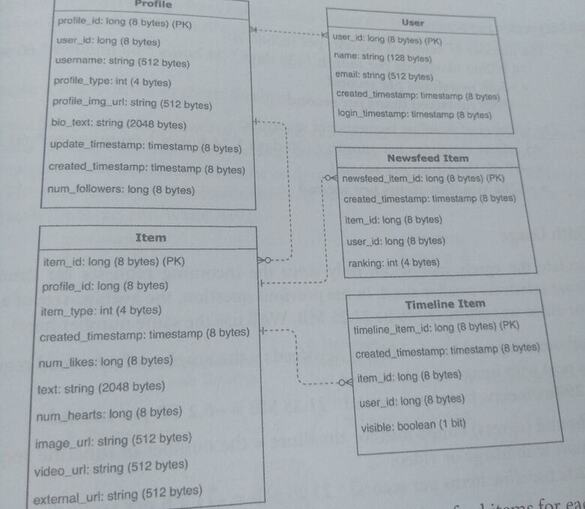
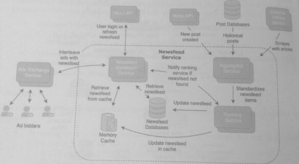
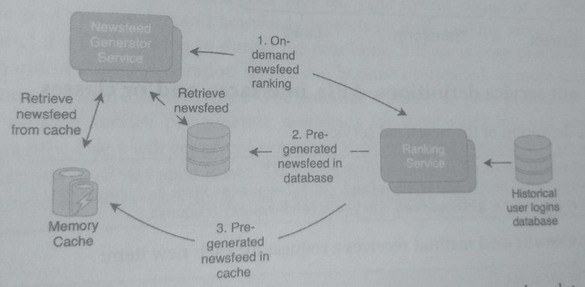
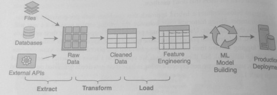

## 26. Newsfeed & Timeline

Design a newsfeed and timeline, such as those commonly used in Facebook, Twitter, and Instagram.

#### What is a Newsfeed?
A newsfeed is found on a user's homepage with a collection of posts from other users, news articles, ads, and other updates. Each
newsfeed is also customized for a user, containing hopefully relevant content that the user would want to engage with.

#### What is a Timeline?
A timeline appears on a user's profile page, with a list of items
belonging to that user: their posts, activities, and other updates. 

A timeline is sorted in reverse chronological order, ***with the most recent updates shown at the top***.

There is overlap between the items that appear in a timeline and those in a newsfeed; both can
contain user updates and posts. A newsfeed, however, is more complex than a timeline because
it contains items from multiple sources and is driven by ranking algorithms that determine
the most relevant items for a target user. T

The data models and services definitions for posts stay the same as the previous question.

### 1. Clarify the problem and scope the use cases

Use Cases:
- A user navigates to the application's homepage and is shown the newsteed.
- A user can interact with the items in the newsfeed, which could be from external
sources, including ads that redirect the user to the advertisers' websites or other friend's posts.
- A user navigates to another user's profile and is delivered the timeline in reverse chronological order.
- A user can control which posts and activities are displayed on their timeline.

Requirements:

* The newsfeed service and timeline must have high availability, where consistency is a secondary priority to availability.
* The newsfeed and timeline must be delivered to the user within relatively low latency (aka a few seconds) to keep a user's attention
* Need to support varied access patterns:
  * Heavy users log in multiple times a day
  * Infrequent users log in a few times a year.
* Need to support popular user profiles which could be accessed by hundreds of millions of fans in a single day.

Clarifying questions to ask:
* How many users will use the service?
* Do timelines and newsfeeds need to be precomputed/precached, or can the newsfeed algorithm
make real-time computation within the latency requirements?
* How much customization do external items in the newsfeed need per user? Can the
same group of ads or news articles be delivered to a group of users?
* What is the limit of the number of items to be generated for the newsfeed and
timeline?

### 2. Define the data models

The entities Profile and User are repeated from the previous design question,

An Item in the newsfeed and the Timeline could be a post, ad, or other update.
An Item has 3636 bytes, not including the media data in the object store.

NewsfeedItem is used to determine the ranking of the newsfeed items for each user_id
through the attribute ranking. A newsfeed item has a size of 36 bytes; this does not include
the underlying item and the media data in the object store. Newsfeed Item has a many-
to-one relationship with Item since the same item can appear in multiple newsfeeds.

Timeline Item is used to determine what should appear in a user's timeline. A post or an
action could be hidden on the timeline through the visible attribute. A timeline item has a
size of 32 bytes; this also does not include the underlying item or media data in the object store.

### 3. Make back-of-the-envelope estimates

#### Users and Traffic

Estimate the additional costs of the newsfeed and timeline. The estimates for
posts and media data from the previous design question remain the same.

* We previously assumed 500 million MAU registered users.
* On average, assume that each user accesses the application once a day and triggers a
request for the newsfeed. This means -15 billion newsfeed requests per month.
* Assume each generated newsfeed has 50 items.
* On average, each user accesses 3 profiles each day, which includes a request for a
timeline. This means ***-45 billion timeline requests per month.***
* Assume each generated timeline has 30 items.

#### QPS (Queries per second)

* The number of newsfeed requests per second is:
    15 billion newsfeeds per month / (30 days* 24 hours * 60 minutes 60 seconds)
    = -5.8k newsfeeds per second
    = ~290k newsfeed items per second

The number of timeline requests per second is:
45 billion timelines per month / (30 days * 24 hours * 60 minutes* 60 seconds)
= -17.4k timelines per second
= -520k timeline items per second

#### Bandwidth Usage

Calculate the egress bandwidth only since the incoming requests for timelines and
newsfeeds are relatively smaller sized. Assume the average size of a post with
an image or video was estimated to be 21.25 MB:

* Outbound (egress) bandwidth for newsfeeds the number of newsfeed requests 
  *size of a post with image or video:
  290k timeline items per second * 21.25 MB = -6.2 TB per second
* Outbound (egress) bandwidth for timelines = the number of timeline requests size of a post
  with image or video: 520k timeline items per second 21.25 MB = -11 TB per second

#### Memory

Estimate the newsfeeds/timeline amount that are computed beforehand and kept memory:

* Assuming we can correctly predict the newsfeeds and timelines that will be accessed
in the next half hour, the memory usage of the cache is:
  * -6.2 TB per second * 1800 seconds = ~11 PB for newsfeeds
  * -11 TB per second * 1800 seconds=-20 PB for timelines

This estimate contains memory usage for both the database and object storage; if images and
videos are excluded because of CDN usage, the memory usage will be lower.

#### Storage

In the previous question, we calculated that posts consume about 82 TB per year of database
usage and 127 PB per year of object storage. Calculate the additional storage cost of timelines
and newsfeeds:

* 15 billion newsfeeds per month * 50 items 36 bytes per newsfeed item
  * =~27 TB per month= ~320 TB per year
* 45 billion timelines per month 30 items 32 bytes per timeline item
  * =-43 TB per month= -518 TB per year

Compared to the posts storage from before, these values are relatively small. This is because
the newsfeed and timeline do not store the underlying posts but only the lists metadata that refer to the posts

### 4. Propose a high-level system design

The diagram below adds the newsfeed, timeline, and fan-out services to the previous design. 

The newsfeed service serves users customized newsfeeds, either by
keeping pre-generated newsfeeds in cache or dynamically generating the newsfeeds on users
requests. The timeline service behaves similarly but with users' timelines. Both services are
called through the Read and Write APIs.

* Additions include separating out the fan out service, consisting of the notification service and the 
search indexing service.

### 5. Design components in detail
The timeline service is similar to the newsfeed service but does not have the added complexity of aggregating items 
from multiple sources and ranking items.

Timelines are commonly generated in reverse chronological order with the user's actions being the single event source.

In contrast, a newsfeed has multiple sources and uses a ranking algorithm to filter and order items by relevance. 
Additionally, a newsfeed is updated more frequently than a timeline.

The following shows how a newsfeed service may aggregate and rank items 
(services include by rows: read api, write api, external articles service, ads exchange service, 
newsfeed generated service, aggregator service, ranking service,)

The aggregator service merges items from multiple sources:
1. Write API: new posts are added to the newsfeed on-write.
2. Post databases: older posts that are relevant for users who don't frequently log in.
3. External Articles: provides news articles and blogs that were scraped news from
external sources.

The aggregator service normalizes the newsfeed items and pushes them to the ranking
service, which uses an algorithm to rank the items and generate a sorted newsfeed for each
user. The generated newsfeed is placed into a database or a cache. Upon a user
newsfeed request, the generator service accesses the newsfeed data and merges it with ads.

The ranking service also updates newsfeed item copies with new items based on their rankings.

#### Is the newsfeed generated on-demand or pre-generated?

Newsfeed generation can be a computationally intensive process that could take on the order
of seconds or more to compute.

This could lead the user to lose interest and exit the app.

By pre-generating the newsfeed, it is readily available, and the newsfeed generator service fetches it from cache/db, 
with latency on the scale of milliseconds.

Both approaches have advantages and disadvantages.

On-demand newsfeed generation uses fewer computational resources, as the newsfeed will only be generated if and when
a user logs in. Pre-generated newsfeeds are created before the user logs in, meaning that newsfeeds will be 
generated even for users that don't use them.

The diagram below outlines a hybrid approach that combines both pre-generated and on-
demand strategies. Using historical login behavior, the ranking service predicts if a user will
log in within the next hour.

* Users with a high probability of logging in have their newsfeeds pre-generated, updated, and placed into a cache (path 3).
* Users with a medium chance of logging in have their newsfeed pre-generated and placed into a key-value database (path 2), 
  but these newsfeeds are updated at a lower frequency than those of path 3.
* Lastly, users who are not expected to log in have their newsfeeds generated on-demand through path 1

Hybrid Ranking Approach (Pre-generated & on-demand) 

This hybrid approach means that the system doesn't need to generate and update newsfeeds
for all users, but only the users that have the highest probability of logging in.

#### How is the ranking performed?

When the newsfeed was first introduced on social networking sites, items were arranged in
reverse chronological order, with the newest posting first. Since then, the newsfeed has evolved
to include news sources, ads, and other updates. However, there were too many items for a
user to reasonably process,

Due to the plethora of potential newsfeed items (news sources, ads, friend updates), a ranking algorithm was eventually
needed to filter and score each item by its relevance to the user.

The ranking algorithm's input is the set of a user's potential newsfeed items, and the output is the list of the 
highest-ranked items.

This algorithm could be simple and create a ranking based on factors such as the number of
mutual friends, the type of item, and the age of the post.

Or it could incorporate more sophisticated factors such as historical user behavior, content type, 
closeness of the friend, number of likes/interactions, and likelihood that a user will interact with that post.

The factors that the algorithm uses to determine the rank of a newsfeed item are called a feature set, 
and determining the best factors to use is a process called feature engineering. The goal of the algorithm 
is to predict and maximize a target variable, such as time spent on the platform or
probability of interaction with the newsfeed item.

Feature engineering is the last step of a data engineering process called ETL. ETL (extract,
transform, load) is a three-step process where data is extracted from multiple sources, cleaned
transformed, and then loaded into a container where features and models can be analyzed.

Target variable data optimization 

The updateNewsfeed method receives a request for each new item

The newsfeed service updates the relevant newsfeeds in the cache/db after
calculating the item's ranking score:

### 7. Identify and solve potential scaling problems and bottlenecks

Possible scaling and bottlenecks include:

1. **Users who follow a large number of users.** Users who follow a large number of other
users could become potential scaling problems. The aggregator service is designed to
merge items from multiple sources, and as the velocity of items from those sources
increases, it means that the aggregator service is triggered more frequently. One
possible solution is to consider the computational costs of a push vs. pull model.
A push model means that the aggregator service is triggered on each new item. This
model provides the most updated newsfeeds since items are ranked when they are
created. A pull model means that the aggregator service will batch multiple items and
rank them together. This reduces the computational costs but also means that there
are delays in updating newsfeeds. The pull model makes sense for users who follow a
large number of other users since the updates will be batched.

2. **Poor prediction of when a user logs in.** The hybrid design of combining pre
generated and on-demand newsfeeds depends on if the ranking service can correctly
predict if a user will log in during the next hour. If there is poor prediction, the on
demand newsfeed generation service can become overloaded, as more users need to
request on-demand newsfeeds. One potential solution to poor prediction is to have
the ranking service pre-generate newsfeeds for most users but not update them
if that newsfeed has stale items. The users will be able to navigate older items of the
frequently. Users will get an old version of their newsfeed immediately on logif the
newsfeed while the ranking service updates it with new items.
