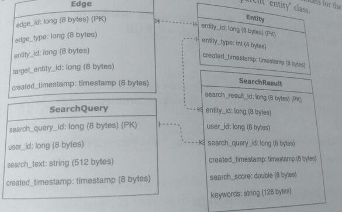
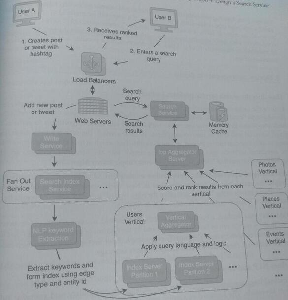
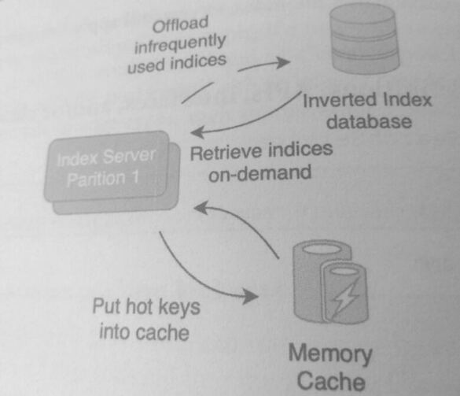

27. Design Question 4: Design a Search Service

Design the search service of a social networking application (Facebook, Twitter, Snapchat, and
Instagram).

This functionality is often exposed externally with a search bar that appears at the
top of a mobile app or website.

One of the differences between a search on a web search engine and a search on a social
networking application is the social relevance of the results: the social network search needs
to be customized based on the user's friends and activities.

For example, on a web search engine, two users who search for a name such as 
"John" will get mostly similar results the more well-known Johns of the world 
and perhaps some local services that have " John" in their name.

However, two users who search for "John" on a social networking site will get different
results: their friends or friends of friends named "John"

### 1. Clarify the problem and scope the use cases
Use Cases:
* A user types in keyword(s) in the search field.
* A user receives results back that can include images, friends, people, places, and/or posts.
* A user adds a post with a keyword. The post appears in the search results for those 
  keywords within some minutes interval.

Requirements:
* Posts can have explicit keyword(s) by using hashtags.
* Social relevance can be measured through friends, location, previous likes, and content.
* Sorting and scoring of the search results should be based on how close they are to the entity on a social graph.
* The service should have high availability, and search results should be returned in less than a second
* New posts with keyword(s) should appear within the relevant seats hours of making the post.


Clarifying questions to ask:

* Should the system be designed as a graph search or keyword index search?
* Should the search allow for semantics, phrases, and natural language for example
"friends in New York or" "pictures of a dog and me"
* Does indexing need to be performed on the keywords or the entire search phrase?

2. Define the data models

Before we define the data models, we'll need to first explain how the social graph search works
from a high level:

   1. Every person, place, or thing is represented as an "entity" that is connected
by "edges." 
   2. An edge describes how one entity is related to another, or it represents an action
taken by an entity. 
      * For example, an entity can be a person, a post, or a group, and an edge can
be "is friends with" or "lives in" or "liked." 
      * For this question, we'll skip the data models for 
       the underlying entities (such as users and posts) and only use the parent "entity" class

```
Edge
edge id long (8 bytes) (PK)
edge type long (8 bytes)
entity_id long (bytes)
target_entity_id long (8 bytes)
created_timestamp: timestamp (8 bytes)

SearchQuery
Entity
SearchResult
```



An Edge (40 bytes) connects an Entity (20 bytes) with another Entity. Users requests
are stored using the data model SearchQuery (536 bytes), and users receive back a list of
entity ids that are stored in SearchResult (176 bytes)

### 3. Make back-of-the-envelope estimates

Users and Traffic
* Assume 500 million MAU.
* Assume each MAU performs 10 searches on average per month:
500 million MAU* 5 searches = 5 billion searches per month
* We previously assumed 500 million posts per month. We can assume another 100
million other entities such as people, events, groups, or pages added per month.

#### QPS (Queries per second)
The number of search requests per second is:
5 billion searches per month / (30 days 24 hours * 60 minutes* 60 seconds)
= -2,000 searches per second

#### Bandwidth Usage

* Inbound (ingress) bandwidth = 2,000 searches per second * 536 bytes
  = -1 MB per second
* Assume each search query returns on average 10 search results, meaning 20,000 search
  results per second.
* Outbound (egress) bandwidth = 20,000 search results per second * 176 bytes
  = -3.5 MB per second

#### Memory
* Assume that servers will keep the search results in memory for an hour.
  -3.5 MB per second 3600 seconds = ~12 GB

#### Storage

We previously assumed that there are 600 million entities. If each of these entities generales
1000 edges per year (edges mean actions such as likes, comments, adding a friend, and joining
a group):
* 600 million entities 1000 edges per year * 40 bytes = 240 TB per year
* Over 10 years, this is 2.4 PB.

### 4. Propose a high-level system design
The design below splits the search space into verticals (categories of items) such as photos
places, and users. A new post is made with a request to the write service, which triggers the
fan-out service. The other services that are part of the fan-out, such as notification, timeline
and newsfeed, have already been described previously.



The Search Index Service, part of the fan-out on write path, indexes the post
or entity so that it is searchable.
* It uses an NLP (Natural Language Processing) Service to extract keywords from the text in the post.
* The indexing service also extracts keywords from images through image recognition.
  The keywords are used to build an inverted index, which is a data structure
  that maps content (keywords, names, numbers) to entities. This is a common structure
  used in search systems, and in this design, the index servers hold a shard
  of the inverted index.
  *  For example, if a user creates a post with the keyword "birthday," an
     entry will be added to the inverted index of ("birthday", <entity-id>).

In addition to the keyword inverted index, the system also indexes the relationships and
actions of the social network by using the "Edge" data model to construct the compound index
key:

```
  <edge-type> : <cntity-id>
```
    
This key is used to map one entity-id to another entity-id, allowing a search of the social graph
based on an edge-type relationship. For example, if a user with an entity id of 1234 creates
post with an entity-id 5678, it would be indexed as created-post:1234", 5678>. This entry
connects the user entity with the post entity, with an edge of type "created-post. There could
be hundreds or thousands of edge types, each representing a possible action or connection
between entities.

### 5. Design components in detail

#### How does the search service perform lookups?

Each of the cedge-type>:<entity-id> is indexed into one or more verticals. For example, for
the edge-type "created-post," it is indexed into the Photos, Users, and/or the Posts verticals

Each compound key associates one entity with another and allows algorithms to perform a
graph traversal and find its nearest neighbors. In each vertical, the search service finds the
most socially relevant entries by performing a breadth-first search across all the edge types that
are associated with the user entity. 

For semantics and phrases, this is applied either within a vertical and/or across verticals. For
example, the search phrase "friends who lives in New York" would require combining the
results from a search of the "Users" vertical of the edge-type of "is-friend" with the results from
a search of the "Places" vertical of the edge-type of "lives-in."

During a keyword lookup, a breadth-first search is performed across multiple index servers
and verticals. A search can be limited by depth and by the number of entities found so that the
search does not need to traverse the entirety of the graph. After the top results from each index
server are retrieved, they are combined using the query language.

### How does NLP and keyword extraction work?

NLP (natural language processing) applies a set of language, vocabulary, and grammar rules
to extract keywords. The keyword extraction process involves linguistics and semantics, but
what you should understand is that words can be indexed into their root word (i.e., running
run, ran should all map to a single keyword).

Another topic that is relevant to NLP is misspellings. If a word does not exist in a dictionary
the *Levenshtein distance* can be used to correct commonly misspelled words. This technique
measures the distance between two words through single-character edits.

#### Why are vertical aggregators used in the system?

Aggregator servers are used because the inverted index is too large for a single server to hold
Sharding (horizontal partitioning) refers to distributing data across multiple index servers.
where each server has a subset of the dataset.

Within each vertical, content is sharded by keywords and by <edge-type>:<id> keys into index servers. 
Both key sets can be consistently hashed and evenly distributed among index servers. 
In cach index server, content is further partitioned to reduce hotspots, 
reducing the chance that a single key is overutilized.

The aggregator servers gather data across the index servers and apply the query language within
the vertical.

### 6. Write out service definitions, APIs, interfaces, and/or classes

The service definition for SearchService:

```
SearchService
   Search Response search (SearchRequest request)

# The requests and responses are:

SearchRequest
  int64 user_id
  int64 timestamp
  string text

Search Response
  int64 user_id
  repeated VerticalSearchResult results
  int64 timestamp

# The response contains a list of results from each vertical, which are the entity ids with the
# highest social relevance score.

VerticalSearchResult
  int64 user_id
  int64 timestamp
  int64 vertical_type
  repeated int64 entity_ids
```
    
### 7. Identify and solve potential scaling problems and bottlenecks
There may be two sources of bottlenecks:
1. The inverted index can grow too large to be held by the index server.
2. There may be hotspots within the index server. That is, popular keywords may receive
   a high number of search lookups, overloading the index server.

To resolve the large inverted index bottleneck, offload parts of the index to a database. The
index can be rebuilt from the database if it is lost or becomes inconsistent. Implement a
heuristic where the indices of users who log in infrequently are offloaded to a database
or even deleted (the indices would need to be rebuilt when the user does log in). The diagram below
illustrates the interactions of an index server with a database and a cache:


  
To mitigate the hotspots in the index servers, add a cache that explicitly holds keys that
experience a large volume of traffic. A cache with an LRU (Least Recently Used) or an LFU
(Least Frequently Used) cache replacement policy would be suitable for this application.
Another possible solution is to create replicas of index servers, where multiple servers provide 
the same set of indices.
