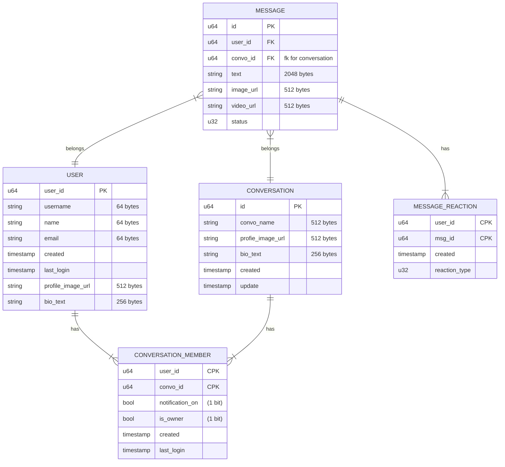
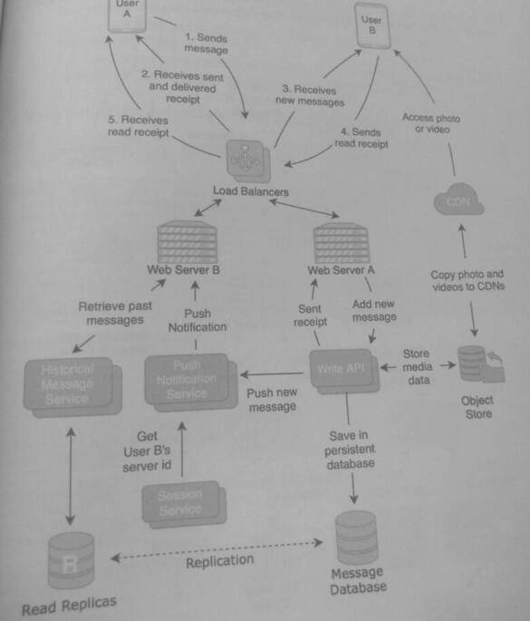
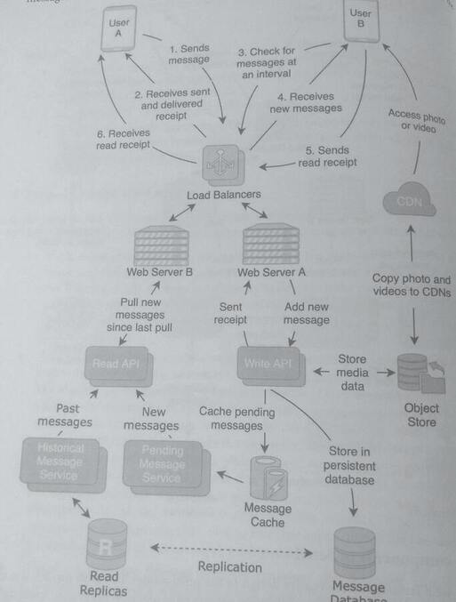
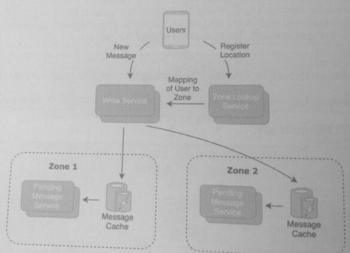

## 28. Design a Messaging Application with Persistent Storage (aka Facebook Messenger and Apple iMessage)

> Messaging apps with persistent storage allow users to browse and retrieve past messages, 
> even if those messages don't exist on their phones. 

### 1. Clarify the problem and scope the use cases

#### Use Cases:
* A user can send a message to another user (one-on-one) or a group of users (group chat).
* Copies of the messages should be stored on the server-side and should not rely on copies on the client-side.
* Users can retrieve past messages on-demand, they can also restore messages to a new device

#### Requirements:
* The system should have high availability and low latency, messages should be delivered within a few seconds.
* Tracks and displays user status: **online, offline, and last seen**.
* Tracks and displays message status: **sent, delivered, and read**.
* Has high consistency and reliability, messages that are not delivered should be **retried**
* Client-side applications should be alerted with push notifications
* Messages can contain photos and videos, these should be held in persistent storage as well.

#### Clarifying questions to ask:
* How many users will use the service?
* Should missed messages be delivered when the user is back online and is there a time limit for ensuring reliable delivery?
* Should image and video max sizes and length?

### 2. Define the data models
The following shows a set of data models that are used for a persistent messaging application.

Messages are organized into Conversations that have one or more users. Message has
an attribute status that can be sent, delivered, or read:

* Sent means that the server has received the message.
* Delivered means that the intended user's device is active and received the message.
* Read means that the user opened the app and clicked into the conversation
  after the message was received.

The sizes of objects are:
* User: 992 bytes
* Message: 3100 bytes
* MessageReaction: 36 bytes
* Conversation: 1304 bytes
* ConversationMember: ~32 bytes

For Message, metadata is held in a database,
and the underlying image or video files are held in object storage.

### 3. Make back-of-the-envelope estimates

#### Users and Traffic
* Assume 300 million MAU use the messaging platform.
* Assume each user sends, on average, 50 messages a day. This means 15 billion
  messages per day or 450 billion messages per month.
* The read-to-write ratio is roughly balanced since most messages are written once and
  delivered to one person. Assume a 3:2 read-to-write ratio.

#### Storage

Assume that each message has 1 reaction on average:
* 450 billion messages per month (3100 bytes + 36 bytes) = -163 GB per month
  = ~1.4 PB per month= -17 PB per year

Assume that 1 in 10 messages contain an image and 1 in 30 messages contain a video. If each image is --5 MB and each video is -100 MB, the estimates for object store usage:
* 1/10* 450 billion messages * 5 MB = 225 PB per month
* 1/30 450 billion messages * 5 MB = 1500 PB per month

#### QPS (Queries per second)
* The number of messages per second written and read per second:
15 billion messages per day / (24 hours 60 minutes* 60 seconds)
 = ~175,000 messages per second

#### Bandwidth Usage
* Inbound (ingress) bandwidth = the number of write requests per-message size:
  175k writes per second (3100 bytes + 36 bytes)
  = ~550 MB per second

* Outbound (egress) bandwidth = read-to-write ratio incoming bandwidth:
  3/2 * 550 MB per second
  = 825 MB per second

* The object storage bandwidth for images and videos:
  1725 PB/(30 days* 86400 seconds) = 665 GB per second
  Though this estimate seems large, most of this bandwidth usage can be offloaded to
  CDNs.

#### Memory

* The memory used by the application servers at any given time should be the combined
  bandwidth of ingress and egress over the time it takes for messages to be delivered or
  stored. Assuming this is 30 seconds:
  30 seconds (550 MB + 825 MB) = ~41 GB

* However, we assume that during heavy and burst usage, we may need to serve 50 times
  the volume of normal steady-state requests. This would mean -2 TB of memory is
  needed during burst periods.

### 4. Propose a high-level system design

In the push model, the server "pushes" messages to devices on the client-side. In the diagram
below, we implement a push on-write design that persists messages on the server-side.

* **Push Notification Service**: unreliably delivers the message on-write to the target
  user(s). Devices that are turned off and users who are not logged in will not receive
  the message. If the message is unable to be delivered, the push service implements a
  retry policy where it retries the delivery of the messages for a limited number of times.
  The time between each retry follows an exponential back off policy.

* **Session Service**: maintains the mapping of the client/device id to the web server. The
  connection between the web server and device is implemented by protocols such as
  *WebSocket* or *long-polling* connection objects. This connection does not persist
  indefinitely but may be destroyed when the user logs out or if there is no activity. The
  instantiation of this connection is often called a *session*, which is a two-way
  communication link between a device and server that allows message exchange in the
  TCP/IP layer.

  A *sticky session* is when the load balancer routes requests of a client back to the same server
  used for the first request of that client. Although web servers are typically stateless, sessions
  are *stateful* since both device and server maintain information about the connection over multiple
  requests. When there is a high amount of bi-directional traffic, such as in a chat application,
  it may be useful to break the stateless design of web servers by using sessions.

* **Historical Message Service**: retrieves messages that occurred in the past. This
  functionality is needed when a user logs in and needs to retrieve the messages that
  were missed during the time that they were logged out. On login, the user sends a
  request to the Historical Message Service with the timestamp of the last message
  received. The service retrieves and delivers messages between the last timestamp and
  the current time.

### 5. Design components in detail
An alternative design to the push model is a pull model, where the client application periodically checks
if the application servers have any new messages, pulling any new ones.

Modifying the original design, we add a Read API and a cache in the diagram below. When a
message is written, it is held in cache since it is likely it will be requested shortly by the target
recipients. User B's device periodically sends a request at a 10 second interval to the Read API

On each request, the Read API checks

1. the message cache for new messages, and
2. the messages database for undelivered messages that were evicted from the cache

The push model may seem more efficient than the pull model as it has lower latency between
the time the message is written and when the message is delivered.

In addition, clients do not send requests when there are no messages.
However, the pull model is preferable in these use cases:

* Clients that have a large number of messages may want to pull the messages at an
interval by batching them together instead of processing the messages one at a time.

* A pull model would offload the retry and login logic to the clients, adding reliability
to message delivery.

* Pull intervals can be customized on the client-side. Clients who want lower latency
but higher QPS can configure the client to pull at a faster interval.

### 7. Identify and solve potential scaling problems and bottlenecks
Users in the same conversation but located in different geographic locations can face
potential scaling problem. In the existing design, the Write API will either keep the message
in cache in the same zone or have the push notification service deliver the message. This
doesn't scale well since messages may be stored in a cache that is not physically close to the
target recipient, causing more cross-zonal traffic.

A solution to solve this scaling problem is to add a "Zone Lookup Service" that helps the write
API place the message in caches that are closest to the receiving users. Devices periodically
send their location to the Zone Lookup Service, which associates a device with the zone closest to it

For a new message, the Write API first performs a lookup of the target user in the mapping
and forwards the message to the zone in the mapping.
