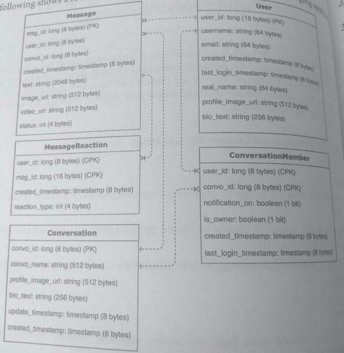

## 28. Design a Messaging Application with Persistent Storage (aka Facebook Messenger and Apple iMessage)

> Messaging apps with persistent storage allow users to browse and retrieve past messages, 
> even if those messages don't exist on their phones. 

### 1. Clarify the problem and scope the use cases

#### Use Cases:
* A user can send a message to another user (one-on-one) or a group of users (group chat).
* Copies of the messages should be stored on the server-side and should not rely on copies on the client-side.
* Users can retrieve past messages on-demand, they can also restore messages to a new device

#### Requirements:
* The system should have high availability and low latency, messages should bedelivered within a few seconds.
* Tracks and displays user status: **online, offline, and last seen**.
* Tracks and displays message status: **sent, delivered, and read**.
* Has high consistency and reliability, messages that are not delivered should be **retried**
* Client-side applications should be alerted with push notifications
* Messages can contain photos and videos, these should be held in persistent storage as well.

#### Clarifying questions to ask:
* How many users will use the service?
* Should missed messages be delivered when the user is back online and is there a time limit for ensuring reliable delivery?
* Should image and video max sizes and length?

### 2. Define the data models
The following shows a set of data models that are used for a persistent messaging application.



```
Message
msg_id, long (8 byte) (PK)
user_id, long (18 bytes)
convo_id, long (8 bytes)
text, string (2048 bytes)
image url, string (512 bytes)
video url, string (512 bytes)

MessageReaction
user : long (8 bytes) (CPK)
mag iet: long (18 bytes) (CPK)
created timestamp: timestamp (8 bytes)
action type int (4 bytes)

Conversation
convo id: long (8 bytes) (PK)
convo name: string(512 bytes)
profie_image_urt string (512 bytes)
bio text string (256 bytes)
update timestamp: timestamp (8 bytes)
created, timestamp: timestamp (8 bytes)

User
user id long (16 bytes) (PK)
usemame: string (64 bytes)
email: string (64 bytes)
created timestamp: timestamp (8 bytes)
last login timestamp: timestamp (8 bytes)
real name string (64 bytes)
profile image url string (512 bytes)
bio text: string (256 bytes)

Conversation Member
user_id: long (8 bytes) (CPH)
convo jd long (8 bytes) (CPK)
notification on boolean (1 bit)
is owner: boolean (1 bit)
created timestamp: timestamp (8 bytes)
last login timestamp: timestamp (8 bytes)
```

Messages are organized into Conversations that have one or more users. Message has
an attribute status that can be sent, delivered, or read:

* Sent means that the server has received the message.
* Delivered means that the intended user's device is active and received the message.
* Read means that the user opened the app and clicked into the conversation
  after the message was received.

The sizes of objects are:
* User: 992 bytes
* Message: 3100 bytes
* MessageReaction: 36 bytes
* Conversation: 1304 bytes
* ConversationMember: ~32 bytes

For Message, metadata is held in a database,
and the underlying image or video files are held in object storage.

### 3. Make back-of-the-envelope estimates

#### Users and Traffic
* Assume 300 million MAU use the messaging platform.
* Assume each user sends, on average, 50 messages a day. This means 15 billion
  messages per day or 450 billion messages per month.
* The read-to-write ratio is roughly balanced since most messages are written once and
  delivered to one person. Assume a 3:2 read-to-write ratio.

#### Storage

Assume that each message has 1 reaction on average:
* 450 billion messages per month (3100 bytes + 36 bytes) = -163 GB per month
  = ~1.4 PB per month= -17 PB per year

Assume that 1 in 10 messages contain an image and 1 in 30 messages contain a video. If each image is --5 MB and each video is -100 MB, the estimates for object store usage:
* 1/10* 450 billion messages * 5 MB = 225 PB per month
* 1/30 450 billion messages * 5 MB = 1500 PB per month

#### QPS (Queries per second)
* The number of messages per second written and read per second:
15 billion messages per day / (24 hours 60 minutes* 60 seconds)
 = ~175,000 messages per second

#### Bandwidth Usage
* Inbound (ingress) bandwidth = the number of write requests per-message size:
  175k writes per second (3100 bytes + 36 bytes)
  = ~550 MB per second

* Outbound (egress) bandwidth = read-to-write ratio incoming bandwidth:
  3/2 * 550 MB per second
  = 825 MB per second
