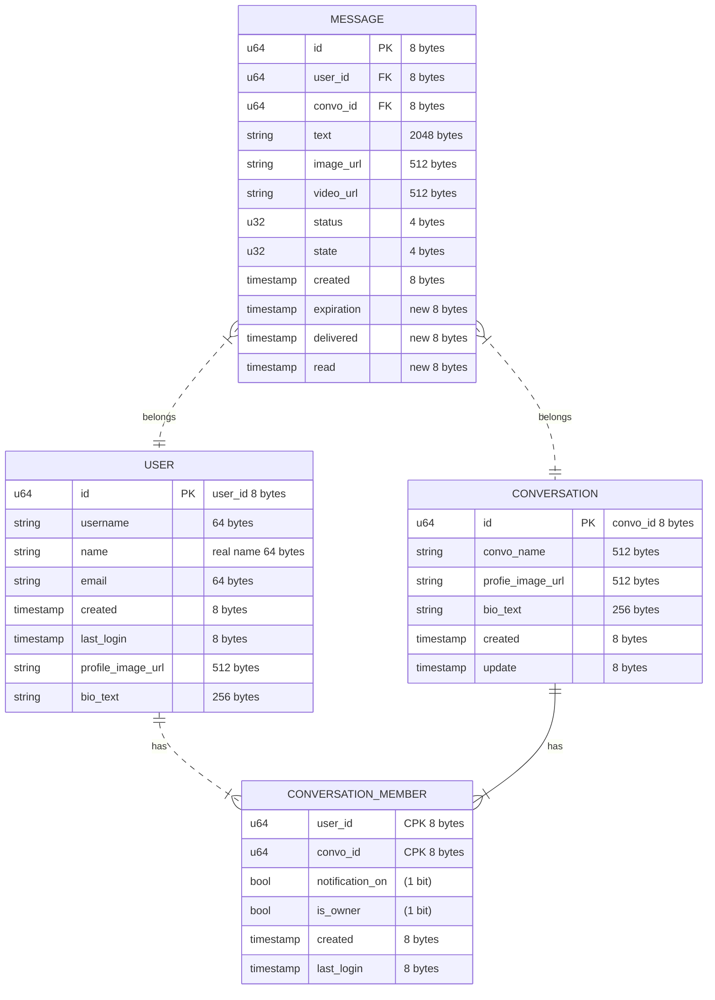
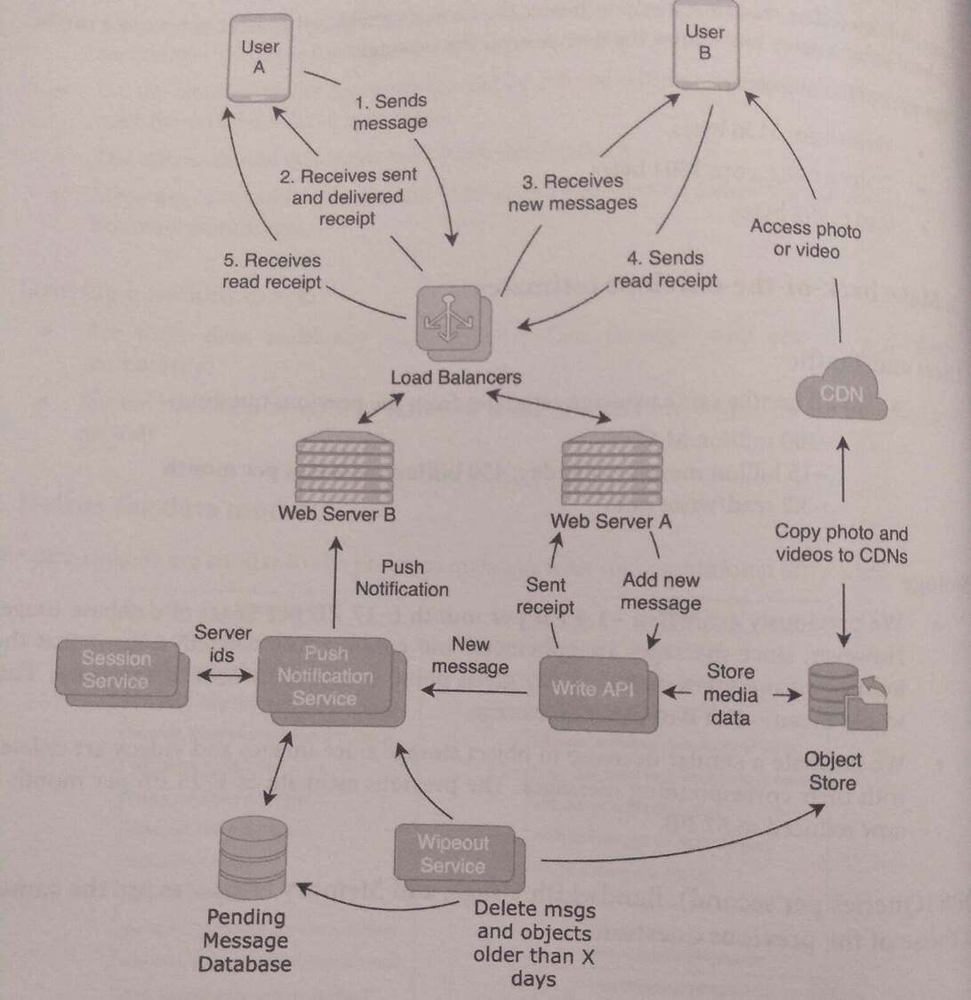
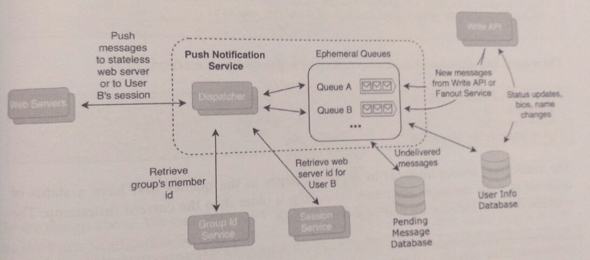
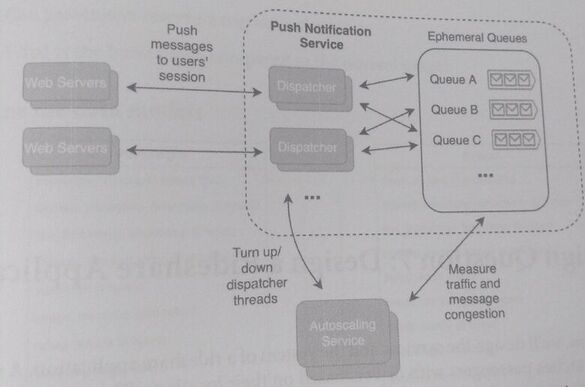

## 29. Design a Messaging Application with Ephemeral Messages - 6

> A messaging application with ephemeral messages are deleted on the client and/or
> the server after they are delivered and read.

> Ephemeral messaging applications are popular among users who value privacy and do not
> wish to have personal data stored anywhere.

> For example, for WhatsApp, after messages are confirmed as delivered,
> message copies are deleted on the server-side, with message copies only remaining stored on the users' phones.
> If both users delete their messages, that message is lost.

> However, in Snapchat, messages are deleted on both the server and the client. The server
> message is deleted once the delivery is confirmed, while the client copy is deleted after the
> recipient reads the message.

> Ephemeral messaging applications also commonly have an expiration feature, indicating when it should
> be deleted on the server, ignoring whether the message was not delivered to or read
> by the intended recipients.

### 1. Clarify the problem and scope the use cases

#### Use Cases:

* A user can send a message to another user (one-on-one) or a group of users (group chat)
* Messages do not persist on the server-side once successfully delivered.
* Messages do not persist on the client once read.

#### Requirements
* The application needs to have high reliability and low latency.
* The server side should delete the message either when it has been delivered to all
  recipients or when it hits a maximum expiration limit, whichever comes sooner.
* On the client-side, the messages should be deleted within a customizable time frame
  once the recipients have read them.
* The clients should be alerted with push notifications.
* Messages can contain photos and videos, and they should follow the same expiration
  behavior as messages.

#### Clarifying questions to ask:
* Are there data residency requirements? Can message data rest in a database
temporarily?

* Should messages be reliably delivered if the user has not logged in for an extended
  period?

### 2. Define the data models
The data models are similar to the previous question with some additional attributes:





The expiration, delivered, and read timestamps are new attributes that will be used by servers
to delete messages on the client and server. 
* The expiration timestamp is the timestamp after which the messages should be deleted, 
  regardless of if the message was delivered or read. 
* The delivered timestamp indicates the time after which server-side copies can be deleted. 
* The read timestamp indicates the time after which the client-side copies can be
  deleted (after a delay of course to allow the user to read the message).

The sizes of the objects are:

* Message: 3136 bytes
* Conversation: 1304 bytes
* User: 992 bytes

### 3. Make back-of-the-envelope estimates

#### Users and Traffic

Use the same message estimates from the previous question:
* 300 million MAU
* 15 billion messages per day, 450 billion messages per month
* 3:2 read/write ratio

#### Storage
* The previous estimate was ~1.4 PB per month (~17 PB per year) of database usage.
However, since messages are ephemeral and continuously deleted, assume that the
number of messages stored at any given point is ~1 day's worth of messages. This
would mean ~47 TB of database storage.

* Estimate a similar decrease in object storage since images and videos are deleted
with their corresponding messages. The previous estimate of 1725 PB per month is
now reduced to 57 PB.

#### QPS (Queries per second), Bandwidth Usage, and Memory estimates are same as previous

### 4. Propose a high-level system design



The above design accommodates ephemeral messages by adding components that delete
messages once they are delivered or read.

* **Push Notification Service**: places messages in ephemeral queues and dispatches them
to user sessions. After confirming the delivery of the message, the messages are
discarded.
* **Pending Message Database**: messages that could not be delivered within a set periol
are placed into the pending database message, to be retried when the user logs in.
* **Wipeout Service**: Periodically checks and deletes expired messages and objects from
the pending messages database, push notification queues, and object storage.

### 5. Design components in detail

The implementation of the push notification service uses ephemeral (temporary) queues to
minige messages and a dispatcher that delivers the messages to users with a FIFO round-robin policy.



The benefits of using temporary queues are:

* Provide a lightweight communication channel that allows threads and processes to
communicate without locks or RPC method overhead.
* Allows a dispatcher to asynchronously deliver messages and control the rate of
processing messages. This regulates periods of high traffic without requiring
additional computational resources.
* Allows better scalability: the service is easily parallelizable since the number of threads
or processes used by the dispatcher(s) can be increased by an arbitrarily large amount
without concerns of race conditions or bottlenecks.
* Queues are created per producer. A round-robin FIFO policy ensures a quality of
service across different message producers and prevents a single producer from
overusing their share of resources.
* When no longer used, queues are automatically cleaned up, matching the
behavior of the ephemeral behavior of the messages.

Temporary queues are a common design pattern used in request-response messaging systems.

The logic for message retries and retrieval should exhibit idempotence, that is, calling the
methods of the push notification service more than once with the same inputs should not
impact the results. 

Additionally, the client-side application should be an idempotent consumer, which is a message 
consumer that can handle duplicate and out-of-sequence messages correctly.

### 6. Write out service definitions, APIs, interfaces, and/or classes
The service definition of PushNotificationService:

```
PushNotificationservice
NewMessageResponse newMessage (NewMessageRequest request)
GetPendingMessageResponse getPendingMessage (GetPendingMessageRequest request)
Renovel xpiredMessageskesponse removeExpiredMessages (RemoveExpired Messageskequest
request)
RegisterSessionResponse registerSession (RegisterSessionRequest request)
GetSessionResponse getSession (GetSessionRequest request)

# The request and response of the removeExpiredMessages method:

RemoveExpiredMessages Request
int64 user_id
int64 convo_id
int64 expiration timestamp

# The notification service attempts to delete messages in the queues that have a status of
# delivered or if the message's expiration timestamp is older than the current timestamp. The
# response contains message ids that have been deleted:

RemoveExpiredMessages Response
repeated int64 deleted_msg_ids
int64 timestamp
```

### 7. Identify and solve potential scaling problems and bottlenecks

The design of the PushNotification Service used queues and dispatchers to
parallelize the delivery of the messages.
* However, intraday and/or seasonal trends of the request traffic can cause possible bottlenecks.
* For example, if there is heavier request traffic during the peak hours from 8 am to 10 am,
and from 5 pm to 7 pm, this may cause system congestion and high latency.

Having intraday peak hours is a common pattern in consumer applications, where users may have 
similar access patterns based on when they wake up and finish work.

To solve this problem, add *autoscaling* (automatic scaling) to the service. Autoscaling is
when the computational resources are dynamically adjusted based on usage.



In the design above, the autoscaling service measures the traffic and congestion experienced
by the Push Notification Service. This can be *measured by metrics* such as 
* **the length of the queues, 
* the average latency of a message delivery, 
* the QPS, 
* the amount of CPU used**.  

If these metrics indicate that the Push Notification Service is near capacity, it will allocate more
threads and CPU to the service by adding more service instances. Similarly, it can reduce service
instances if there is excess capacity.
