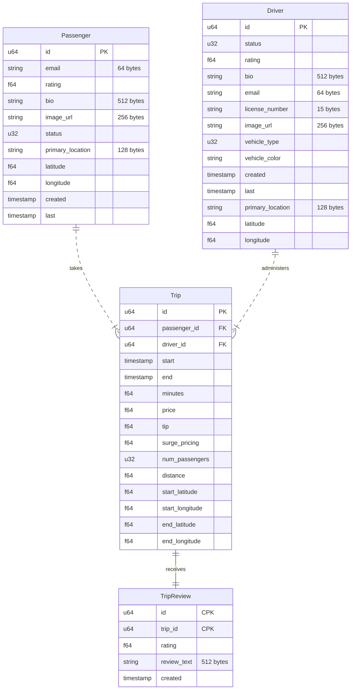
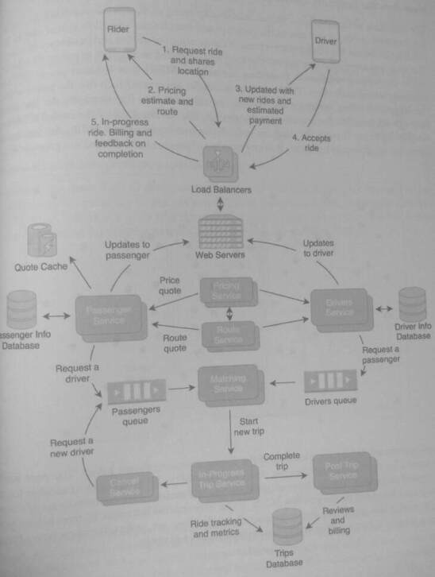
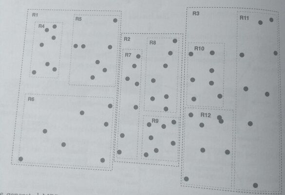
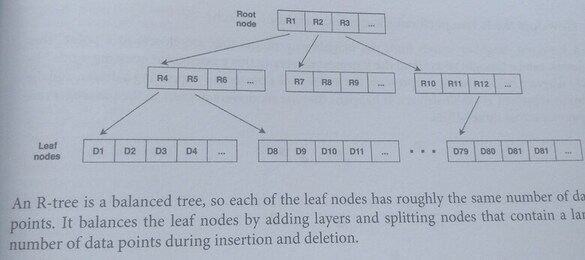
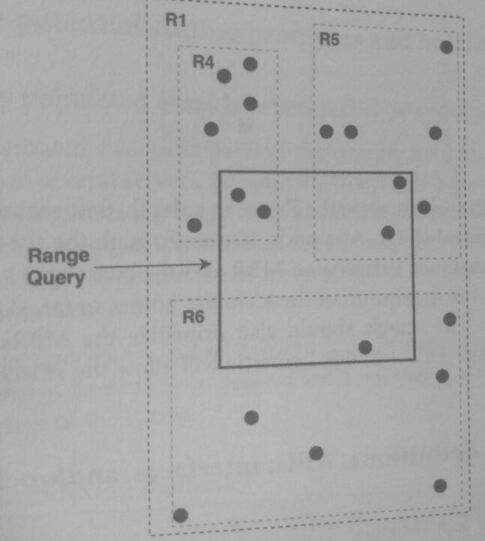
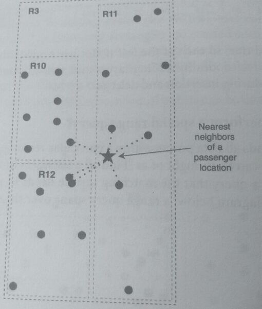

## 30 Design a Rideshare Application

> A rideshare application matches passengers with drivers based on their locations.
> Driver and passenger searches use spatial queries using location information.

> In order to perform a spatial query, passenger and driver data are indexed
> using spatial indices that structure geo data points around their relative
> distances. A spatial index is built using an R-tree data structure designed for
> indexing and querying

### 1. Clarify the problem and scope the use cases
* A passenger requests a driver and is matched with a nearby driver.
* A driver requests a passenger and is matched with a nearby passenger.
* In-progress trips are tracked with metrics.
* Passengers pay for and review the trip on completion.

#### Requirements:
* Spatial queries for nearby passengers and drivers must have low latency.
* The application must handle a large range of passenger and driver densities
  * urban areas that are highly dense
  * rural areas that have low density
* The matching service must be able to perform both nearest-neighbors queries and
  range-based queries.
* The system must handle burst usage / surge pricing when services are in high demand.

#### Clarifying questions to ask:
* Should the system use a spatial database?
* Should the application support passenger pooling or other group features?
* Can passengers reserve a trip beforehand?
* What is the burst usage compared to the normal usage?

### 2. Define the data models

These data models do not track the real-time telemetry measurements of an in-progress trip.
The Passenger data model is used to hold the state and real-time location of a passenger
and the Driver object holds the state and location of a driver and their vehicle. A Trip holds
information about the trip, and each object is 116 bytes.

### 3. Make back-of-the-envelope estimates

#### Users and Traffic

* Assume 100 million MAU use the ridesharing application. On average, each user
makes two rides per month, meaning 200 million trips per month.
* There is a 1:10 passenger-to-driver ratio.
* Assume that in the densest areas, there are over 50,000 users per square mile.
* Assume that in the least dense areas, there may be no drivers or passengers per square
mile.
* Assume that the duration of each trip is 20 minutes on average.

#### QPS (Queries per second)

* The number of trip requests is:
  * 200 million trips per month/ (30 days * 24 hours * 60 minutes* 60 seconds)
  * =~77 trips per second

* Assume that during each trip, the client makes 10 requests per second for telemetry.
  metrics, and ride updates.

* ~77 trips per second 10 requests per second 20 minutes 60 seconds
  = ~920k queries per second

### 4. Propose a high-level system design
Main services descriptions:

* *Passenger Service*: Provides passenger operations such as pickup and destination,
profile changes, historical trips, and estimated pricing.
* *Drivers Service*: Provides driver operations such as estimated earnings per trip,
underserved regions that need more drivers, profile changes, and requesting a passenger.
* *Pricing Service*: Provides price quotes for requested trips. Quotes are estimated based
on demand, trip length, and area.
* *Route Service*: Computes and provides the optimal route from passenger pickup
point to destination point.
* *Quote Cache*: Memory cache that holds recently quoted **prices** and **routes**. 
* *In-Progress Trip Service*: Tracks ride metrics and provides updates during the trip
* *Post Trip Service*: Provides methods for driver reviews, billing, and feedback.
* *Matching Service*: Matches drivers with passengers based on location, rating, route
and trip preference. Performs two types of spatial queries: a range query that finds
passengers and/or drivers in a rectangular area and a k-nearest neighbors search.
* *Passenger/Driver Queues*: Distributed queues that are used to hold requests until
they can be consumed by the Matching service. This buffers the matching service against a 
burst of requests during peak hours, to allow it to consume
the drivers and passengers' requests at a reasonable rate to effectively match.

### 5. Design components in detail
#### How does the matching service perform spatial indexing?

The matching service performs spatial indexing by using an **R-tree (region-tree)**. An R-tree
is a tree data structure that can index geographical coordinates and allow spatial queries, In
the diagram below, the black points represent the locations of drivers and passengers on a map.
The locations are spread throughout the map and clustered at different densities.

The R-tree builds overlapping **minimum bounding rectangles (MBR)** that contains points that are
grouped close to each other. The bounding rectangles are created such that the points within
the larger bounding rectangle are roughly equally divided.
* For example, the bounding rectangle R1 contains the bounding rectangles R4, R5, and R6.
* Each of the nested MBRs has roughly 7 points.

Though the diagram only shows two layers of nested MBRs, the number of layers can be arbitrarily
high such that any number of points can be divided to a granular scale.

These generated MBRs are placed into the R-tree structure shown below. The **root node**
contains a list of the largest rectangles, and each value of the list is a pointer to another list of
the nested rectangles.

The last layer of nodes has the leaf nodes, which contain the list of actual
data points bounded by the smallest MBRs.

Note: R-tree searches over a **region** instead of a **key range** like B-trees.

An R-tree is a balanced tree, so each of the leaf nodes has roughly the same number of data
points. It balances the leaf nodes by adding layers and splitting nodes that contain a large
number of data points during insertion and deletion.

#### How does an R-tree perform a spatial range query?

A spatial range query finds all data points within a particular rectangular area bounded by two
coordinates. This query can be thought of as "Find all passengers in this rectangular area who
need a driver," which is a query that the matching service needs to perform to match drivers
and passengers. In the diagram below, a range query spans over three MBRs.

To find the data points within the range query bounds, traverse the R-tree in a breadth-first or
depth-first approach. At each node, iterate through the list of MBRs, and if an MBR overlaps
the the bounds of the range query, continue to traverse down that node of the R-tree until
the traversal reaches the leaf nodes. At the leaf nodes, append the data point to the results that
fall within the range query bounds. The time complexity for this search is O(log N), where
N is the number of data points.

#### How does the R-tree perform a k-nearest neighbor search?

A k-nearest neighbor search finds the neighboring points that are closest to a point. This
search can be thought of as "Find the k nearest drivers to this passenger requesting a ride." In
the diagram below, the star represents the location of a passenger requesting a driver, and the
points represent available drivers. It happens that the six drivers nearest to the passengers ate
spanned across three MBRs.

To find the nearest neighbors, traverse the R-tree in a depth-first search and hold a sorted list
of the k closest points found so far. At a node, iterate through the list of MBRs and calculate
the minimum possible distance between an MBR and the passenger location. If the distance
from that MBR exceeds the maximum of the k closest points so far, skip that MBR and don't
traverse its child paths. The search should also prioritize the MBRs that have the closest
proximity to the passenger location; this heuristic will allow the search to short-circuit most
of the R-tree.

#### 6. Write out service definitions, APIs, interfaces, and/or classes

### 7. Identify and solve potential scaling problems and bottlenecks

#### Will R-trees in densely populated areas be overloaded by requests?

The R-tree will be a distributed structure: **parts of the tree are held on different servers**, and
queries of the tree can span several servers.

Because the tree is self-balancing, it is unlikely that any single leaf node can be
significantly larger than another leaf node. However, a partitioning scheme can be used
where neighboring MBRs of densely populated areas are *not held by the
same server*. This reduces the overload likelihood if there were a sudden burst of
passengers in a particular location.

Additionally, for the range queries, we can set a dynamic query range that is based on expected
passenger and driver density. In densely populated areas, a range query with smaller bounds
will search a smaller subtree of the R-tree.

### Are there other spatial indexing methods?

While an R-tree is one of the most popular spatial indexing methods, there are other
approaches to building a spatial index.
* The quadtree, which partitions space by recursively dividing it into four quadrants,
  is another method that can be used to index and search two-dimensional space.
* Uber's open-source spatial indexing library, H3, is based on similar concepts
  as the quadtree but uses hexagons instead.

Another simple alternative is to use geohashing, which divides an area into a grid and encodes
latitude and longitude pairs into a string. The main downside is that geohashed areas have
distortion because a degree of longitude near the north or south pole is much smaller than a
degree of longitude at the equator.
