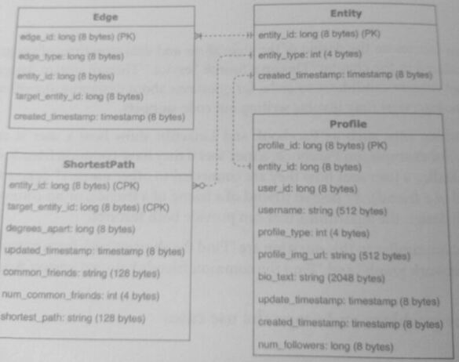
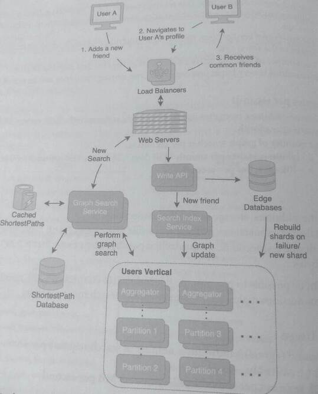
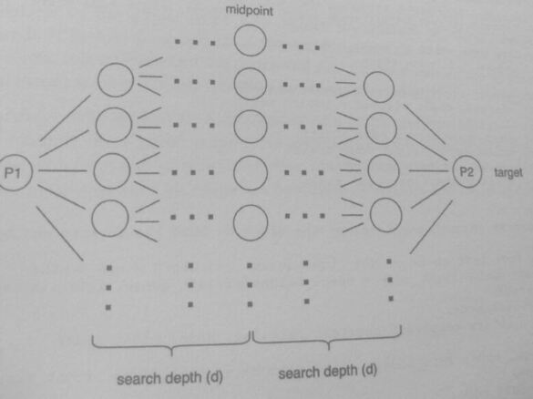

## 31. Design a Social Network Graph Search Algorithm (8)

This question focuses on the design of the algorithms and data structures of the graph search
system introduced in the chapter "Design a Search Service." Also billed as "Find the shortest
path from person A to person B in a social network graph" and "Find the common friends
between person A and person B."

System design questions don't usually require candidates to code, but for questions about 
designing algorithms and data structures, writing out code snippets may be involved.

Social networking sites such as Facebook and LinkedIn show how a user is connected to
another user.

#### Features of interest:
1. *Facebook style* - a user sees if they have common friends with another user.
2. *LinkedIn style* - a user sees how they are connected to other users:
   * 1st degree (friends)
   * 2nd degree (friend of a friend)
   * 3rd degree (friend of a friend of a friend)
   * No connection

### 1. Clarify the problem and scope the use cases

#### Use Cases
* A user logs in and navigates to another user's profile.
* The user is shown how they are connected to the other user: 1st degree, 2nd degree,
  3rd degree, or none.
* The user is shown a list of friends they have in common with the other user.

#### Requirements
* The service should have low latency and be able to retrieve common friends within
  the page load time (~hundreds of milliseconds).
* Friends can be located anywhere geographically.
* Results do not need to be strongly consistent; common friends can be updated with
  eventual consistency.

#### Clarifying questions to ask:
* Should the shortest path between two users be computed on-demand, or should it be
  precomputed?
* Are there privacy features for users who do want to be searched?
* Is there a breadth or depth limit for graph searches of users who have a large network?

### 2. Define the data models
This design reuses the Edge and Entity data models that were created in "Design a Search
Service.

The Profile data model is a sub-type of Entity; entities can be people,
businesses, groups, and interests. This question assumes that a Profile refers to a person
only for simplicity.

An Edge is used to define direct connections between two entities and is used to traverse the
social graph. 

A Shortest Path is used to store the shortest path between two entities and
the common friends they have. It uses a compound key of two entity ids (entity_id and
target_entity_id). The size of Shortest Path is 292 bytes.

### 3. Make back of the envelope estimates
This step will estimate the additional cost of the graph search and the common friends

#### Users and Traffic
* Assume 500 million MAU registered users.
* On average, assume each user has 300 friends, which means *150 billion edges*.
* For 2nd-degree connections, this means a total of 300 300 500 million=-45
  trillion possible Shortest Path entries, assuming the worst case of no friend
  overlaps.
* For 3rd-degree connections, this is ~13.5 quadrillion possible Shortest Path
  entries in the worst case.
* The number of possible Shortest Path entries for 2nd and 3rd-degree
  connections is very large; precomputing and storing them may not be possible.

#### QPS (Queries per second)
* Assume each user navigates to about 50 profiles per month. This means 25 billion
  searches per month.
* The number of graph searches per second is:
  25 billion searches per month/ (30 days * 24 hours * 60 minutes 60 seconds)
  = ~10k searches per second

#### Storage
Estimating the additional storage cost of the connections:
* 2nd degree connections: 45 trillion possible Shortest Path * 292 bytes = ~13 PB
* 3rd degree connections: 3.5 quadrillion possible Shortest Path 292 bytes= ~4
  Exabytes

While it might be possible to precompute the 2nd-degree connections, the number of possible
3rd-degree connections makes an on-demand graph search more sensible.

#### Bandwidth Usage
* Outbound (egress) bandwidth = number of search requests per second * size of 
* Shortest Path:
    10k searches per second 292 bytes=-3 MB per second

### 4. Propose a high-level system design
In the design below, the Graph Search Service handles requests for searches between two
profiles. This service first checks if a Shortest Path between these two profiles already
exists in the cache or in the database. If there is not in either, the system performs a graph
search across the Users Vertical. Unlike an inverted index search, where the search is a
keyword lookup, a graph search needs to traverse a graph.

In the Users vertical, each partition is responsible for a subset of the graph, and resources In
rebalanced based on usage. For each graph search request, a partition performs a breadth first
search (BFS) across the subset of the graph. If the search needs to cross partition boundares,
a partition forwards the request to the other partition, and the aggregator combines the res
from both partitions,

### 5. Design components in detail

In a graph search, each entity is represented as a **vertex**, and each **edge** 
represents how vertices are connected. To find the shortest path in
a normal BPS graph search, the service performs a search in one direction from the **source
vertex** (P1) to the **target vertex** (P2) to find the shortest path.

The number of connections each vertex (person) has is called the **branch factor (b)**, and this
was previously estimated as 300 friends. The **search depth (d)** is how many layers away from
the source vertex to perform the search. In a normal BPS, this would mean a space and time 
complexity of 0(b^d) since each level increases the search by a multiple of b.

A more efficient approach would be to perform a bidirectional search, which is a graph search
algorithm that runs two simultaneous searches: 1) a forward search from the worcenter,
and 2) a backward search from the target vertex. The goal of the search is to meet in the middle,
and by performing both forward and backward searches, the time and space complexity of
each search is O(b^d/2), for an overall complexity of O(b^d/2+b^d/2)=O(b^d/2). This complexity is
much less than O(b^d), especially for large values of b and d.

The cost of a bidirectional search can also be reduced by adding heuristics to early terminate
the search. A common heuristic used in bidirectional searches is to end search paths that are
known to not be the shortest path. For example, if a common friend between P1 and P2 is
found, any path that is greater than one connection away should not be explored.

For our design, we are interested in connections up to the 3rd degree. This means that the
search can be early terminated at d=2 for both the forward search and backward search. If the
searches have not converged, that means there is no path between the two users shorter than
the 3rd degree.

### 6. Write out service definitions, APIs, interfaces, and/or classes
Bidirectional search

Each vertex is represented by a Person Node, which maintains a dictionary of friends. The
previous_node member variable is used to track the shortest path from the source vertex
to the target vertex..

The bidirectional search iterates through the forward and backward searches simultaneously.
If an overlapping vertex is found, that means the shortest path has been found.

### 7. Identify and Solve Potential Scaling Problems and Bottlenecks

A potential bottleneck is users that have a large number of connections (ie, millions of
friends)
* Implying => a large branch factor b, and a high time complexity
* Further improving the bidirectional search through additional heuristics
  can mitigate the bottleneck.

For example, a nearest neighbor grouping score that measures the proximity of vertices in the graph could 
help reduce the amount of exploration in a bidirectional search. If part of the graph has a score that 
indicates it is far from the source vertex or target vertex, it is unlikely that the search will find a 
mutual connection in that part of the graph, and those searches in those branches can be terminated early.

Bidirectional searches can be applied to many shortest path graph problems that have edges
and vertices. For example, this algorithm applies to optimize location-based searches, such as
finding the shortest path from one location to another in applications such as Waze, Google
Maps, or Uber. For these problems, locations can be treated as vertices and roads as edges.
