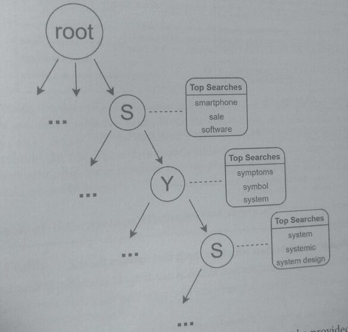
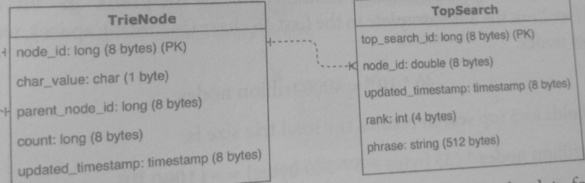
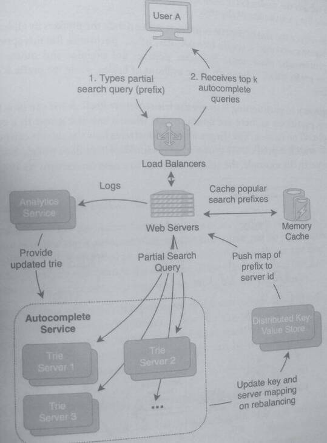
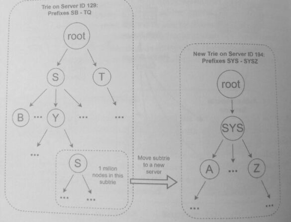

## 32 Design an Autocomplete System

> Autocomplete, also known as "typeahead," is a common feature in searches, spellchecks, and
> IP routing.

> In searches, the autocomplete feature shows the most frequently searched phrases
> below the search box. If a user types "fra," the most frequently searched
> phrases shown could be "fraggle rock," "fracking" and "frame".

> Autocomplete is a problem that involves tracking, caching, and/or calculating the
> frequency of user input and calculating the top inputted queried sentences.

### 1. Clarify the problem and scope the use cases

#### Use Cases:
* A user types a partial search phrase in a search engine.
* As the user types, the autocomplete shows the most frequently searched phrases that
  have the partially typed phrase as a prefix.

#### Requirements:
* Provide the top k search terms prefixed with the user's input.
* Results of the previous top searches must be provided in real-time with low latency.
* The total number of search terms is too large for a single server to hold.

#### Clarifying questions to ask:
* What are the latency requirements of the autocomplete results?
* Should the autocomplete be personalized based on the user's location, personal
  information, and search history?
* Is this autocomplete only for the English language only?

Should the autocomplete include commonly mistyped phrases

### 2. Define the data models

The main data structure used to build an autocomplete system is a trie.

A trie is an ordered tree data structure commonly used to associate string keys with data.
A trie is comprised of nodes, where each node represents a character and has children
(or "leaves") that represent the next character.

A trie is also known as a "prefix tree" because, during a trie traversal, each node's
character is appended to the accumulated path string, creating a prefix. 

A trie is critical to the data model designs.

For terminology, we'll refer to an incomplete search query as a "search prefix," or the
partial search string that the user has typed so far.

In an autocomplete, a single trie can be used to track search strings, where each node
represents a character of the search string. The trie starts with a root node, and as the user
types a character, the traversal proceeds further down the trie. When a user finishes typing and
enters the search phrase, that node is considered a terminal node, and the phrase's frequency
in the counter is incremented. The following diagram shows a visualization of what traversing 
down a trie looks like if the user types "sys." As the user continues to type, the top search 
terms change to match the prefix of what has been type so far.



One of the requirements for autocomplete is that the results must be provided in real-time,
*which usually means a latency lower than 100 milliseconds*. 

This requirement means that the system can't look up the top search terms after the user has 
entered the search but instead must hold the lists of the most frequent search terms at each node. 

If the nodes did not hold the list of top search phrases, all children nodes of a node would 
need to be traversed to find the top search phrases.

Here are code variable descriptions for a trie implementation.

* terminal node = the trie node of the completed search phrase
* k = the number of top search results to track
* query = the partial search string that ends at the node, aka. the "prefix"
* top_queries = the list of the top search phrases with the prefix of query
* count = the frequency that query has been entered
* children = a map that holds the next possible characters and their nodes

TrieNode has a method to update the list of top searches. The terminal node, which contains
the completed search phrase, is appended to the list and sorted. To store the trie in a database,
we could use the data models:



```
TrieNode
node_id: long (8 bytes) (PK)
char_value: char (1 byte)
parent_node_id. long (8 bytes)
count: long (8 bytes)
updated timestamp: timestamp (8 bytes)

TopSearch
top_search_id: long (8 bytes) (PK)
node_id: double (8 bytes)
updated timestamp: timestamp (8 bytes)
rank: int (4 bytes)
phrase: string (512 bytes)
```

TrieNode holds the data of a single node, and TopSearch holds the data for a single top
search phrase associated with that node.

When the trie is built, children nodes are formed by using the parent_node_id;
the data model does not need to explicitly hold the children node ids to rebuild
the trie. 

These data models allow the trie to be serialized and establish a one-to-many relationship 
between nodes and top search phrases. A TrieNode is 33 bytes, and a TopSearch is 540 bytes.

### 3. Make back-of-the-envelope estimates

#### Users and Traffic

* Assume 300 million MAU perform searches and use the autocomplete feature.
* Assume that each user performs ~50 searches per month. This means *15 billion
  search phrases* per month.
* For each search phrase, assume that autocomplete is triggered on average 2 times per
  phrase. This means *30 billion autocompletes per month*.


#### QPS (Queries per second)

* The number of autocompletes per second is:
  30 billion autocompletes per month / (30 days * 24 hours * 60 minutes 60
  seconds)
  = ~11.5k autocompletes per second

#### Bandwidth Usage
* Assume that k (the number of top search results per partial phrase) is 5.
* Outbound (egress) bandwidth = number of autocompletes* size of top search results:
    11.5k autocompletes per second * 5 * 540 bytes
    = -31 MB per second

#### Memory & Storage

If the trie is built for the English language only, there are 96 possible unique characters. We
can assume that only 40 of the characters are commonly used in search; special characters such
as "%$-@&" don't frequently appear in search phrases. Similarly, we can assume that after the
first character, there are only 10 valid characters typed frequently enough that they need to be
included in the trie.
* For example, the trie shouldn't include the prefix "gz" but does need the prefix "ga."
* If we limit the autocomplete to the first 15 chars (including space), we can estimate
  the number of nodes:
  * 40* 10 = 4000 trillion nodes
If each node holds k-5 top search results, the total trie size is:
  * 4000 trillion nodes (33 bytes + 5* 540 bytes) = ~11000 PB

The exponential nature of the trie quickly becomes a scaling problem where a
single or group of servers may not be able to hold the entirety of the trie in memory (or
storage), even when the autocomplete is limited to just 15 characters.
  * One option is to simply reduce the trie by not including paths that are of less
    frequent searches. Additionally, language rules can be applied to reduce trie phrases
    that are misspelled. However, even if heuristics limit the trie size, the design should
    be able to handle a distributed trie that is managed by a cluster of servers.

### 4. Propose a high-level system design

The estimates we made in the previous step indicated the entire trie could not be held by a
single server, so the trie must be distributed.

Smaller parts of the trie, called "sub-trie" or "partitioned trie," are held at different nodes.
One approach to dividing the distributed trie between the nodes is to use a solution similar
to database sharding: splitting the trie by prefix alphabetically.

Create a distributed key-value store to associate trie prefixes with server ids. In the key-value 
store, an example of the mapping of a prefix to a server id is shown in the following table:

|Prefix Range | Server Id |
|----         | ----      |
| A  - ACZ    |     1     |
| AD - BTWK   |     2     |
| ...         |     ...   |
| ZWT - ZY    |     192   |
| ZZ -        |     193   |

In this table, anything that falls in the prefix range in alphabetical order will be associated
with the corresponding server. 
* prefix AB would fall in the range of A-ACZ and correspond to server id 1. 

Using the table mapping, the trie is distributed amongst different servers, where each one is 
responsible for part of the trie search.



Web servers use the distributed key-value store to route the request to the proper trie server
that holds the prefix with the request.

A memory cache on the web server tier stores and returns the most frequently searched prefixes,
reducing traffic to the trie servers. The analytics service is used to update the trie based on
new searches from the logs.

### 5. Design components in detail

#### What happens when the trie for a single server grows and becomes too large for the server to handle?

The initial design picked prefix intervals that were reasonable and would divide the trie into
nodes roughly the same size. However, as more searches are made, more prefixes are added to
the trie, and some prefix ranges may have a sub-trie that grows too large. We can't manually
track and rehash the nodes every time a trie grows too large and need to devise an approach
to automate the partitioning of the trie.

One way to reduce the size of the trie is to continue to divide the prefixes by alphabetical order
so that if A grows too large, A is split into AA, AB, AC,... partitions. But this approach quickly
becomes problematic since some character prefixes are popular and others are not.
* the prefix WHAT will mostly have millions of nodes, while the prefix RZTYV should have very few.

A better approach to partitioning is to use the trie structure itself. A trie can be arbitrarily split
into as many partitions as there are nodes so that when a sub-trie grows to a certain size, it
should be split off on its own.

The diagram below illustrates how the subtrie can be rebalanced:
* If the subtrie with the prefix SYS grows to a threshold of 1 million nodes, it is moved to a
  separate server.
* In the example, the subtrie is moved to a new server with ID 194.



For the nodes to the left and right of the moved sub-trie, they can be left on the same server,
both SB-SYRZ and SYT-TO map to server ID 129 in the new distributed key-value store table
below,

| Prefix Range | Server Id |
| ---          | ---       |
| A - ACZ      | 1  |
| AD - BTWK    | 2  |
| ...          | ... |
| SB - SYRZ    | 129 |
| SYT - TQ     | 129 |
| ...          | ... |
| ZWT - ZY     | 192 |
| ZZ           | 193 |
| SYS - SYSZ   | 194 |

This approach can be used to continuously divide and partition the trie based on size and
traffic.

#### How does the analytics service update the trie?

While a trie that self-updates on-search the top k results of the prefixes of a search entry would
provide the most accurate top k autocomplete results, this might not be practical or necessary
in a system with billions of requests per month. As billions of searches are performed, it's
unlikely that a single search will change the ordering of the top k results. The analytics service
batch updates the trie by processing the logs and updating the trie periodically.

The analytics service runs a daily job that processes all the search logs using MapReduce. After
counting the frequency of the search phrases, a new trie can be placed in the autocomplete
service. In merging the historical search phrase frequencies with the new search phrase
frequencies, an exponential weighted-moving average can be used such that recent search
queries count for more than historical searches.

### 6. Write out service definitions, APIs, interfaces, and/or classes
The AnalyticsService batch updates the trie. 

The MapReduce job produces a list of search queries and their associated weight in the trie, 
which are then used to update the trie nodes

In this question, we've designed both a batch and an online approach to updating the trie. 
* If the product needs real-time updating where the autocomplete could change quickly (e.g.. new
  sites or blogs), then online updating might be a suitable approach.
* If the autocomplete is for an established product where an incremental search will unlikely impact 
  the results, then batch updating with MapReduce is the better approach.

### 7. Identify and solve potential scaling problems and bottlenecks

One possible scaling problem is that the computational cost of updating the trie on each search
may be high. The analytics service fixes this by processing logs using MapReduce to batch update the trie offline. 
These updates are performed by an independent service not in the request path since they are offline.

Our partitioning approach was based on the trie size instead of the traffic quantity; a small trie
with a popular prefix can result in heavy traffic to a single server.

A solution to mitigate this scaling issue is to explicitly account for search phrases that fall
under the "heavy-hitter" category: the small percent of search phrases that account for a
large percent of the total volume of searches.

For example, heavy hitters are the top 5% of search phrases that account
for 80% of the search volume. These top phrases can be tracked on a continuous rolling basis
and explicitly placed in a *cache*, which would reduce the chance of a single trie server becoming
overloaded.
