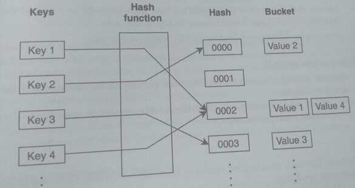
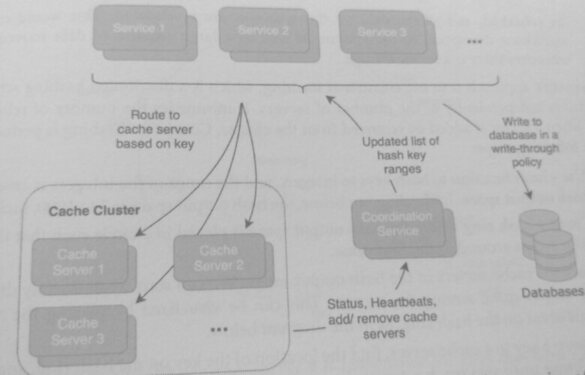
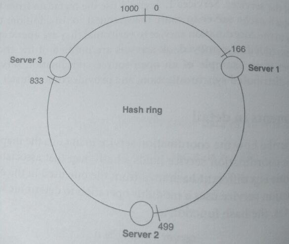
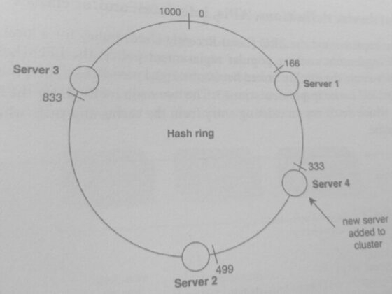
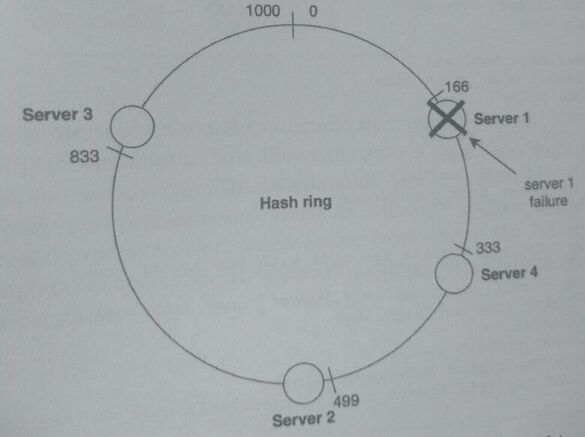
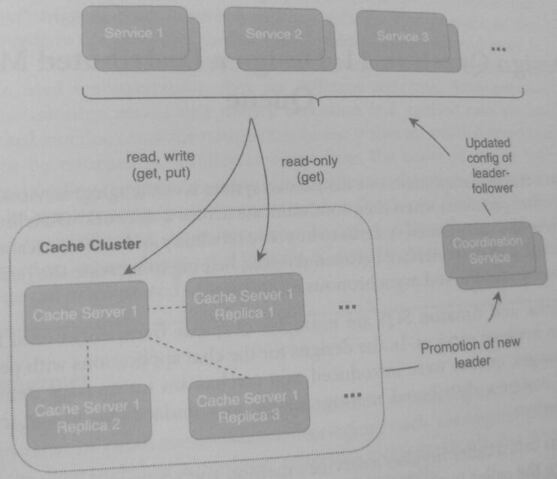

33. Design a Distributed Cache (10)

> Caches keep data and objects in memory to reduce requests to databases and services.
> A local cache is physically located on the machine or server of the service instance.
> Internally a cache can use different data replacement strategies such as

* LRU - Least Recently Used (most popular)
  * Tracks entries by last access time and discards oldest entries when cache is full
* LFU - Least Frequently Used
  * Tracks entries by how many times entry was accessed and discards entries with lowest
    counts when cache is full.
* MRU - Most Recently Used
  * May be useful in a system where data is read only once (okay read it, now clear space)
* FIFO - First in first out
  * discards the oldest entries, w/o considering how often they are accessed
* LIFO - Discards the newest entries.
  * Like MRU, works best when reads on an entry are temporally not clustered
* Random
  * Discard entry chosen at random

Also caches can be updated based on different write strategies such as
* Write Through
  * both db and cache are written to simultaneously
* Write Back
  * cache written to first, and then eventually the database through data synchronization
* Write Around
  * db written to first, and then the cache gets the update on cache miss

A single machine is limited to vertically scaling, and for some applications, the cache size
requirements may exceed the capacity of a single server.

An alternative is to distribute the cache among different servers, and this is called a
distributed cache. The machines used to host a dedicated distributed cache are, in aggregate,
called a cache cluster. Redis and Memcached are popular open-source cache solutions that
support both local and distributed caches.

### 1. Clarify the problem and scope the use cases
#### Use Cases:
* The cache keeps data in memory, and responses from a cache lookup have an order of
  magnitude lower latency than database queries.
* Services access and update the cache with get and put operations, respectively.
* *The required size of the cache exceeds the memory and capacity of a single machine*.

#### Requirements:

* The distributed cache should be scalable, highly available, and performant.
* The cache should have a replacement policy that is suitable for web services
* The system should support get and put operations across regions and zones.
* Eventual consistency is allowed as a tradeoff for high availability and performance

#### Clarifying questions to ask:
* Should the cache be accessible in network partitions?
* What is the consistency model during these partitions?
* Should the cache data survive hardware failures?
* Should the system contain read replicas of the cache?

### 2. Define the data models

A distributed cache does not persist any data or objects to databases, as they are held in
memory.

In memory, the cache holds data in a key-value map called a hash table (or hash map).

A hash table is a data structure that associates keys to values. It uses a hash function to
compute a hash (or hash code) from a key and uses the hash to identify the location where the
value associated with the key is stored, aka a bucket. A good hash function will assign a key
to a unique bucket, but there might be collisions where multiple keys are assigned to the
same bucket.

A good hash function should also have uniformity ~ it maps keys to output hashes as evenly as
possible such that no single hash has a high probability of having more keys associated with it.

The goal of a hash table is to provide a structure that can look up a key with a time complexity
faster than 0 (log n), the time complexity of a sorted search, where n is the number of
elements in the structure. For a hash table, the average time complexity for search, insert, and
delete is O (1)

This is usually the case if the hash function distributes the keys uniformly with
minimal collisions. The worst-case time complexity is O(n) for search, insert and delete; this
is the case when the hash function results in many collisions.

*Hash Terminology Clarification*

A cryptographic hash function is a type of hash function. It has several
security properties, such as **low collision** and **unique hash output**. It is a
one-way function that makes the hash output infeasible to reverse. It is
used for security purposes such as digital fingerprinting and
authentication. Examples of cryptographic hash functions are MD5 and SHA-1. 

In this design question, however, we will use a non-cryptographic
hash, which is a normal hash function that attempts to avoid collisions but
doesn't have the same security guarantees as a cryptographic hash. In
return for weaker security guarantees, non-cryptographic hashes are
typically much faster than cryptographic hashes. 

Since the cache's hash table is used as part of an internal system, there is less need for security and
having some hash collisions is acceptable. An example of a non-
cryptographic hash is CRC16.

### 3. Make back-of-the-envelope estimates

#### Users and Traffic
* Assume 100 million DAU that use services that call the distributed cache.
* Assume that the request access patterns have high temporal locality and that all
  requests within the past 2 hours should be kept in the cache.
* Assume a read-heavy workload with a 20:1 read-to-write ratio

#### QPS (Queries per second)
* Assume each user makes 10 read requests per day to the services that use the
  distributed cache:
  * 1 billion read requests per day / (24 hours * 60 minutes * 60 seconds)
  = ~11500 reads per second

#### Memory
* Assume that each read request results in cache data of 10 MB. Over two hours, the
  cache size needed is:
  * 11500 reads per second * 10 MB * 7200 seconds= ~830 TB

* This required size for a cache exceeds the capacity of a single server or machine.

### 4. Propose a high-level system design

Design a cache cluster dedicated to caching data for other services. By
separating the cache from the services, the design allows for loose coupling of functionality:
resources of the services and the cache can be isolated and scaled separately. Additionally, the
cache can be used as a shared resource by multiple services. In our previous design of a local
cache, servers held the cache on the same machine as the service instance. Though the system
did not need to dedicate specific machines for the cache, co-located caches were tied to their
service instance and thus were more difficult to scale.

In the design below, the coordination service is a component that manages the servers of the
cache cluster. Some of the service's responsibilities include synchronizing configurations and
coordinating actions among the servers.

The coordination service holds the list of available cache servers and the mapping of key ranges
to cache servers. This mapping is called the cluster's metadata, which is periodically updated
and sent to each of the services. Services 1, 2, and 3 use the metadata from the coordination
service to check which cache server to route their request to. In addition, the cache servers
send status updates to the coordination service to verify that they are operating in a good state.
As cache servers are added or removed, all services are notified of the change through the
metadata. Zookeeper is an example of an open-source coordination service that manages
metadata, performs distributed synchronization, and provides other cluster services.

### 5. Design components in detail

The coordination service maintains the mapping of key ranges to cache servers. Specifically, the 
coordination service holds a hash map that associates a key range to a
cache server cache (this is a different hash map from the one used in the cache to hold data).
Suppose the coordination service uses a modulus operation to determine which server should
hold which keys; that is, the hash function is:

> server # = key % n

where n is the number of cache servers. For example, if there were 20 cache servers, the key
8392 would be associated with cache server 12 because 8392 % 20 = 12. While this approach is
simple and evenly divides the key space, it has drawbacks:

* While the key space is evenly divided, this does not mean that the load is evenly
  balanced. The access patterns of the keys might be non-uniform and non-random,
  and some cache servers could become overloaded.

* Whenever a cache server is added or removed (i.e., during maintenance or downtime),
  this causes many keys to be rehashed. For example, if cache server 12 experienced a
  failure and went offline, another server would need to take over its load. Depending
  on the failover strategy, this may mean that all keys on servers 13 to n would need to
  be rehashed, and all the data on those servers are invalidated. This would cause
  significant disruption to the system, as well as a large amount of data movement
  whenever there is a server change.

An alternative approach is to use consistent hashing, which is a distributed hashing scheme
that behaves independently of the number of servers. It minimizes the number of rehashes
needed when a server is added or removed from the cluster. Consistent hashing is performed
with the following steps:

1. Use a hash function to hash keys to integers, and the range of the integers is called the
   **hash output** space. In the diagram below, the hash output space is 0 to 1000, inclusive
2. Create a **hash ring** where the hash output space is placed in a circle such that the last
   value wraps around to the first value.
3. Place the cache servers in the hash output range. We can start by uniformly dividing
   the output space among the servers. This can be visualized by placing the servers
   equidistant on the hash ring, as in the diagram below.
4. To map a key to a cache server, find the location of the key on the hash ring, and move
   clockwise until you reach a server. For example, if a key hashes to value 982, moving
   clockwise, this key would be associated with server 1.
   

Server 1 is responsible for the keys that hash from 834 to 1000 and 0 to 166, Server 2
responsible for the keys that hash from 167 to 499, and Server 3 is responsible for the keys that
hash from 500 to 833. Consistent hashing is considered a better hashing scheme because fewer
keys are rehashed when servers are added or removed from the cache cluster. In the diagram
below, a new server (Server 4) is added to the cluster.

Using the consistent hashing scheme, Server 4 is responsible for keys that hash from 167 to
333, taking over part of the hash output space of Server 2. While keys from 167 to 333 need to
be rehashed from Server 2 to Server 4, the keys for Server 1 and 3 have stayed intact, and the
keys from 334 to 499 have stayed on Server 2.

The same approach applies to removing a server. Suppose that Server 1 experiences a failure
and is removed from the hash ring. The keys that hashed to Server 1 (834 to 1000 and 0 to 166)
will now be hashed to Server 4. The existing keys on Servers 2, 3, and 4 have stayed intact.

In both the server addition and removal scenarios, consistent hashing resulted in fewer
rehashes and less disruption to the system than modulus hashing. In practice, servers in a
cluster are continuously added and removed due to maintenance or scaling, and consistent
hashing is a critical tool to redistribute the hash output space among servers.

### 7. Identify and solve potential scaling problems and bottlenecks
Some keys in the cache may receive a high amount of traffic compared to other keys, causing
hotspot. A cache server with a hotspot might become overloaded by requests, lowering its
erformance and availability. One approach to mitigate this problem is to use replication with
leader-follower relationship between a cache server and its replicas. The cache server is the
propagation.

The read replicas are read-only and can handle get operations, and the leader can handle
both get and put operations. This allows the system to achieve high availability despite
hotspots within the cache server. The coordination service is used to maintain the metadata
tracking which servers are leaders and which are followers. If the leader fails, the cluster uses
a consensus-based process to elect a new leader from one of the followers. This change is
reflected through the coordination service so that the services are aware of the new leader that
handles put operations.
