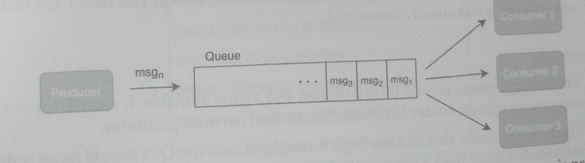
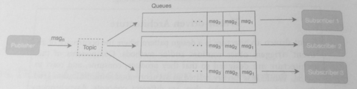
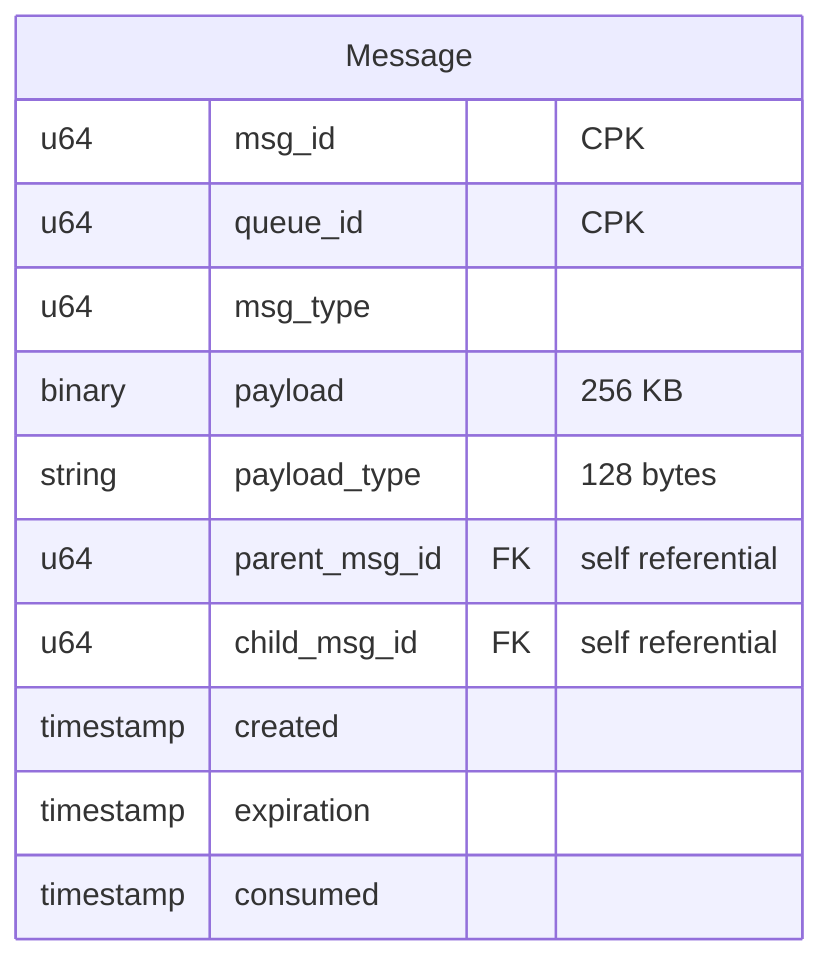
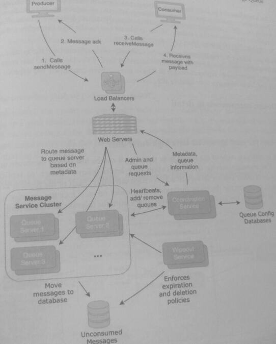
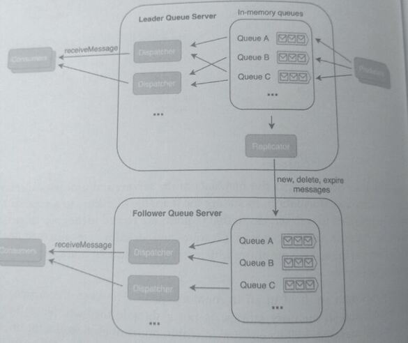

### 34. Design a Distributed Message Queue (11)

Coordination between components of a distributed system is challenging: services have errors,
failures, and other problems when they communicate across a network. 

**Distributed queues** are commonly used in distributed systems to improve reliability and increase 
scalability. These queues are used as a shared interface between services, helping to increase 
the resiliency of the system by allowing scalable and asynchronous messaging.

**RabbitMQ, Kafka, and Amazon SQS** are examples of queue frameworks used for network
communication between services. In the designs for the chat applications with persistent and
ephemeral messages, queues were introduced as a mechanism for message delivery. In this
question, we'll design a distributed message queue and understand how it increases the
resiliency of a system.

In a *synchronous call*, a caller invokes a service's method and waits for the service to complete
the request. Once the caller is notified that the method has been completed, the caller moves
on to the next request.

* The caller is blocked until the request is completed; this is a blocking call.

For synchronous messaging, a similar paradigm happens between producer
and consumer: one service produces a message and waits for another service to consume the
message. While synchronous communication is simple and easy to implement, there are
drawbacks:
* The producer and consumer may process messages and data at different rates. Both
  would be constrained to the slower rate.
* The producer and consumer may have disparities in resources and how quickly they
  need to process the messages. For example, logs that are generated by a service may
  not need to be processed immediately, and it makes more sense to delay processing
  the logs so that they can be batched.
* Poor parallelization. If there are multiple producers and consumers, coordinating
  their actions synchronously is challenging.
* Computational resources might be wasted or inefficiently used since the producer is
  blocked until the consumer completes the task. The producer would either be idle or
  make a context switch.

In contrast, in asynchronous communication, a caller invokes a service's method and moves
on to the next request immediately. In this design, a queue holds the request/message so that
the consumer service can process the request at its own pace. The caller makes a non-blocking
call because it can continue to the next request without waiting

*Event-driven Architecture*

Event-driven architecture is a design pattern where the occurrence of an
"event" triggers other routines and/or methods. Components of this
architecture are designed so that they produce, consume, and react to
events. While it is closely related to asynchronous communication (and
often used synonymously), they are different concepts. Asynchronous
communication means that routine execution and method calls are not
blocked and don't wait for returns/responses. It also means that responses
might be returned in a different order from the order in which their
corresponding requests were sent. 

However, event-driven architecture can also be synchronous; the listeners (event handlers) 
would need to process requests serially and return responses in order. Although we made this
distinction, event-driven architecture is usually asynchronous so that
events can be processed concurrently,

*Producer-Consumer*

A distributed queue is used for both producer-consumer messaging and pub-sub (publisher-
subscriber) systems. 

In producer-consumer messaging, each message/request is processed only once. In the diagram below, 
a producer generates messages by placing them onto a queue that has three consumers processing the 
messages concurrently.

There can be multiple producers and consumers in this design, but each message is processed
*by only one consumer*. This design allows for asynchronous message production and
consumption and is suitable for applications where messages are similar to tasks and need an
at-most-once" processing behavior.

*Publisher-Subscriber*

In contrast, in a pub-sub (publisher subscriber) application, a publisher creates a message, and
subscribers have an "at-least-once" processing behavior. That is, all subscribers should receive
that message. 

In the diagram below, the publisher broadcasts a message to a "topic" that subscribers 
have opted to listen to. Each subscriber has their own queue, and the system
*multiplexes* (simultaneously transmits multiple messages from a single channel) each mesage
to all queues of the subscribers that listen to the topic.

Both designs use queues to allow for asynchronous messaging, but pub-sub broadcasts the
message to multiple subscribers. In this design, we'll use a distributed producer-
consumer messaging system, but the same concepts can be extended to the pub sub system design.

### 1. Clarify the problem and scope the use cases

#### Use Cases
* A service produces a message, sends the message to the queue, and the message is
  consumed by another service.
* The producer and consumer generate and consume messages at differenl rates.
* The consumer may take hours or even days before it consumes the message. The
  message must be persisted until it is consumed or reaches expiration
* For a few days after the message is consumed, the consumer can replay the message
  even though it was already consumed.

#### Requirements
* The message queue must be distributed and highly available. It should survive and
  continue to operate under hardware failures and network partitions
* The message queue must have high throughput, and the QPS must be an order of
  magnitude higher than a similar database solution.
* The message must be performant. The latency overhead of the queue must be minimal
  minimal and must be on the scale of network latency.  
* Messages sent to the queue must be durable; they must not be lost even if the queue
  is destroyed or has a physical hardware failure.
* Queues must be horizontally scalable; an increase in QPS can be handled by
  increasing the number of queues.

#### Clarifying questions to ask

* What type of delivery guarantees should the queue provide?
* What is the expiration period before the system can delete the message?
* Is there a storage limit or a maximum number of messages held by the queue?
  * For example, if there are no consumers and only producers, at what point
    does the system start discarding old messages?
* What type of message ordering should be guaranteed if the queue is asynchronous?
  Should the queue support different message orderings (ie, priority-based)
  other than FIFO?

2 Define the data models
Messages of a distributed queue are held in memory. However, if the queue nears capacity or
message remains unconsumed for an extended period, older messages are placed into a
database to free up memory for new messages.

If the system placed all messages into a database
immediately after receiving them, the system would simply be offloading the workload to a
database. This would not fulfill the requirement for a performant solution that can be achieved
with an in-memory queue.

Messages that need to be persisted to the database use the following data model:

The size of a message is ~256 KB, and the attributes are:
* payload: binary data that can be cast into any arbitrary type using the
  payload_type attribute.
* parent_meg_id and child_mag_id: used to associate multiple messages
  together. These attributes are useful if a single large payload needs to be sent over
  multiple messages.
* queue_id: used to associate a queue with the message so that consumers can process
  unconsumed messages that have been moved to the database.
* consumed_timestamp: if present, indicates that a consumer has already
  processed this message.

3. Make back-of-the-envelope estimates
Users and Traffic
* Assume 100 million DAU use services that use the distributed queue.
* Assume that each user makes, on average, 10 requests per day that each result in a
  message added to the queue.

QPS (Queries per second)

* 1 billion messages per day / (24 hours 60 minutes 60 seconds)
  =-11500 messages per second

Memory

* Assume that the system imposes a 30-day limit (TTL) until message expiration,
  regardless of if the message was consumed.
* Assume that 90% of the messages are consumed within 24 hours.
* Over 24 hours, the max amount of memory needed is:
  11500 messages per second 256 KB 24 hours= -254 TB

#### 4. Propose a high-level system design

In the design below, in-memory queues are held and managed by queue servers. The Message
Service Cluster is designed for asynchronous producer-consumer communication: producers
send messages through the sendMessage method, and consumers receive messages
through the receiveMessage method at their own rate and timing. The producer can also
delete messages that have already been sent, and the consumer can replay messages that have
been consumed but not yet deleted.

The coordination service manages the metadata of the servers and processes administrative
requests. The metadata information, including the mapping of queues to servers, is held in a
database and is provided to web servers so that requests are routed to the correct queue server.
Administrative requests such as queue creation and deletion are also handled by the
coordination service; the service monitors which server has the least traffic so that new queues
are created on that server.

Newly arrived messages are held in an in-memory queue. However, the capacity of queue
servers is limited, and in-memory storage is not a durable medium. Since there are no
guarantees that the messages will be consumed within hours or even weeks, the unconsumed
messages database is used to store messages if a queue reaches its allocated capacity.

An alternative design is to store every message in a database and retrieve each message when
a consumer makes a request. However, storage schemas of databases are typically not well
suited for a FIFO, consume-once access pattern. A pure database design would also offload the
scalability problems to the database. While databases can handle high throughput, they have
worse latency performance than an in-memory queue.

Wipeout service is a background service that deletes messages from both the queues and the
unconsumed messages database that have exceeded their TTL. One of the use cases of the
message queue was to replay messages that have already been consumed; the wipeout service
does not delete messages immediately after consumption.

### 5. Design components in detail
#### How does the message service have high durability?

If there is only one copy of the message in memory, it can be lost due to hardware or server
failure. The message service uses replication in a leader-follower design to replicate the
messages to N other replica servers to achieve high durability. Each of the replicas keeps the
messages in memory for the same duration as the leader server. Once the message has been
received or expired, the replicator deletes the copies from the follower servers as well.

There are two different types of replication:

* *Synchronous replication*: the producer waits for the replication to complete before
sending the next message. This approach has higher latency but achieves higher
durability since the producer confirms that the message has been replicated to the
other servers.

* *Asynchronous replication*: the producer moves on to the next message immediately
after sending a message. This approach is more performant since the producer does
not wait for the message to be replicated, but there is also a possibility that the message
can be lost.

#### Does the consumer push or pull new messages?
In a pull model, the consumer repeatedly calls receiveMessage to consume the next
message. In a push model, the consumer is notified that there is a new message, which triggers
it to call receiveMessage. Both approaches are valid: the pull model is easier to implement
but might make many calls that return empty, and the push model may make more sense in a
system that has low traffic.

### 6. Write out service definitions, APIs, interfaces, and/or classes

### 7. Identify and solve potential scaling problems and bottlenecks
#### Are there guarantees about message delivery order?

If all producers and consumers made methods calls synchronously and serially, it would be
possible to guarantee that the messages are delivered in a FIFO (first in first out). However,
because the message queues have been designed to be asynchronous, the existing design does
not guarantee a FIFO order. The sendMessage and receiveMessage methods may not be processed in the same 
order that they were called in. 

In general, distributed message queues do not guarantee a strict ordering of messages. Message 1 
might be produced before Message 2, but Message 2 might be consumed before Message 1.

Imposing this FIFO requirement may be a bottleneck for scaling this design. It would require
adding a layer of logic that checks the sequence of the messages received and delivered. This
additional overhead could limit the throughput of the distributed queue. 

Additionally, message order guarantees are difficult to achieve with replication; it would require a
coordinator to track which messages have been consumed in the replicas and synchronize this
information with the leader and other replicas.

A distributed message queue is a building block of asynchronous and high throughput
systems. Some distributed message queues are marketed as temporary databases, and their
flexibility as both a performant solution and durable storage is why they are commonly used
in systems.
