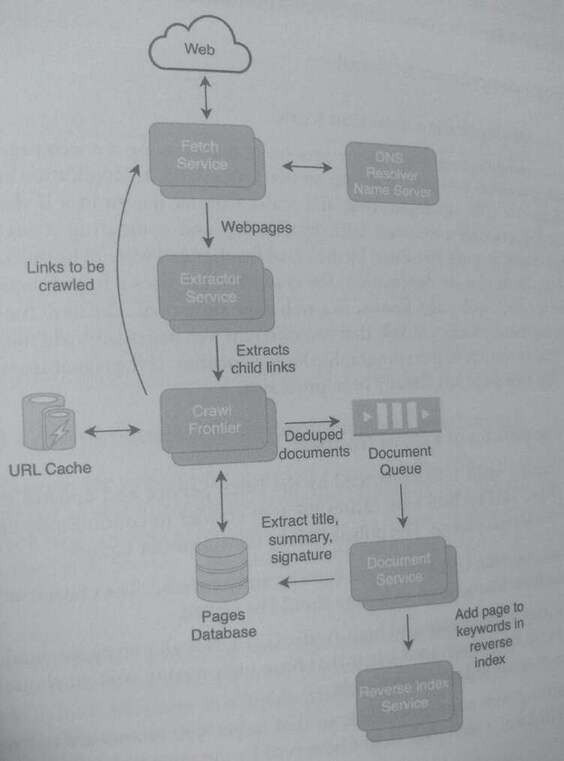

## 35. Design a Web Crawler 12
> A web crawler is an application that systematically browses the web with the goal of indexing
> content.

> A web crawler starts with a list of seed links that are reputable websites with known
> behavior.

> When the crawler processes a link, it extracts the child links from the link's
> web pages, which are structured HTML documents.

> These child links redirect to other web pages, which are subsequently processed by the crawler.

> Web crawlers are commonly used by search engines to download and learn about web pages
> of the World Wide Web that can be added or updated in the search index.

The World Wide Web is the collection of web pages connected through URLs and uses the HTTP protocol for
transferring HTML. The World Wide Web is one of the services provided by the Internet,
which refers to the physical network of computers. There are other Internet services such as
e-mail, FTP, chat, and telnet that are outside of the scope of the web crawler.

### 1. Clarify the problem and scope the use cases
#### Use Cases:

* The web crawler browses, downloads, and stores web pages.
* The web crawler extracts the title, summary, and links from a web page. It also
  identifies multimedia content such as images and videos
* A user or service inputs a search term and sees the relevant web pages based on
  keywords.

#### Requirements:

* The web crawler should run with high availability.
* The web crawler should be able to determine if a web page is similar or a duplicate of
  an existing web page.
* The web crawler does not browse web pages that are excluded from robots and
  automated browsing.
* The web crawler should be able to detect infinite loops that occur when URL are
  cyclical.
* The web crawler should be respectful of its traffic on web pages and throttle its
  requests to a single web server.

#### Clarifying questions to ask:

* How does the web crawler handle pages that are only slightly different from each
other? Should they have different indices?
* Will the web crawler results be used to create a search index for personalized searches
or anonymous users?
* How does the ranking algorithm for a search engine integrate with the crawler?

### 2. Define the data models

The Page data model encapsulates how a page is stored and processed by the web crawler.
The crawler generates a signature for cach page, allowing it to compare if the web page has
been processed before. The child pages of a page and the graph of how URLs are connected
can be generated with the parent_page_id and parent_url attributes.


```
Page
page_id: long (8 bytes) (PK)
ut string (500 bytes)
signature long (8 bytes)
duplicate_page_id: long (8 bytes)
updated_timestamp: timestamp (8 bytes)
parent ut string(500 bytes)
parent_page_id: long (8 bytes)
contents: bytes (500 KB)
Keyword
keyword id: long (8 bytes) (CPK)
page_id: timestamp (CPK)
ranking: timestamp (8 bytes)
keyword_text: string (100 bytes)
updated_timestamp: timestamp (8 bytes)
```

### Make back-of-the-envelope estimates

#### Users and Traffic
* There are over 50 billion web pages and over 2 billion websites; a large percent of web
  pages are duplicates or generated on web page templates.
* Assume that there are 5 web pages per website that are relevant to the web crawler.
  This means 10 billion unique web pages to crawl.
* Assume that the web crawler needs to check each web page at least once a week to
  ensure that the content is updated regularly. This means that the web crawler needs to
  crawl -40 billion web pages a month.

#### QPS (Queries per second)
* The number of web pages that the crawler needs to process per second:
40 billion web pages per month / (30 days 24 hours 60 minutes 60 seconds)
=-15,000 web pages per second

#### Storage
* Assume that each web page is about 500KB. A web crawler generally exclude
multimedia files and only retains the text and metadata for a web page.
* 10 billion web pages 500 KB=-5 PB

#### Bandwidth Usage
• -15k web pages per second 500 KB = 7.5 GB per second

### 4. Propose a high-level system design



The main services are:

* Fetch Service: retrieves web pages based on a URL list provided by the Crawl Frontier.
  The service either persists the HTML document to a database or stores it in memory.
  It uses a set of high authority seed URLs to initialize the crawl.
* Extractor Service: extracts the hyperlinks (child links) from the HTML document.
* Crawl Frontier (URL Frontier): executes the logic and policies of the crawler,
  determines which URLs should be visited and the set of child links to be crawled.
  Deduplicates URLs that have been recently visited.
* Document Service: Process the HTML document and generates the title, summary,
  keywords, and signatures. Updates the Pages database and calls the Reverse Index
  Service.
* Reverse Index Service: Maintains a reverse (inverted) index of content to page_id
  and is used by the search engine to rank pages.
* DNS Resolver Name Server: maps a hostname to an IP address.

### 5. Design components in detail
#### How does de-duplication detection work?

De-duplication detection, which is the process of determining if a web page is a duplicate of
or similar to another web page, happens on two levels: URL de-duplication and document de-
duplication. 

For URL de-duplication, the crawl frontier determines if the current URL is
similar to a previously processed URL by filtering and comparing strings. URLs that are
considered duplicates are discarded by the crawl frontier and will not be processed by the Fetch
Service. 

For document de-duplication, the crawl frontier uses a hash function to compute a
hash value for each web page, known as a web page signature. The hash function is designed
so that it is mathematically unlikely that two different web pages will yield the same hash value,
a process that is similar to a cryptographic hash algorithm. If the signature is not unique, it is
likely that the web page has already been processed.

#### What are the policies of a crawl frontier?

The crawl frontier visits URLs provided by the Fetch Service and updates the Fetch Service
with new URLs. This cyclical loop causes the web crawler to continuously crawl and update
content for the search engine. The policies of the crawl frontier include:

* Avoid crawling URLs that have been recently crawled. The crawl frontier has policies
  about how frequently a web page should be visited.
* Prioritize high-quality and high-traffic URLs. Not all web pages should be updated at
  the same frequency; web pages that have high-quality content should be prioritized
  more than an unknown web page.
* Throttling web page downloads so that target web servers are not overloaded. The
  child links of a web page might be served by the same web servers as the parent web
  page. If the crawler makes repeated requests to a web server within a short period, it
  may overload the web server. The web server may ban or block the web crawler because of this 
  access pattern.
  
To achieve these policies, the crawl frontier uses both FIFO and priority queues to sort links
sent to the Fetch Service. 

The FIFO queues prevent burst requests: child links to be crawled are placed at the end of the queue, 
thus allowing a timeout period between successive requests to the same web server. 

> Additionally, the crawl frontier calculates a score for each child link
> based on its estimated quality and the urgency of a refresh crawl. 

The priority queues are sorted using this score, which allows high-quality links to be crawled more frequently than low-
quality links.

### 7. Identify and solve potential scaling problems and bottlenecks
Unlike most DNS clients, the web crawler processes a large number (billions) of URLs. Public
DNS resolvers may not be able to handle the requested traffic and may ban the web crawler if
it attempts to make a large number of requests. 

One option to resolve this bottleneck is to add DNS cache to the Fetch Service. This cache would 
hold mappings of hostnames to IP addresses, and this would reduce the number of requests the 
Fetch Service needs to make to the DNS resolver.

Another bottleneck is that the latency of web page retrieval is limited by the target server.
which could take seconds to respond. To crawl the required 15k web pages per second, the
web crawler needs to fetch webpages in a highly parallelized environment to account for the
delay that it takes for the server to respond.
