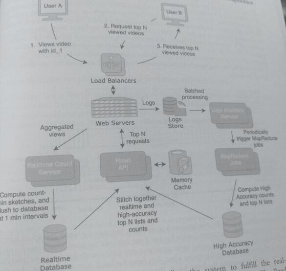
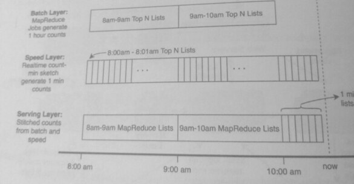
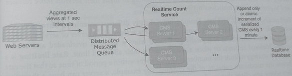

## 36. Design a System that Tracks the Most Frequently Accessed Items (13)

> Designing a system that tracks the frequently accessed items is a popular system design
> question (aka "Top N," "heavy hitters," "most popular items," or "real-time view
> count.")

> It is commonly used to create "Top N" lists for a large number of items in real-time using
> limited space.

* YouTube has over 5 billion videos. What are the top 100 most viewed videost
* Amazon has over 100 million products. What are the top 100 bestselling product?
* Facebook has over 1 trillion posts/news items. What are the most liked or trending
  items?
* Twitter has over 200 billion tweets per year. What are the most popular tweets this
  year?
* Spotify has over 80 million songs. What are the top 100 most listened to songs

> Each question can also be answered over different time ranges. What are the top N items in
> the past 5 minutes, 1 hour, day, week, month, and all-time?

> A core aspect of this problem is that these Top N items need to be computed in real-time. The
> system needs to compute the top N items quickly and efficiently but is allowed to give up some
> accuracy in return for these constraints.

Possible approaches:

* Why don't we increment a counter for each item and then sort them?
  Using a hash map from item id to count seems to be the most straightforward
  approach; however, it runs into a scaling problem because hash maps have O(n) space
  complexity. Suppose we use this approach to find the top tweets of the year. Suppose
  each counter uses ~100 bytes, which includes tweet metadata and the counter. Hence
  the memory requirements would be 200 billion tweets per year * 100 bytes = 200 TB,
  which might exceed capacity for a single server to track and sort in real-time.

* This tracking and sorting also must be performed for multiple time ranges and
  categories ( the top tweets about cats in the past week). The number of
  permutations of Top N lists increases the space requirements exponentially, the
  approach doesn't meet the real-time requirement, nor does it scale well. The sheer size
  of the sampling space makes it infeasible to keep a counter for each sample.

* Why don't we perform a MapReduce on the logs?
  In "Autocomplete" and "Core Components" MapReduce was used to count the frequency of
  search phrases. While MapReduce can generate counts of each item by processing the
  system's logs, this is performed offline,by batching the logs. This doesn't meet
  the real-time requirement; a real-time count needs to process streams instead of logs.

* Why don't we subsample the data?
  Since the requirements for accuracy have been relaxed in this question, one approach
  would be to subsample the data and extrapolate. For example, we could stagger the
  counting so that each item's count is only incremented for 1 out of every 10 minutes.
  We could then multiply the count by 10 to estimate the actual count. 
  
  Though this would reduce the computational cost of the counting, it doesn't change the cardinality
  of the problem. That is, the number of items still stays the same, and the system still
  has the same memory and scalability issues. Additionally, there may be statistical bias
  and errors in the extrapolation if the usage is non-uniform or occurs in bursts.

* Why don't we maintain distributed counters and then aggregate them?
  Distributed counters would need to be aggregated and sorted, effectively turning this
  approach into the MapReduce approach. Additionally, the real-time requirement
  suggests that the counts be precomputed instead of requiring aggregation and sorting.

This question centers around trading accuracy for greater efficiency in limited space, 
a certain probabilistic data structure: the *count-min sketch (CMS)* solves this. A *sketch* is a
data structure that can keep a large amount of data in constant space but at the cost of accuracy.

### 1. Clarify the problem and scope the use cases
#### Use Cases
* A service tracks and returns the top N items by count that've been viewed, liked, or
  accessed.
* The top N items should be computed for multiple time ranges, including the past 5
  minutes, 1 hour, day, week, month, and all-time.
* The items can be partitioned into categories and sub-categories. The top N of each
  category and sub-category should be tracked as well.

#### Requirements
* The top N list should be updated and computed in real-time.
* The counts do not need to be accurate, but +/-10% is a tolerable margin of error.
* The system should be able to scale to trillions of items.
* Services of the system should be performant and have high availability.

#### Clarifying questions to ask:
* What are the in-memory limitations of the syste? to thats sprock chemple and the
  the design should aim to achieve?
* Is there a preference between overestimating or underestimating the
* What is the latency requirement of real time?

### 2. Define the data models

A count-min sketch is a probabilistic date structure used to keep track of counds. It can
represent a large set of data n with a constant space complexity that is less than O(log n)

It's part of a class of data structures called *sketches* that compresses data but loses data
accuracy. There are two parameters in a count-min sketch: height and width, which will
determine the accuracy of the estimates.

The height refers to the number of unique hash functions, and the width is the range of
output for each of the hash functions. The outputs of each of the hash functions map to the
same range of discrete output values. When there is
an event (eg, a video view, a tweet view, or an online purchase), the id associated with that
item (the video id, the tweet id, or the product id) is hashed by all of the hash functions and
the count of the (hash function, hash output) pair is incremented.

To visualize the count-min sketch as a table, rows are the hash functions, and hash outputs
are columns. The table values correspond to the count of each (hash function, hash output)
pair. For example, if there were 80 values hashed, a count min sketch table can be visualized
with the table below. Note that each row adds up to 80 since each value is hashed by each
hash function once.


To illustrate how a count-min sketch works, suppose we have a count-min sketch with a
height of 4 and width of 5 that is used to track video views. A height of 4 means that there
are 4 hash functions h1 to h4.

A width of 5 means that each of the hash functions outputs an integer value from 1 to 5.
Suppose a view for video id 1 occurs, and afterward, a view for a video id 2 occurs.
The count min sketch hashes each of the video ids using the hash functions and gets
the following hash outputs:

> h1(id1)=2, h2(id2)=4, h3(id1)=3, h4(id1)=1

> h1(id2)=4, h2(id2)=1, h3(id2)=3, h4(id2)=5

For each of the (hash function, hash output) pair, the corresponding count in the table is
incremented, as shown in the following illustration. In total,
four values are incremented for the view of id_1, and four values are incremented for
the view of id_2. The table below on the left shows how the count-min sketch looks after the
first view, and the table on the right shows how it looks after the first and second views.

|    | 1 | 2 | 3 | 4 | 5 |
|----|---|---|---|---|---|
| h1 | 0 | 1 | 0 | 0 | 0 |
| h2 | 0 | 0 | 0 | 1 | 0 |
| h3 | 0 | 0 | 1 | 0 | 0 |
| h4 | 1 | 0 | 0 | 0 | 0 |

|    | 1 | 2 | 3 | 4 | 5 |
|----|---|---|---|---|---|
| h1 | 0 | 1 | 0 | 1 | 0 |
| h2 | 1 | 0 | 0 | 1 | 0 |
| h3 | 0 | 0 | 2 | 0 | 0 |
| h4 | 1 | 0 | 0 | 0 | 1 |

This might seem a bit counter-intuitive: why do we hash each video id 4 times and increment
4 different counts for each view? It seems like this method is doing more work instead of just
incrementing one single counter. The reason for the additional counts is that to minimize the
space complexity of a large-scale system, the count of the hashes of different video ids will
overlap. Note that the count-min sketch does not keep track of the video id, so even if we need
to track views of billions of videos, the space complexity of the count-min sketch stays the
same.

To retrieve the estimated count, calculate the hash values for the item id, and then take the
minimum of all the counts of the (hash function, hash output) pairs. Formally, this is

```
count(x) = min^height(i=1) count[h1(x)]
```

To retrieve the view count for video id_2, use the same hash values from before, and find the
counts of each of (hash function, hash output) pairs

|    | 1 | 2 | 3 | 4 | 5 |
|----|---|---|---|---|---|
| h1 | 0 | 1 | 0 | 1 | 0 |
| h2 | 1 | 0 | 0 | 1 | 0 |
| h3 | 0 | 0 | 2 | 0 | 0 |
| h4 | 1 | 0 | 0 | 0 | 1 |

Taking the min of all the counts: count (id_2) = min ([1, 1, 2,1]) = 1.

As the height and width of the count-min sketch are increased, the probability of hash
collisions decreases, and the accuracy of the count increases. However, the space complexity
Because of hash collisions, some of the estimated counts will be greater than the actual count
of the count-min sketch is height width: there is a tradeoff between space and accuracy.

Taking the minimum of the relevant counts reduces the overestimation, but there will still be
some over estimation because there are fewer (hash function, hash otput) pairs than is. A
*count-mean-min sketch* is a variant of a count min sketch and attempts to reduce this
overestimation by subtracting a fraction of the column mean from the estimate

In order to store the count-min sketch in a database, the table needs to be serialized. The
serialization of a table will not be covered in this chapter.

### 3. Make back of the envelope estimates
We can estimate the memory difference between a system that uses a count-min sketch and
one that uses a hash map.

#### Users and Traffic
* Assume that there are 4 billion videos on YouTube.
* Assume 1 billion DAU users watch 1 video a day.
* This means the total view count will increase by 1 billion each day, or 30 billion a month

#### QPS (Queries per second)
* The number of view requests per second is:
  1 billion views a day / (24 hours 60 minutes 60 seconds)
  =-11500 views per second

#### Memory
* Assume each counter uses about 100 bytes, which includes metadata of the item.
* Assume that N=1000 (the number of items in the Top N list).
* Assume there are 200 categories and 10 time ranges. The system will not need to track
  separate counts per time range but does need to for each category.

* The upper limit of memory usage for a hash map containing all the counts, per category is:
    4 billion videos * 100 bytes * 200 categories = 80 TB

* For a count-min sketch with a width of 20000 and height of 500, memory usage is
    20000 * 500 * 100 bytes * 200 categories = 200 GB
  The count-min sketch uses ~ 0.25% of the memory of the hash map.

### 4. Propose a high-level system design
The design below shows two types of counts computations:
* A fast and inaccurate count is performed by the Realtime Count Service, which uses
  the count min sketch structure discussed in the previous steps.

* A slow and accurate count is performed by the Logs Analytics Service and MapReduce
  jobs, which batch process logs files periodically,



The two different data processing pipelines allow the system to fulfill the real-time
requirement but also maintain the accuracy of the counts in the long term. The Read API
Stitches together the real-time top N lists with the batched top N lists with a sorted merge and
holds the merged lists in a cache.

The web server aggregates the views in 1-second intervals before sending them to the Realtime
Count Service. This is a common design pattern in real-time data processing each layer of a
data processing pipeline will perform a degree of aggregation and send the aggregated data at
lover frequency to the next layer. The Realtime Count Service also aggregates the count-min
sketches at a 5-minute interval before updating the Realtime Database.

Updating the count-min sketch in each database from multiple servers is straightforward: cach
cement of the count-min sketch can be added elementwise to an existing count-min sketch to
get the summed count-min sketch.

### 5. Design components in detail

Having two separate paths for data processing is a common approach to handle large volumes of
data and is called lambda architecture, Lambda architecture consists of three layers; batch,
speed, and serving, A system with lambda architecture merges one data processing path that is
fast but inaccurate with another data processing path that is slow but accurate.

The MapReduce Jobs are the slow, accurate path and is the batch layer. The goal of the
batch layer is to process large amounts of data with completeness and accuracy.

The Realtime Count Service is the fast data processing path and is the speed layer. The goal of the
speed layer is to process data streams and sacrifice completeness/accuracy for speed. The Read
API is the serving layer, which responds to requests and combines the data of the batch
and speed layers.



The diagram above visualizes one approach to stitching together the batch and speed layers

The batch layer generates accurate counts for one-hour intervals but takes 30 minutes for each
batch process to execute. The speed layer generates real-time counts for 1-minute intervals
with a count-min sketch. For the times when data from the batch layer is lagged or when the
batch layer is still processing the latest batch, the serving layer merges the speed layer's data.


### 7. Identify and solve potential scaling problems and bottlenecks

The Realtime Count Service may not be able to handle traffic bursts and a sudden large
increase in views. Though there is aggregation on the frontend web server layer, additional
unique video ids will add processing time to the count-min sketch servers. The web server and
the Realtime Count Service process the requests and perform aggregation at different rates.



One possible solution to this bottleneck is to use a component that we designed previously, a
distributed message queue. Adding a queue allows 

1. the web servers to asynchronously put messages that contain incremental view count 
   updates in the queue, and 
2. the Realtime Count Service can consume those messages at its own rate. 

The diagram above shows how multiple servers can be used to consume the view count messages and update the Realtime database.

#### Sketchy structures
Sketch data structures are becoming more common in system design as
the volume, variety, and velocity of data increase. Storing or computing
data in its entirety is not as useful as better space complexity at the cost of
some accuracy. 

Other popular sketch data structures are *bloom filter* and the *hyperloglog*:

* The bloom filter is used to test if an element is in a set. It can generate false
  positives, but not false negatives. 
* The hyperloglog is used to determine the approximate cardinality of a set (set size).

Both sketch structures use a small amount of memory compared to their accurate counterparts.

