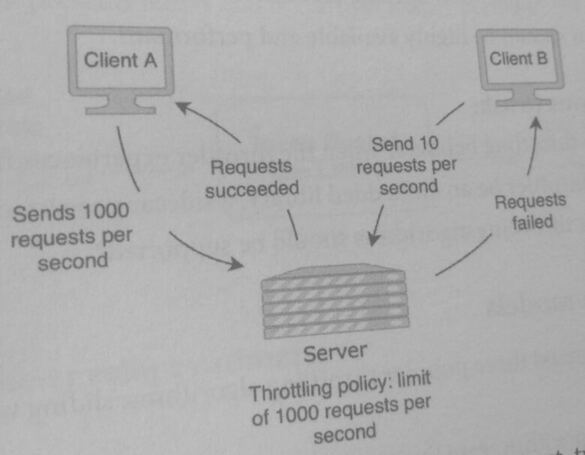
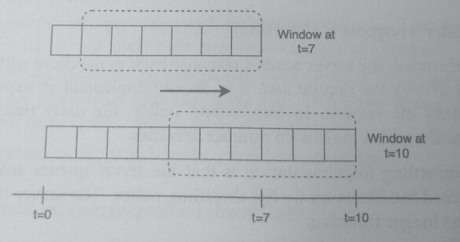
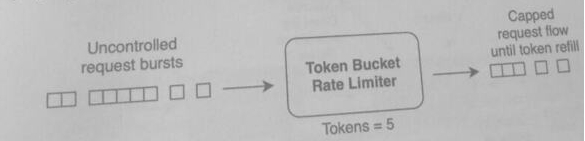
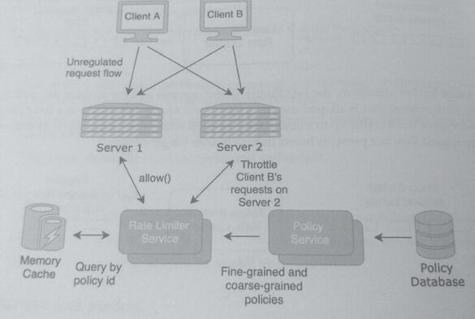
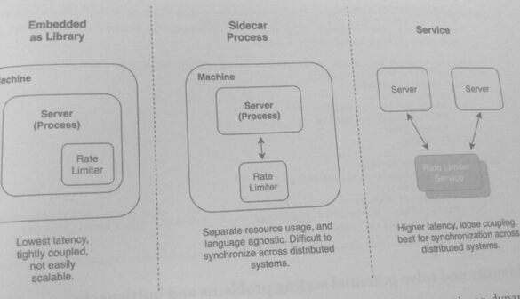
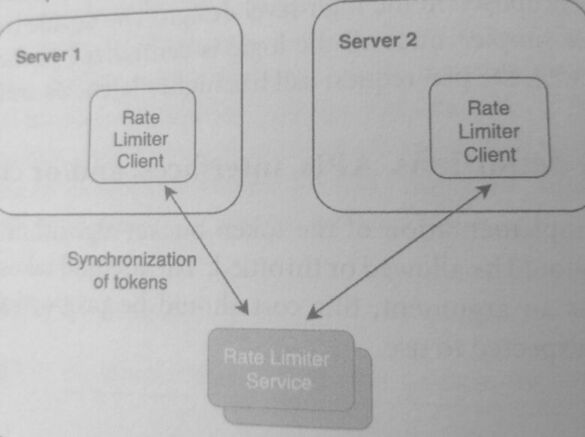

## 37. Design a Distributed Rate Limiter (14)

Rate limiting (or throttling) controls the rate of traffic that is allowed into a
system. It implements a limit or cap beyond which traffic is rejected or blocked. Most public-
facing APIs and services use some type of rate limiting to make their services more resilient
and to protect against malicious network activity.

Technically, throttling and rate limiting have slightly different meanings. Throttling is a
server-side strategy that limits the number of requests accepted by a server or service within a
period of time. Throttling is typically performed when a server is overloaded and cannot
handle additional requests or when a client exceeds their allocated limit.

Rate limiting is a client-side strategy to limit the number of requests sent within a
period of time so that the rate is below the maximum capacity of the channel.

For example, a server can have a throttling policy where any client that sends more
than 100 requests per minute will be throttled. The client would implement their own
rate limiting policy so their rate stays below the 100 requests per minute limit, and thus
not have any requests rejected.

In practice, throttling and rating limiting are terms used almost interchangeably to refer
to the server-side strategy.

#### Why is throttling needed?
* Protects against malicious traffic such as Distributed Denial of Service (DDoS) attacks
  and clients that do not respect the maximum capacity of a channel.
* Protects servers from getting overloaded. Even without malicious activities, servers
  may become overloaded and eventually fail. Throttling allows the servers to be
  resilient and more reliable during times of burst traffic.
* Protects against "noisy neighbors" in a multi-tenant system.

#### What is fine-grained vs. coarse-grained throttling?

In the previous designs, most of the services were designed with a multi-tenant architecture,
which means that a single software instance is used by multiple clients or users (tenants).
Even though each tenant's activity and data are isolated and private from
other tenants, they share the same resources. In a multi-tenancy environment, one client may
use resources such as CPU, memory, or disk that exceed a reasonable portion or even
dominate the resources of the server. This is called the "noisy neighbor" problem since other
clients in the same environment may experience higher latency, increased failures, and
resource starvation.

In the diagram below, the server implements a *coarse-grained* throttling policy, it has a limit
of 1000 requests per second and rejects requests that exceed the limit. A coarse-grained
throttling policy does not effectively discriminate the type of request or the context (such as
the client, IP, source) in its throttling. While this is useful to protect the server from being
overloaded, it does not implement effective controls per client. Client B is unable to send 10
requests per second because Client A is using the entirety of the allowed limit of 1000. Load
balancers often have coarse-grained policies that limit traffic to servers without any
application or client-specific knowledge.



A *fine-grained throttling* policy can distinguish between request types and clients. The
throttling can be performed by client, request type, and even application-specific logic. For
example, a fine-grained throttling policy could state that every client is limited to 200 requests
per second per server. There are usually multiple throttling policies used by a system,
combining both fine-grained and coarse grained policies.

#### What happens after a request is throttled?

After a request is throttled, the server sends a response back to the client with a failure status
The client can opt to retry the request and, if so, should implement an exponential backoff
policy when it retries the request. In this backoff policy, the delay time between retries
increases exponentially, with a maximum number of retries.

Another possible throttling implementation is that the server queues any requests on the
server-side that exceed the limits set by the throttling policy. The server then processes the
request when it is no longer throttled.

### 1. Clarify the problem and scope the use cases

#### Use Cases:
* A client sends requests at a rate above the throttling policy limit. The requests that are
  above the limit should be rejected.
* The server-side employs different algorithms to throttle the requests,

#### Requirements:
* The servers that need rate limiting operate in a multi-tenant environment, where
  many clients can connect to the same server instance.
* Throttling policies should be applied in a fine-grained manner. This can be per user
  per IP, or per application-specific identifier.
* The system should be highly available and performant.

#### Clarifying questions to ask:
* What is the throttling behavior when the throttler experiences failures?
* Should the throttler be an embedded library, a sidecar process, or a separate service?
* What type of throttling algorithms should be supported?

#### 2. Define the data models
In this section, we'll discuss three popular throttling algorithms: sliding window, leaky bucket,
and token bucket.

In a **sliding window** algorithm, rate limiting is performed by limiting the number of requests
allowed in a lagging time period (the "window). For example, this rate limiting algorit
could enforce a limit of 50 requests in the past 10 seconds. In the diagram below, each of the
rectangles represents the requests made to a server in a 1-second time period. The sliding
window of 6 seconds measures how many requests were made in the past 6 seconds and rejects
requests that exceed the limit.



In a **leaky bucket** algorithm, the request flow is regulated so that requests are allowed at a fixed
rate. It is analogous to how a bucket with a hole at the bottom leaks water: regardless of how
much water is poured into the bucket, the amount of water leaks out at a fixed rate. This
algorithm can be implemented using a queue: all requests are placed in a FIFO quruc on
arrival, and the leaky bucket rate limiter allows requests to be taken off the queue at a fixed
rate. This algorithm protects servers against burst traffic, allowing servers to process requests
at a rate that is known to be below capacity.


In a token bucket algorithm, the rate limiter allows requests as long as there are sufficient
tokens. Each request that is allowed uses up a token, and tokens are refilled at a fixed rate. It
allows for some burst traffic up to a limit. This algorithm is useful for allowing some degree of
varying request flow but prevents bursts that occur over longer periods.



### 3. Make back-of-the-envelope estimates
#### Users and Traffic
* Assume 100 million DAU users make requests to a server, with an average of 100
  requests per day. This means 10 billion requests per day.
* During the peak hours of 8 am - 10 am, the request traffic is three times the amount
  of the normal traffic.
* A cluster of 25 servers can handle 5,000 QPS on each server, the capacity of the cluster
  is 125k requests per second.

#### QPS (Queries per second)
* The average requests per second:
  10 billion requests per day / (24 hours 60 minutes * 60 seconds)
  =~*115k requests per second*
* During non-peak hours, the cluster of 25 servers has the capacity to handle this usage.
* During peak hours, at three times the normal traffic, there are 345k requests per
  second. This means 230k requests per second need to be throttled.
* Consider autoscaling the cluster to handle the additional traffic during peak hours

### 4. Propose a high-level system design

The diagram below proposes a distributed rate limiter that provides synchronized rate limiting
across multiple servers using a token bucket algorithm.



The Policy Database stores both fine-grained and coarse-grained rate limiting policies. The
Rate Limiter Service acts as a central token provider, enforcing fine-grained and course
grained policies broadly or specifically across all servers.
*  A policy could be server, user, or application-specific:
   "Limit Client B's requests to 200 tokens per minute on Server 1.

A centralized rate limiter is one way to solve synchronization problems in a distributed
environment where there could be race conditions of token usage across multiple servers.

The Rate Limiter service implements the method *allow()* that evaluates if requests should
be throttled based on contextual information such as client, IP address, application data, and
server information. The service uses a memory cache to store the rate-limiting policies
caching is useful for a large number of policies.
*  If the rate limiter enforces a per-user throttling policy, and there are millions of users,
this would mean that the rate limiter needs to track mean millions of entries.

An LRU using the tuple (policy id, user id) as a cache key would be effective
at evicting unused policies.

5. Design components in detail
There are multiple ways to design the distributed rate limiter, each with its advantages and
disadvantages.



* Embedded: a "local" rate limiter that can be implemented as a static or dynamic
  library. Since this is embedded in the server process itself in nuns with the lowest
  latency. The downsides are
  1. it uses the same resources as the server process itself.
  2. it needs a language-specific implementation, and
  3. it is difficult to synchronize rate limiting across multiple servers in a distributed system.

* Sidecar: a sidecar process is a supporting process that is deployed with the primary
  application or process. Typically, the sidecar process runs on the same machine as the
  primary process, requiring only a local IPC (inter-process communication) call that
  has low overhead and low latency. The sidecar process is more loosely coupled than
  the embedded rate limiter, allowing separate resource usage and language-agnostic
  implementation. Like the embedded rate limiter, it has difficulties in synchronization
  across multiple distributed servers.

* Service: implementing the rate limiter as a separate service is the most loosely coupled design
  and was proposed in the high-level design. The upside is that synchronization
  across servers is simpler since all the logic is centralized in the server. Though this
  solution scales well, the per-request call has higher latencies and more overhead

### 6. Write out service definitions, APIs, interfaces, and/or classes

The code below is an implementation of the token bucket algorithm. The allow method
determines if a request should be allowed or throttled. The method takes the number of tokens
that the request costs as an argument; this cost should be proportional to the amount of
resources the request is expected to use.

```elixir
def allow(tokens, policy) do
  refill_tokens(policy);

  # Consume tokens
  if tokens <= policy.tokens_available do
    tokens_available -= token;
    return true
  end

  return false
end

def refill_tokens(policy) do
  if policy.tokens_available < policy.capacity do
    now = time();
    more_tokens = policy.refill_rate * (now - policy.last_refill_timestamp);
    tokens_available = min(policy.capacity, tokens_available + more_tokens)
    policy.last_refill_timestamp = now;
  end
end
```

### 7. Identify and solve potential scaling problems and bottlenecks

The centralization of tokens in a rate limiter service comes with its problems:

* **Race conditions**: If multiple servers attempt to consume tokens simultaneously.
could lead to unsynchronized decrements of the tokens, which undermines the
purpose of the rate limiter. Adding a lock per (policy id, user id) tuple or fine-grained
policy would allow only one client to consume tokens at a time but also serializes the
throttling logic. This problem becomes worse where there is high concurrency.

* **Poor performance**: Each server needs to make a remote call to the Rating Limiter
Service, which adds network and service overhead.

These problems can be mitigated by relaxing the strong consistency requirements of a rate
limiter and adding a Rate Limiter Client on each server, as shown in the diagram below. The
Rate Limiter Client is a thin client that allows servers to make local in-memory calls to
consume tokens that are synchronized with the central Rate Limiter Service.



The periodic synchronization of local tokens is eventually consistent: it allows for token values
to diverge across the servers, leading to possible over-consumption of tokens globally
Allowing the thin clients to synchronize at a higher frequency could reduce this problem.
