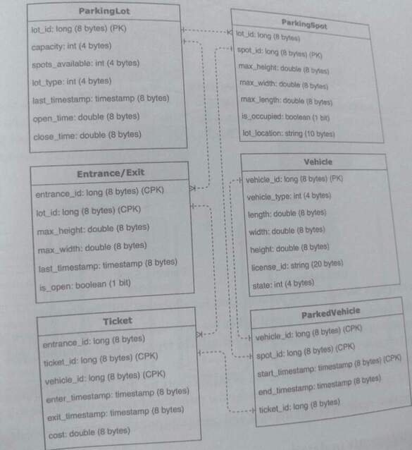
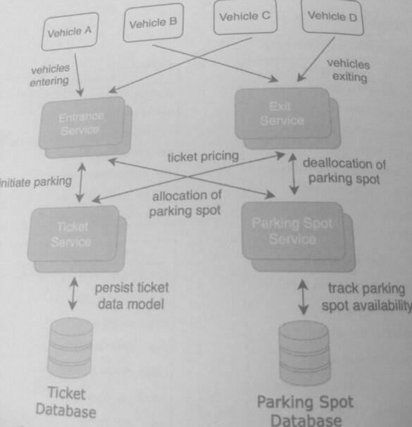
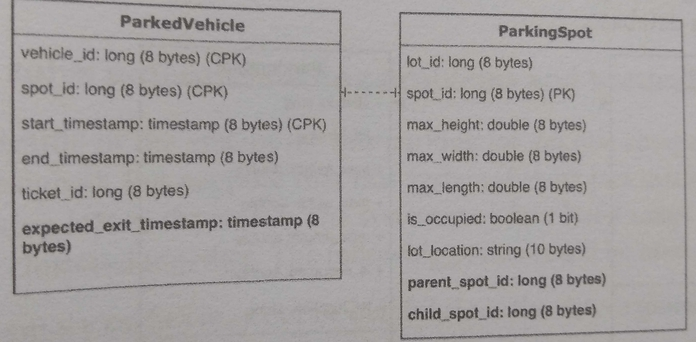
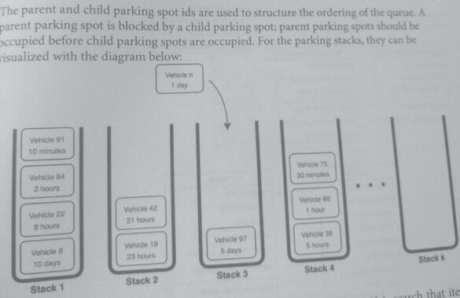
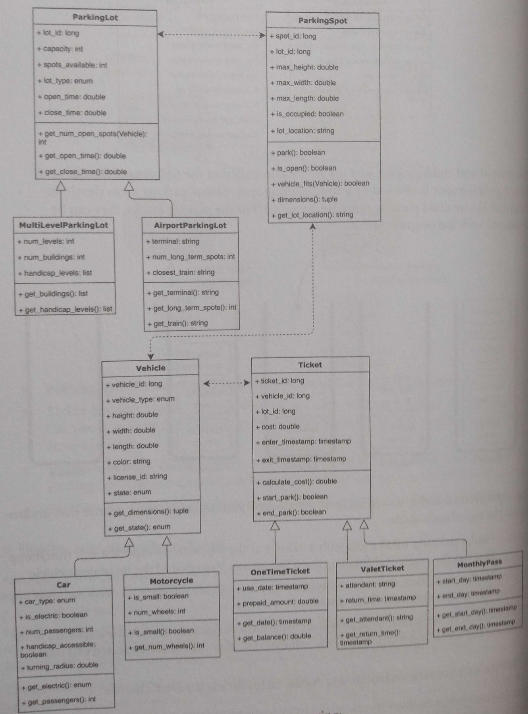

## 38. Design a parking lot (15)

*This question focuses on OO system design, class hierarchy, and interfaces*

### 1. Clarify the problem and scope the use cases

#### Use Cases
* A user enters the parking lot, receives a parking ticket and a parking spot.
* A user exits the parking lot and pays for the parked time.
* Users should be notified, before entering, if there are no parking spots left
* With different vehicle types (car, truck, minivan, motorcycle, etc.) are different pricing

#### Requirements:
* The parking lot has multiple entrances and exits.
* The parking lot has different parking spot sizes for different vehicle types.
* The parking lot is ticketed and can have different pricing based on time and vehicle type
* The parking lot should handle high burst usage, including times when vehicles need
  to wait for other vehicles to park or leave.
• The parking lot should accommodate at least 10,000 spots, with an average turnover
  of 2 times a day.

Clarifying questions to ask:
* Is the parking lot a building or an open area? Can there be multiple building levels?
* Is there long-term parking or monthly membership?
* Is there stacked parking where vehicles need to be parked or unparked in order?
* Is there self-parking or valet parking with attendants! What interfaces should be
  designed for human interaction?

### 2. Define the data models

The data models of the databases are:

### 3. Make back-of-the-envelope estimates
#### Users and Traffic
* Assume 10,000 parking spots with 20,000 parkings a day.
* Traffic peaks during the start and end of the workday.
* The parking lot is open 24 hours a day, 7 days a week.

#### QPS (Queries per second)
* The number of write requests per second is: 20k parkings per day / (60 seconds)
  = ~1 parking every 4 seconds

### 4. Propose a high-level system design

* Parking Spot Service tracks parking spots for allocation and deallocation.
* Ticket Service: creates the initial ticket for new vehicles entering the parking k
  Calculates pricing for parking based on vehicle type, parking duration, and other
  factors on exit.
* Entrance Service: checks if there are available spots for the vehicle type through the
* Parking Spot Service. Creates a ticket for the vehicle and assigns the vehicle to a spo
* Exit Service: deallocates parking spot and calculates price for departing vehicle.

### 5. Design components in detail

Assume that the parking lot is space-constrained and has stacked parking, where one or more
vehicles block other vehicles from exiting. For example, suppose the parking lot has physical
parking decks with multiple levels. Vehicles on the lower levels need to be moved before
vehicles on the upper levels can be moved. 

How can we modify the existing data models to accommodate this functionality? What are the 
algorithms and structures used to optimize parking and minimize the number of vehicles that 
need to be moved during exits?

The stacked parking can be represented with k stacks, where each stack has LIFO (stack) ordering for
vehicles to park and unparked. 

We can augment the existing data models by adding an expected_exit_timestamp attribute to 
ParkedVehicle, and parent_spot_id and child spot id to ParkingSpot. 

The expected time for the vehicle to exit can be used to determine the ordering in which 
vehicles should be parked and stacked

The parent and child parking spot ids are used to structure the ordering of the queue. A
parent parking spot is blocked by a child parking spot, parent parking spots should be
occupied before child parking spots are occupied. For the parking stacks, they can be
malized with the diagram below:

The algorithm to add a new vehicle to the stacked parking is an 0 (k) search that iterates
across the top of each stack:

1. Find a partially filled stack with a vehicle at the top with an expected exit timestamp
   that has the smallest difference from but greater than that of the incoming vehicle.
2. Start a new stack if the incoming vehicle is long-term parking (1 week or more) or
   there are no partially filled stacks.

There can also be additional logic added for long-term parking, how close the stacks are to the
entrances and exits, and a time buffer for vehicles that don't exit at the expected exit time.

### 6. Write out service definitions, APIs, interfaces, and/or classes

The diagram below outlines a possible class hierarchy and includes the subclasses of ParkingLot,
Vehicle, and Ticket. 

The fields of the types overlap with the attributes of the data models created in the previous 
steps as states of the objects often overlap with the data that is persisted to a database.

When designing a type hierarchy, think about answering:
* What are the submodules for the main module? Are there any interfaces?
* What are the main methods and state variables?
* How do types interact?

### 7. Identify and solve potential scaling problems and bottlenecks

The QPS and the traffic of the system for this parking lot are low compared to previous systems. 
But suppose that this system doesn't just manage a single parking lot, but all the parking lots in 
the world. The system may face burst usage because peak hours of parking lots are clustered together. 
The following points could be used to scale the systems

* Adding memory caches may not be helpful since the entering and exiting of a vehicle
  are typically one-time requests.
* Create database keys to avoid hotspots. A parking lot id maybe a poor choice to use as
  a database key since the requests of a single parking lot may be clustered temporally
* Add autoscaling resources to the entrance and exit services during peak hours
