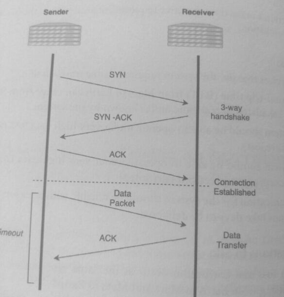
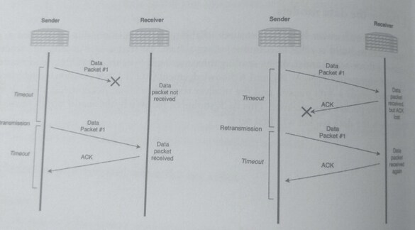
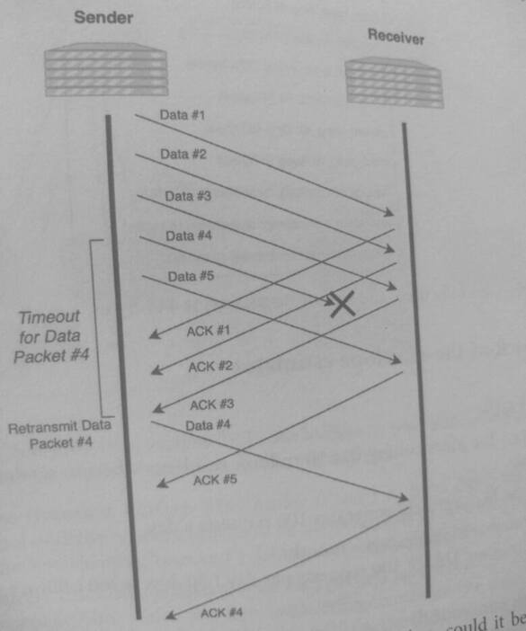
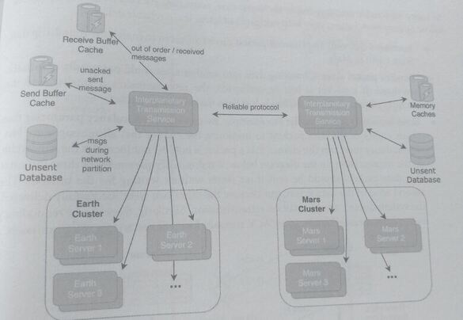
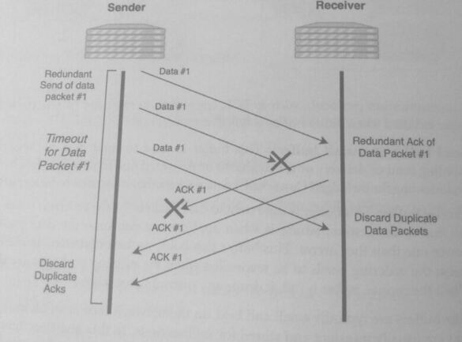

## 39. Design an Interplanetary Distributed Computing System (16)

Imagine that in the future, humans have set up a colony on Mars. Like Earth, the Martian
colony needs technology services and systems, and these services need to communicate with
services on Earth. For example, a bank providing financial services on Mars would need to
synchronize bank accounts with those on Earth.

Challenges with sending data over interplanetary distances:

* The distance between the planets causes a significant delay in receiving the data. Data
  transmission (assuming lightspeed) from Earth to Mars can take anywhere from 4 to 24 minutes
  one-way, depending on the orbit location.
* There is a high loss rate during transmission: data that is sent interplanetary can easily
* There is a high corruption rate during transmission; sent data is received, but it might
  contain incorrect information.
* There are extended blackout periods where communication between the two planets
  is severed. For example, a blackout happens when the planets are positioned in orbit
  such that interference from the Sun prevents data transmission.

How do we design a system that provides reliable and available interplanetary services?
While this question is a bit far-fetched, it tests your understanding of
reliable communication protocols at its limits.

Additionally, some of the concepts have analogies to networking concepts: a blackout period
is similar to a network partition, and a high loss rate in data transmission is similar
to an unreliable network.

### 1. Clarify the problem and scope the use cases

#### Use Cases:
* A user on Mars sends a request to a service. This service has servers running on
  machines physically located on Earth.
* The Mars colony and Earth use services that require a system with high availability
  and consistency except during network partitions.
* The services make time-sensitive requests but are aware of the blackout periods of no
  communication

Requirements:
* The services that use the system require reliable transmission.
* The round-trip time (RTT) from Mars to Earth can range from 8 to 48 minutes. This
  RTT is calculated in real-time and is known by the system.
* The system should be able to operate under very high data loss rates (i.e., 50% of data
  packets are lost).
* The system should be able to operate under very high data corruption (i.e., 50% of
  data packets are received but corrupted).
* Communication for the system should be reliable with a reasonable latency; messages
  should not take days to be delivered.

#### Clarifying questions to ask:
* Do data loss and corruption occur at the same rate in both directions when
  transmitting from Earth to Mars and Mars to Earth?
* Does the data loss have any time patterns? Is it possible to predict periods of higher
  data loss?
* Are the occurrences and the length of the blackout periods known before they happen?
* Are there bandwidth limitations to the interplanetary transmissions?
* Is there a TTL to any of the data sent between the planets?

### 2. Define the data models
TCP ensures reliability in transmission and can be used as a foundation to build a reliable
communication system. To start a TCP session, the sender initiates a three-way handshake
by sending three messages: 1) Synchronize (SYN), 2) Synchronize-
Acknowledgement (SYN-ACK), and 3) Acknowledgement (ACK).

Once a session is established, the sender sends a data packet, and the receiver responds
with an Acknowledgement (ACK) that the data packet was received. This ACK should be received
by the Sender within a timeout from when the data packet was first sent.



If the sender did not receive the ACK within the timeout period, it assumes that message was
lost and attempts to retransmit the packet. This retransmission mechanism allows TCP
protocol to be reliable: data delivery is assured because the sender is notified if the delivery of
data was unsuccessful, and it redelivers the data. In an unreliable protocol such as UDP, data
delivery is not guaranteed because the sender does not confirm that a message was received
In the diagram below, two scenarios trigger retransmission in TCP:



In the first scenario, the data packet is lost, and the sender did not receive an ACK within the
timeout, which triggers the retransmission of the data packet. In the second scenario, the ACK
message from the receiver is lost, and the sender retransmits the data packet, even though it is
a duplicate message for the receiver.



Data packets are not sent serially; the sender does not wait for ACKs before sending
the next data packet. TCP uses buffers on both the sender and the receiver to hold data packets
to reconstruct data if there are missing packets. In the diagram below, the sender sends out 5
data packets and retransmits data packet #4 because it was lost.

Now that we understand how TCP provides reliable transmission, could it be used as the
communication protocol for our interplanetary system? Would increasing the timeout
interval be sufficient to fulfill the requirements?

TCP is designed for an unreliable network but does not work as well in a network that
has very high loss rates, such as here. A typical TCP retransmission rate for applications
on the internet is <0.5%, and a 2% retransmission rate is considered very high.

The guidance for a data loss rate of 50% suggests that the retransmission rate will need to be
at least 50% since some of the data packets will need to be retransmitted more than once
if the retransmission also fails.

Another factor to account for is that the timeout period would have to be greater than the RTT
of 8 to 48 minutes. That means some fraction of data packets that need to be repeatedly
retransmitted may take hours or even days to be reliably delivered. For example, if the data
loss rate is 50%, that means a successful roundtrip serd and acknowledgment occurs with a
25% probability. 

If the retransmissions have independent probabilities, that means that 1 out
of every 300 packets will take more than 16 hours to transmit in the worse case. This doesn't
fulfill the requirement for reasonable latency, and we can design a communication protocol
that better fulfills these requirements.

Data that needs to be persisted are stored as messages

```
Message
msg_id: long (8 bytes) (PK)
msg_type: long (8 bytes)
payload: binary (256 kb)
payload_type: string(128 bytes)
retry_attempts: int(4 bytes)
parent_msg_id: long (8 bytes)
child_msg_id: long (8 bytes)
created_timestamp timestamp (8 bytes)
expiration_timestamp: timestamp (8 bytes)
ack_timestamp: timestamp (8 bytes)
```

If the attributes are fully used, the size of Message is 444 bytes.

### 3. Make back-of-the-envelope estimates

#### Users and Traffic

* Assume the Mars colony has 10 million residents that use system services
* Assume Each resident generates 100 requests a day.
* The number of requests per month:
    10 million DAU 100 requests per day 30 days 300 billion requests

QPS (Queries per second)
* The number of requests per second is:
    10 billion requests per day / (24 hours 60 minutes 60 seconds)
    =~115k requests per second

Bandwidth Usage
* Assuming that the inbound and outbound bandwidth usage are the same and that
  each message is 444 bytes:
    115k requests per second 444 bytes=-51MB per second

### 4. Propose a high level system design
The system design below uses the "Interplanetary Transmission Service" to reliably deliver and
reconcile messages. Services and servers asynchronously send messages to this service, which
assures delivery of the messages and sends a confirmation on delivery completion.



Reliable communication protocols, such as TCP, use buffers to send and receive packets. The
transmission is halted when either buffer is full. The buffers are:

* Send buffer (transmit buffer): This buffer is used to hold data packets that are
  pending send or delivery or are unable to be delivered due to network problems. This
  includes unacknowledged ("unacked") data packets that may need to be retransmitted.

* Receive buffer: This buffer is used to hold data packets for the receiver. It can become
  full due to congestion, which is when applications consume the data packets at a
  slower rate than they arrive. This buffer also holds packets that were delivered out of
  order, the ordering needs to be reconciled when the missing packages are delivered.
  When the receive buffer is full, it drops any incoming messages.

For TCP, the buffers are typically small and kept on the network card or in memory, packets
in the buffer are usually transient and stored for milliseconds. In this question, however, due
to the long KTT and high loss rate, these unacked and out of order data packets might be held
for hours until they are resolved. The memory usage of these buffers is significantly more than
in a typical network card, and this design adds an explicit memory cache for both of these
buffers.

During the blackout periods, the interplanetary transmission service persists messages to a
database and sends them after the blackout period is resolved. This is equivalent to the
occurrence of a network partition and a synchronization afterward.

Using the TCP as the protocol had downsides that made it unsuitable for interplanetary
communication. We estimated that, on average, 1 in 300 data packets would take more than
16 hours for reliable delivery, and in the worst case, some data packets would take days. The
following proposed features may help mitigate tail latencies in reliable delivery:

* **Increased timeout**: The timeout period can be adjusted to match the round-trip time
  from Earth to Mars.
* **Smaller packet sizes**: Chunking data into smaller sizes could potentially reduce the
  overhead. If a packet is lost or corrupted, the retransmission is smaller, and the
  amount of data that is discarded is less than that of a large packet.
* **Send messages redundantly**: For example, we can add a redundancy parameter that
  sends copies of the data packets to minimize the chance that all messages are lost.
  Redundancy increases the chance that a packet is not lost but increases the bandwidth
  of the transmission. In the diagram below, a redundancy parameter of three indicates
  that data packets should be sent three times without waiting for the timeout. The
  second send of the data is lost, but because the other two were successfully delivered,
  the system doesn't need to wait on retransmission. Similarly, there can be redundancy
  in the ACK message sends, as an ACK message loss will also trigger retransmission.

  

* **An exponential increase in redundant messages**: As the retransmission atte
  increases, it becomes more important that the message is successfully delivered; there
  are more packets on both ends waiting for the missing packet to be delivered. One
  mechanism to encapsulate this urgency is to increase the number of redundant copies
  after the transmission fails, the protocol increases the number of sends from 1 to 2
  sent per retransmission iteration, up to a limit. For example, in the diagram below,
  After the retransmission fails also, the second retransmission sends four copies

```
[0]
(Sender)
Original
transmission
|
|
V
(Receiver)
Data Packet #1
lost in delivery

(Sender)
Timeout occcurs

[1]
(Sender)
First
retransmission (data #1, data #1)
|
|
V
(Receiver)
Received Data
Packet #1, but
both return ACKS are
lost

[2]
(Sender)
Second
retransmission,
with error
correcting
code
|
|
(Sender)
Received back
duplicate acks
from Receiver
```

* **Error correction code (ECC)**: The data is encoded with redundant information. If
there are errors detected, the receiver may be able to correct the errors without a
retransmission. This approach is commonly used in unreliable and noisy networks;
for example, ECC encoding is used for transmissions to satellites. We'll further discuss
this idea as a scaling solution.
