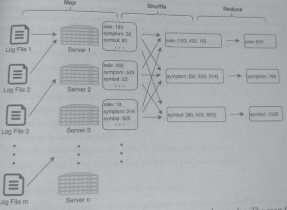

## 19. Big Data and Map Reduce

**Big data** means data sets that are too large to be processed and analyzed by traditional
software. Big data includes

* Structured data: data is stored in a predefined format.
* Unstructured data: data is stored in their native format without following a data model.
* Semi-structured data: data doesn't follow a data model but has some elements that can define
  the layout of the data.

Big data could mean terabytes, petabytes, or exabytes of data. Because of the sheer volume and
variety of the data, it presents unique system challenges to capture, store, and analyze this data.

**Databases** are used to store structured data structured or semi-structured data. The primary
purpose of using a database is that it can create indexes, handle queries, record transactions,
and serve requests.

**Data warehouses** are used to store **structured data from multiple sources** to be used for
analysis. Data warehouses commonly contain data from the ETL (Extract, Transform, Load)
process. The primary purpose of warehouses is to generate analysis, reports, business
intelligence, and dashboards. Compared to databases, warehouses are *not intended* to handle
*queries, transactions, or serve requests*.

**Data lakes** are used to store any type of data in its *original raw format*. Data lakes come
usually as inexpensive storage meant to hold data from **upstream or unformatted sources**.
Consumers of this data use a *schema-on-read* approach where a format is applied to the data
**when it is read**. In contrast, databases and data warehouses use a schema-on-write approach.

**MapReduce** is a programming model for processing big data with a parallel and distributed
method. It
1. splits the data set into smaller data sets
2. performs the same computation across all the smaller data sets in parallel
3. combines the results.

The MapReduce process happens in 3 steps:

1. Map: the data set is split into smaller data sets. Each small data set is assigned to a
worker node (a server), which applies the map function to it and produces an output.
This output is a map of key-value pairs.

2. Shuffle: the output from the map step is reorganized so that all data of one key is held
   together on a worker node.
3. Reduce: each worker node applies the reduce function to the reorganized data, which
   collapses the data to the final output.

MapReduce is commonly used to process and analyze server logs. Each web
server and application server generates logs of per-request actions and server behavior.

Since there could be billions of requests per day, the per-request logs are considered big data. A
canonical example used to explain MapReduce is to count the number of occurrences of items
in a large data set.

For an autocomplete system for example, it needs to process logs and count the number of occurrences
of each search term to rank them. The diagram below visualizes the MapReduce steps for the log files
of the autocomplete system:

* The system generated m log files, which are split between n worker nodes.
* The map function counts the occurrence of search words in each log file, and the diagram shows
  three words ("sale," "symptom," "symbol") and their counts.
* In the shuffle step, the key-value maps are reorganized so that the counts of each key are on
  one node.
* The reduce function adds all the counts together to get the final count of each search word.

Although MapReduce is good for processing batch files to get known outputs, the process is
not flexible and constrains the structure of parallel data to a key-value format.

Additionally. MapReduce is not good at reusing data.

In data mining and analytics, computations are often repeated in an iterative process, and
MapReduce may not be a suitable method to handle data in these fields. Though MapReduce was once the
standard of big data processing, its popularity has declined, but the concepts behind them are useful.

Alternatives such as Apache Spark, a distributed big data framework, have an in-memory cache that can
reuse data in repeated calls to the same dataset. Spark also can handle streaming data.
