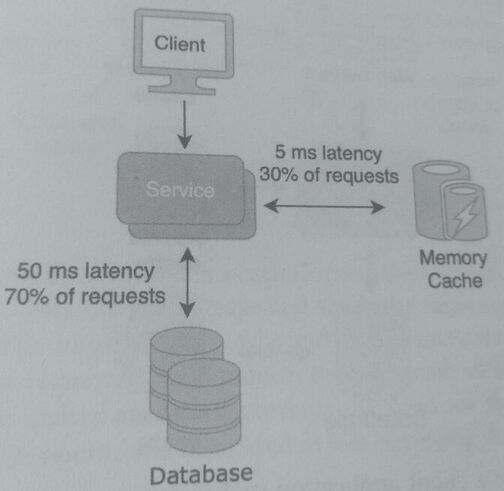
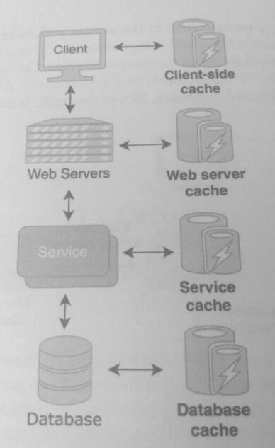
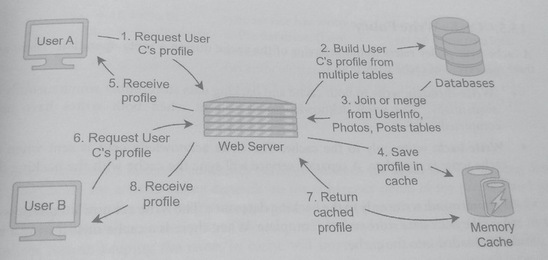
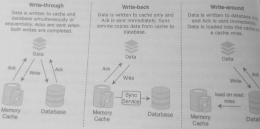

## 13. Cache

### 1. Definition
A cache is hardware or software that temporarily stores a subset of data in a high-speed
medium so that future requests can be served faster. The primary purpose of a cache in a
system is to improve performance by shortening data access times and reducing resource
usage.

Caches store transient data in a medium that is faster than the medium where data is
persisted; this usually refers to in-memory (RAM), as opposed to other mediums such as
hard drive (HDD) or solid-state drive (SSD).

A cache also allows servers to fulfill requests by returning previously computed data without
having to perform the computation again-this is particularly useful when the computation
is costly resource-wise.

Data on a machine or database is typically stored on **persistent storage**, such as hard drives
(HDD) or solid-state drives (SSD). The main characteristic of persistent storage is that it is
non-volatile memory-*it retains data even without power*.

In contrast, volatile storage such as random-access memory (RAM) requires power to
maintain data. The performance of volatile memory is better than non-volatile memory,
and the table below shows benchmarks of a typical machine:

|             | Throughput     |  Latency     |
| ----        | ----           |  ----        |
| RAM         | 12,800 MB/sec  | 12 nanoseconds | 
| SSD         | 540 MB/sec     | 200 microseconds |
| HDD         | 150 MB/sec     | 30 milliseconds |

RAM is nearly 20 times more performant than SSD and more than 80 times more performant
than HDD in terms of both throughput and latency.

Specific details aside, this is meant to illustrate that volatile memory is an order of magnitude
more performant than non-volatile memory. Given this large difference in performance, why isn't
volatile memory used for all storage?

1. Volatile memory is typically more expensive per byte than non-volatile memory
2. During system failure, all information would be lost.

While data is stable and persistent in non volatile storage, it cannot be as quickly accessed
as if it were in volatile memory.

In the following diagram, a cache is used in the request serving path to keep recent and often-used
data items in memory, which is *faster* and *computationally cheaper* to access than performing
a *computation* on the backend server or *querying* a database.

Caching improves the latency of the read request path from *50 milliseconds* to *5 milliseconds*.

Additionally, it *reduces the workload* on backend servers and databases; 30% of the traffic
is directed to the cache instead of the service and database.

By caching data and objects in memory, the system *lowers the response latencies* and *reduces
the number of queries* sent to the database. Typically, caches improve the response time of
requests that are similar or identical to previous requests. The time of items in caches,
until they expire or are considered invalid, is called **time-to-live (TTL)**.

A local cache (co-located cache), is a cache located on the same machine as the server that
uses it.

A distributed cache, is a cache located on a different machine than the server using it.

### 2. Cache Locations
Caching can exist at multiple levels of a system, from the A) client-side applications to the
B) backend servers to the databases.

Determining the best location to place a cache is a critical part of a system design and
will likely be covered in a system design interview. Here are a few of the common places where
caches are located:

* Client-side cache: a client application caches **server responses** on the client device,
  which *reduces the number of requests* sent to the web server. Client-side caches are
  often implemented as an in-memory database, such as *Memcached* and *Redis*.
* Web server cache: **responses to recurring requests** are held in a cache so that they can
  be served directly from the cache instead of being routed to the backend server.
* Service cache: computations or data from a service are cached to **reduce recomputation**.
* Database cache: **frequently accessed blocks of data** of the database can be cached to
  reduce retrieval times. A database cache is usually implemented as part of the *database
  platform* and is not transparent to clients.

These caches can exist separately and complement each other.

> Each of the caches operates on different parts of the request path, but all work to reduce
> the response time and computations needed to serve the request.

### 3. Cache Example

How caching works in a web server:
*  On a client device, User A navigates to User C's profile. This action generates a request
   to the web server to retrieve User C's profile.
   * A profile consists of the user's information, posts, and photos, which
     different table.
*  User C's profile is not currently stored in a cache, and the web server performs JOINs on
   these tables (or merges in the case of a normalized NoSQL database) to create the profile.

*  Once the profile is generated, it's stored in a cache that is local to the web server.
*  A few minutes later, User B also navigates to User C's profile page and sends the same request
   to the web server.

*  This web server checks that the profile is in cache and returns that data. This not only improves
   the responsiveness of the request but also *reduces the workloads* of the database and the *web
   server*. By retrieving the cached profile, it prevents the need for the JOIN calls, which are
   computationally expensive operations compared to just retrieving data from memory.

### 4. Cache Terminology
* Cache Hit: when the requested data is found in a cache. When a cache hit occurs, data is read
  directly from the cache and returned to the client without having to recompute or read from the
  slower original data store.
* Cache Miss: when the requested data is not found in the cache.
* Cache Hit Ratio (Hit Rate): # cache hits / # cache accesses, as a percentage.
* Cache Invalidation: process by which cache content or cache entries are marked as invalid,
  indicating that they need to be removed.
* TTL (Time to live): the lifespan of a cache entry. Once the elapsed time has exceeded
  the TTL, the cache entry is considered invalid.
* Cache Coherence (Cache Consistency): in a system with multiple caches, caches can
  be coherent or incoherent. **Coherent means that the caches have the same entries**; that
  is, there is a uniformity of the data. **Incoherent means that caches have different values
  for the same entries.**
* Cache Replacement Policy: the policy of determining **which cache entries should be
  removed (evicted)** from the cache when it is full.
* Cache Write Policy: the policy that determines a cache's behavior during a write
  operation.

### 5. Cache Write Policy

A cache write policy refers to the behavior of the cache during a write operation. There are
three main types of cache write policy:

> A helpful insight is that these are written from perspective of data -- cache -- db.
> * Write-through goes to both cache and db. 
> * Write-back (implicit cache first) goes to cache and db is synced back later
> * Write-around (implicit cache first) goes around cache and db is written to db first

* Write-through: write to both cache and backing data store, either simultaneously or
  sequentially. The write acknowledgment is sent when both writes have been
  completed.
  * Pros: Fast read and will not lose data during cache failure
  * Cons: Will need to write data twice, meaning higher overhead
  * Best For: Applications that write and then re-read that data immediately and frequently
* Write-back: write only to the cache. The write acknowledgment is sent when the
  cache write is complete. A separate service will sync the cache with the backing data
  store.
  * Pros: Writes have low latency since data doesn't need to be written to the
    database immediately
  * Cons: Risk of data loss if there cache failure before the sync service has written it
    to the database. (Low availability and durability)
  * Best For: Applications that are write-heavy, require low-latency, and can accept some
    data loss.
* Write-around: write only to the backing data store. The write acknowledgment is sent
  when the back data store write is complete. When there is a cache miss during a read,
  data is loaded into the cache.
  * Pros: No risk of data loss
  * Cons: Recently written data require a cache read miss to be loaded into the cache
  * Best For: Applications that don't re-read or infrequently access data once it is written

The following figure illustrates the behavior of these three write policies with a database as the
backing data store:

The write-through policy prioritizes consistency over performance, as both the cache and the
backing data store have updated copies of the data. In contrast, the write-back policy
prioritizes availability over consistency, as the data in the cache could be different from the
backing data store.

Each policy exhibits a different coherency behavior between the cache and the backing data
store; the choice for a write policy depends on the coherency needs of the product and use
case.

For example, in social networking applications such as Twitter, a write-through policy is
the most suitable. After a user posts a tweet, it will be read by his or her followers in the
immediate future; keeping the tweet in cache will improve performance. Additionally, it's
critical that the system not lose a tweet, so a write-back policy is not suitable since it introduces
a single point of failure.

### 6. Cache Replacement Policy
Caches are typically smaller in size than the original data store and have a limit on the number
of entries they can hold.

A cache replacement (or cache eviction) policy is a policy for managing the entries of a cache
and deciding which entries to discard when the cache is full.

Commonly used cache eviction policies:
* Least Recently Used (LRU): discards entries that are the least recently used. This
  policy tracks entries by the last time they were accessed and discards the oldest entries
  when the cache is full. LRU is one of the most popular cache replacement policies.
* Least Frequently Used (LFU): discards entries that are the least frequently used. This
  policy tracks how many times each entry cache was accessed. When the cache is full,
  the entries with the lowest counts are discarded.
* Most Recently Used (MRU): discards entries that are the most recently used; this is
  the opposite of the LRU policy. While this might seem counter-intuitive, this policy
  may be useful in a system where data is only read once. The cache has older entries
  compared to the LRU policy
* First-in first-out (FIFO): discards the oldest entries, without considering how often
  they are accessed.
* Last-in first-out (LIFO): discards the newest entries. Like MRU, this policy works
  best when reads operations on an entry are temporally not clustered.
* Random: randomly selects an entry to discard.

In deciding which replacement policy to use in a cache, the main objective is to maximize the
hit ratio of the cache, which depends on the cache's read access patterns.

The cache should keep entries that are more likely to be accessed and evict entries that are
less likely to be accessed. LRU and LFU are arguably the most popular replacement policies;
however, the policy that works best for an application depends on the read access pattern.

### Replacement vs Eviction

There is a slight difference between cache replacement and cache
invalidation.
* **Cache replacement** refers to the process of removing entries
  when the cache is full.
* **Cache invalidation** refers to the process of deciding which entries are invalid or stale.
  Stale entries can stay in the cache, depending on the cache policy. Some policies combine
  a replacement policy with an invalidation policy by evicting entries that exceed the TTL.

### 7. LRU Cache Code Example
A data structure commonly used to implement a cache is a key-value map; these caches are
known as **key-value caches**.

The two main data structures of an LRU cache are a hash map and a doubly linked list.
* The hash map is used to associate a key with a cache entry (a value).
* The doubly linked list is used to track when each entry was last accessed.

When the LRU cache get method is invoked, the most recently accessed entry is placed at the 
end of the list.  If the LRU cache is full upon put invocation, the entry at the head of the
list is discarded.
