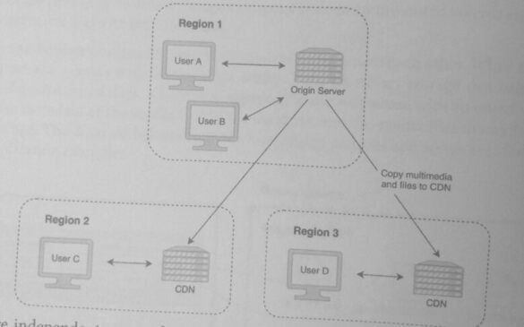
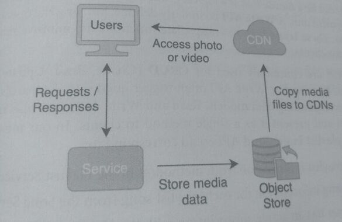

## 15. CDN

In a network, **latency** is the time that it takes for data to move from its source to its destination

It can also be considered the delay it takes for content delivery and is typically measured
in milliseconds.

A content delivery network (CDN) is a group of distributed servers that reduce the latency of web
content delivery. These CDN servers are located geographically throughout the world so that they
are physically closer to users and clients, reducing the distance that the data needs to travel.

A CDN server copies content such as images, videos, and HTML pages from a web server (also
known as an origin server) and provides the content to users and clients. While a CDN can
be used to deliver any content, one of the common use cases is to have CDNs deliver large files
such as images, videos, and the static content of a webpage to users.



**Regions** are independent geographic areas such as countries or continents. Regions consist
of zones, which are smaller sub-areas.

For example, the United States is a region, and the United States East is a zone.
In the diagram above, a CDN is placed in each region to reduce the distance content needs to travel
to users in each region.

Besides reducing latency, some of the additional benefits of CDN are:

* **Lower operational expense**: Running a CDN server maybe be less operationally costly
  than running additional web servers and corresponding backend servers.
* **Increased security**: A CDN acts as a layer between the user and the web server. It can
  mitigate a DDoS Attack (Distributed Denial-of-service Attack) and provide security
  measures that protect the web server from being exposed to malicious users.
  ```
    User ---- CDN --- Web Server
  ```
* **Reduced computations and bandwidth**: By caching content, a CDN server reduces
  both the computations performed by the origin server and the bandwidth needed for
  communication within the network.

A CDN server can be considered a type of cache server. However, they have slightly different purposes:
* A CDN server reduces the distance that content needs to travel to users e.g a video file
* A cache reduces the latency of a request and decreases the number of requests sent to servers.

Adding a CDN to your system design is a *technique to scale systems* that involve *image and video*
media files. CDNs are commonly used with object stores.

In the diagram below, users call the backend service with requests. The responses point the client
to a CDN that has close proximity to the users' location, reducing the latency and bandwidth needed
to access photos and videos associated with those responses.



