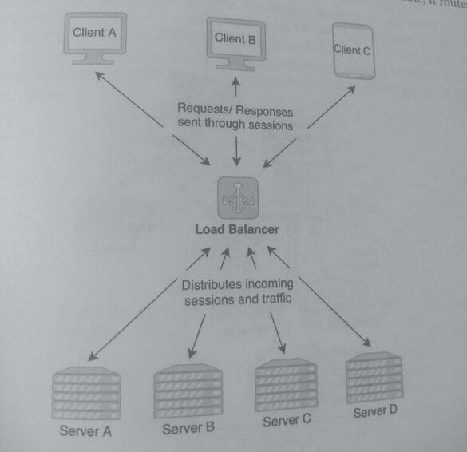
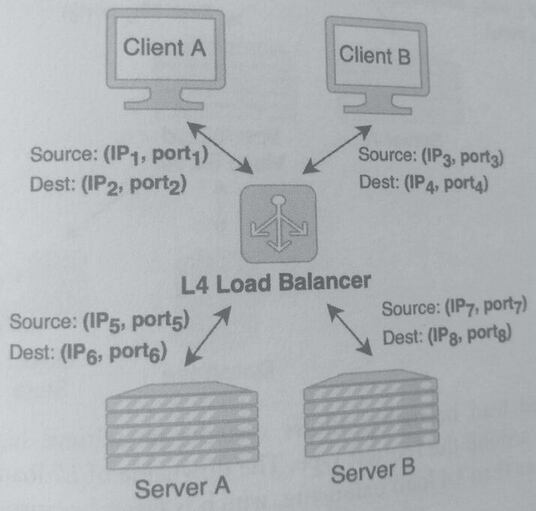
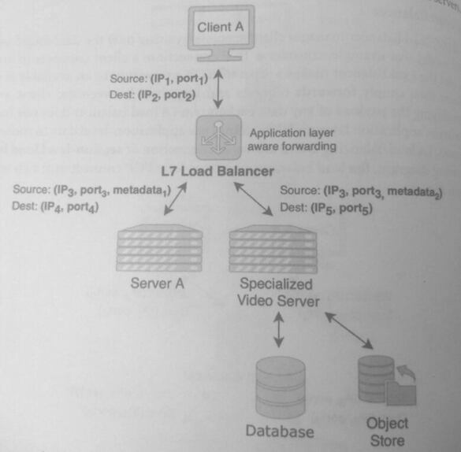

## 12 - Load Balancer

### 1. Definition
A load balancer is a physical piece of hardware that distributes incoming network traffic across
a group of servers. By distributing the network traffic among multiple servers, a load balancer
prevents any one server from getting overloaded, which would degrade the system's
performance.

Load balancing increases availability and reliability by allowing a system to
increase the number of servers that can concurrently handle requests.

Additionally, a load balancer adds failover protection because if a single server becomes unavailable,
it routes the traffic to other online servers.

In a distributed system, the load balancer is often the first point of contact in the request path,
acting as the reverse proxy. In the request path, it sits in front of the frontend web servers and
distributes traffic among them.

A reverse proxy is a server that accepts requests from clients and forwards them to other servers.
A load balancer and a reverse proxy are often combined in a single device, and both terms are
often used interchangeably despite having different functions.

Load balancers can also terminate TLS/SSL connections through decryption. Moving the termination point
to the load balancer unburdens web and application servers from spending CPU resources on
decryption.

#### Load balancing locations

While the most common location for a load balancer is in front of the web servers, load
balancers can be placed anywhere in a system to evenly distribute traffic.

Another common location for a load balancer is between the web server and the backend servers.
In the following diagram, load balancer 1 is placed in front of the web servers, which route requests
to a server cluster to load balancer 2. This second load balancer helps distribute traffic evenly among
servers in the cluster.

Load balancers increase the reliability of a system by managing concurrent connections. Each
connection could contain one or more network sessions, which is the process of handling
multiple requests from a single client. 

For example, a TCP connection creates a session for each user. Session management from the load 
balancer increases the performance of web and application servers because they no longer have 
the overhead of maintaining network sessions.

The load balancer also periodically checks the status of each server and routes requests to only
healthy servers.

### 2. Load Balancer Types

There are two types of load balancers: Layer 4 and Layer 7. These layers refer to layers of the
OSI model, which is a conceptual layer-based model of how data is transmitted. 

* A Layer 4 (L4) load balancer distributes traffic based on the data in protocols of the network and
  transport layers, such as IP, TCP, FTP, and UDP.

* A Layer 7 (L7) load balancer distributes traffic based on the data in the protocols of the 
  application layer, such as HTTP. 
  
Both types of load balancers can co-exist in a system, managing sessions based on both the 
network and application data.

#### Layer 4 Load Balancer

A Layer 4 (L4) load balancer manages client sessions by using only the data in Layer 4.
For example, consider a TCP connection: a client connects to an L4 load balancer, and
**the load balancer makes a separate TCP connection to an available server**. 

The load balancer then simply forwards requests and responses between the client and server
without modifying the payload of any data packets. 

An L4 load balancer does not have access to any data in the application layer and thus cannot 
use application-level data to route requests.

For this reason, L4 load balancing is also known as connection or **session-level load balancing**.
In the following diagram, the load balancer maintains four TCP connections: two with clients
and two with servers.  Meaning the set of tcp connections between client and load balancer, and load
balancer and servers are different and don't overlap.

The load balancer routes each request independently so that a request from Client A could
either be forwarded to Server A or Server B.

However, a load balancer's algorithm could also allow a sticky session (session affinity)
so that a single client's requests are all routed to a specific target for a specified duration.
For example, the load balancer could have all of Client A's requests route to Server B for
the next 24 hours.

This session stickiness improves caching and data locality in Server B but could mean that Server B
has unbalanced traffic it Client A starts to send many requests.

#### Layer 7 Load Balancer
A Layer 7 (L7) load balancer manages client sessions and distributes requests by using the data
found in Layer 7 of the OSI model, the application layer.

An L7 load balancer inspects the metadata and/or content in the request and could route
the request based on HTTP headers, cookies, or even custom application-specific parameters.

This additional logic used during the routing can further optimize the processing of the
request. In the diagram below, a system accepts requests for both video and text data.

An L7 load balancer uses the metadata in requests to route video requests to specialized
servers that are designed to store and stream video data and also to route text requests
to normal servers.

This request type-based load balancing allows systems to achieve high performance by
optimized components around the request type. The downside of L7 load balancing is that it
uses more CPU resources than L4 load balancing, which is faster because it doesn't inspect or
decrypt requests.

### 3. Load Balancing Algorithms

For L4 and L7 load balancers that do not route requests based on application-level data or
session stickiness, several algorithms are commonly used to distribute requests:

* **Waterfall**: a request is routed to the target server that is geographically closest to the
  origin of the request. If that server is at capacity, the request is routed to the next
  closest one, and so on.
* **Round-robin**: requests are distributed by rotating among the target servers. If there
  are n target servers, each server will receive 1/n of the requests.
* **Weighted round-robin**: like round-robin, requests are distributed by rotating among
  the target servers, but the number of requests received by each target server is in
  proportion to the server's capacity.
* **Fewest connections**: a request is routed to the target server with the least number of
  active connections.
* **Lowest response time**: the load balancer actively pings each target server and tracks
  its response time. A request is routed to the target server with the lowest response time
  and with available capacity.

