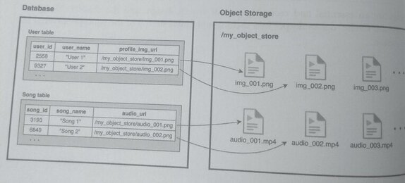

## 14. Object Storage

**Object storage ("object store" or "blob storage")** is a data storage design for holding large
volumes of unstructured data. This includes data such as images, videos, audio files, web
content, and emails, and collectively they are sometimes referred to as "media" or "multimedia
files.

**This type of unstructured data does not fit well into databases, which are generally
designed to hold relational and structured data.**

Additionally, databases are designed for *performant indexing* and *querying* and may impose
**limitations** on the *size of each record/row*.

=> *These limitations do not work well with large files such as videos or images.*

In object stores, objects are held in a structurally flat environment where ***each object has a
unique id number***; clients access the object with this id number.

Object storages **do not have** the *query* features (such as index-based and range-based) or *schemas*
that databases do.

Because of the simplicity (less overhead) of object storages, they can scale to an unlimited volume
and are also less expensive per gigabyte than databases.

Databases and object storages are used in a system to **complement** each other. While a database
can support the queries and relationships within data, an object storage can hold a large
amount of unstructured data.

A common approach in using a database with an object storage is to keep the media file **metadata** in the
database, and the **media files** themselves in the object storage. The diagram below illustrates how
profile pictures and songs are stored in the music application example:

Each row in the user table contains a URL path to a profile picture held in object storage.

The response to a read request will direct the client (i.c., a browser) to load the
profile picture from the object storage. The Song table behaves similarly; audio files are
streamed from the object storage.

In this example, the database allows queries and mutability of metadata, while the
object storage is meant for large amounts of unstructured data.

This pattern combines the strength of both storage forms.

A CDN is another component that is used to complement object storages.
