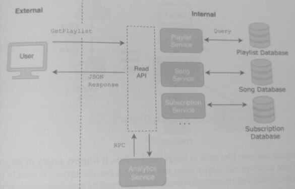
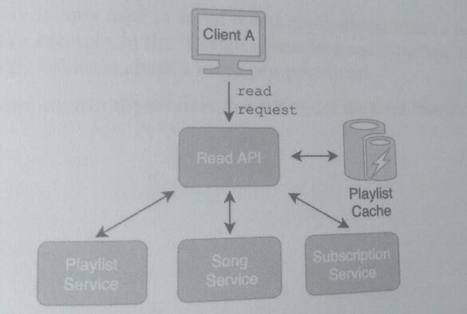
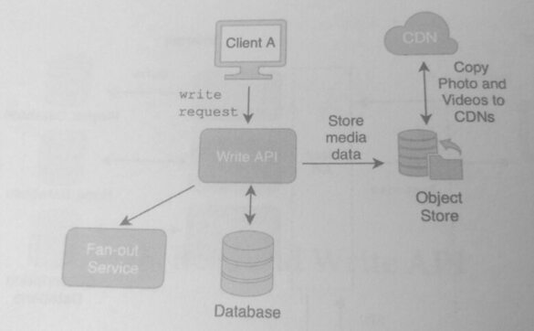

## 16. Read and Write API

For refreshment, an API (Application Programming Interlace) is how one software program interacts
with another.

An API Gateway is a server that provides an external interface to clients and acts as the
single point to access the methods multiple services.

A Read API is the portion of the API Gateway that allows clients to perform *read* requests

Like the gateway, it consists of methods from *different services* or has simplified versions of
those methods. It can be a facade, a logical grouping of read methods, or it can have its
standalone deployment unit.

A Write API is similarly defined, but for write instead of read operations.
These layers help to encapsulate functionality, improve readability, and increase client usability.

Read and Write APIs are commonly used for CRUD (Create-W, Read-R, Update-W, and Delete-W)
operations. Requests to a Read or Write API often trigger queries to database(s) that contain
the objects of the corresponding data models.

Read and Write APIs may also simplify multi-operation workflows and present it as a single
method to clients. In our music application example, a read of a playlist in the Read API
could correspond to these steps rolled into one method:

1. Reading the playlist data from method(s) in the Playlist Service.
2. Reading the song data for each playlist song from the Song Service.
3. Verify if the user has an active subscription with the User Service.

The Read API can stitch together the results of multiple asynchronous calls to different
services and return them as a single result.

Similarly, deleting a playlist could be shown as a single method in the Write API but
correspond to multiple service methods:

1. A delete operation on the Playlist database.
2. A delete operation on each of the saved songs in the Saved Songs database.

The Read API is illustrated in the diagram below as a composite of methods from multiple
services:

In the diagram, the Read API is designed for both external and internal clients. An internal
server-side service, "Analytics Service," also uses the Read API to access information about
playlists, songs, and subscriptions.

Additionally, **different APIs can be provided to different users** but have the same underlying
implementation:
* An external user may be exposed to a different interface than an internal user.
* Often, internal-facing APIs may provide **additional functionality** and options that external
  APIs don't have.

A Read API often uses a cache that allows it to re-serve data without invoking repeated calls
to services. For example, if a popular playlist is frequently requested by users, by caching this
playlist, the Read API will allow subsequent read requests to be served from cached data
instead of allowing a repeated request to the backend services.

The Read API can also track cache hit ratios and implement its own caching logic.
A request to a Write API, besides a db write query, often triggers on-write actions such as:

* Fan-out on-write
* Copy files to Object Store
* Copy files to CDN

If a write request contains files such as images and videos, it triggers a copy operation
of the media files to server-side object store and CDNs. 

A fan-out service is used to parallelize the notification of this write to multiple destinations
