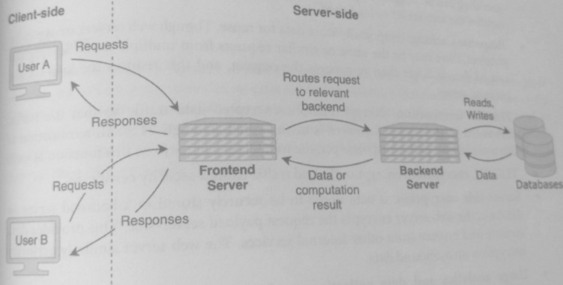
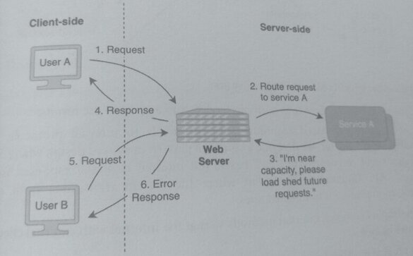
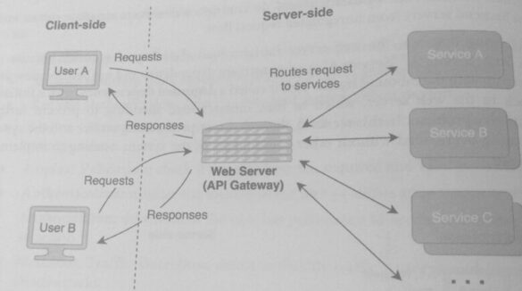

## Web Server (11)

Before defining a web server, it's important to clarify the terms frontend and backend.

"Frontend" and "backend" can have different meanings depending on the context. In a full-
stack application, the frontend refers to the client-side components, such as the UI (user
interface) or a client application, and the backend refers to the server-side components.

On the server-side, a frontend server is a server that is part of the first layer of servers that a
request reaches. A backend server is a server that is not part of the first layer of servers and
often contains services and controls resource access.

* A frontend server is designed to be external-facing and can handle unregulated and
  unfiltered requests to the system.
* A backend server is designed to run services, perform computations, and/or access databases. The
  following figure shows a system that has both frontend and backend servers.



###  Description
A web server is a frontend server that is stateless and responds to network requests over HTTP
and other web protocols. They are commonly used to process and deliver webpages to clients
such as web browsers. 

The job of the web server is to sit between the outside world and the system's services; 
it acts as an intermediary between users and services. The web server is often
the first server that a request will touch in the request path.

#### Roles
* Receive Requests: listen on a port for network requests over protocols such as HTTP
* Request Routing: route requests to relevant services and backend servers
* Request Deduplication: detect and discard the redundant requests.
* Session Management: relay responses back to clients and perform session management.
* Request Validation: check if requests have the required and valid parameters.
* Authentication: validate the identity of the user or allow anonymous access,
* Authorization: determine if the user has permission to access resources or perform
  an action.
* Malicious Traffic Detection: detect malicious traffic patterns and protect against
  DDoS attacks.
* Throttling: reject requests that exceed the request capacity that the web server can
  accept within a window of time. This protects backend services and databases from
  being overloaded with requests. (See Rate Limiter)
* Load shedding: discard or reroute requests that exceed the capacity of the system but
  still allow a portion of the requests. Load shedding is useful when there is request
  congestion; it is preferable to gracefully return an error indicating that the system is
  unable to process the request instead of potentially risking system overload. Load
  shedding can be triggered by a downstream dependency where a system component
  notifies the web server to load shed.
* Response Caching: temporarily store data for reuse. Though web servers are typically
  stateless, there may be the same or similar requests from multiple users. Serving the
  cached data is faster than re-process the request, and this reduces the load on the
  backend server.
* TLS/SSL termination: decrypt TLS/SSL-encrypted data traffic so that the traffic
  forwarded to the backend servers is unencrypted. Though TLS/SSL termination is
  often performed in the load balancer, the web server can perform this function as well.
* TLS/SSL encryption: encrypt outbound traffic using a security certificate.
* Server-side encryption: if data needs to be securely stored in a backend server of
  database, the web server encrypts the request payload server-side. This provides data
  security and privacy from other internal services. The web server similarly performs
  decryption on outbound data.
* Usage analytics and data collection: perform request-level data collection and
  logging for analysis of access patterns.

The frontend web server provides these functionalities at a *single point* instead of spreading
them out throughout the system.

This design allows backend servers to perform their primary roles, such as performing
computations and database operations, without needing to implement this frontend functionality.



Think of backend servers as more fragile software where business critical logic or data is stored. 
In contrast, web servers are more robust and shield the backend servers from unregulated request flow

In the following diagram, the web server initiates load shedding of requests because of
pushback from "Service A." "Service A" is a downstream dependency and has become slow and
cannot keep up with the inbound traffic. This is called a *degraded dependency*, which initiates
a pushback to the web server, which in turn initiates load shedding to prevent further
cascading of this problem.

In this scenario, the web server protects the service and the system from becoming overloaded
without other components of the system needing to implement defensive logic.

```
A1. Send Request

WS2. Route request to service A
WS3. "I'm near capacity, please load shed future requests.

A4. Receive Response

B5. Send Request;
B6. Receive Error
```

#### API Gateway
A web server can often be used as an API Gateway, which is a single point to access multiple
services.

An API Gateway provides an external-facing interface that masks the structure of the
services in the system. It provides better accessibility to external clients who do not need to
know which services are handling the API methods. Also, by providing an external interface,
the API Gateway allows services to be redesigned or refactored without impacting how
external clients interact with the interface.



Some of the other benefits of an API Gateway are:

* Can route a request to multiple services and aggregate the results.
* Can convert web-based communication protocols to internal protocols.
* A common pattern in system design is external requests/responses are REST-based,
  but internal requests/responses are RPC based
  * API Gateway is the point where the system transitions from external
    integration protocols to internal ones.
* Can simplify complex internal methods so that the endpoints with external clients have
  greater usability,
* Can provide multiple/customized API interfaces to different clients but with the same
  underlying services.
