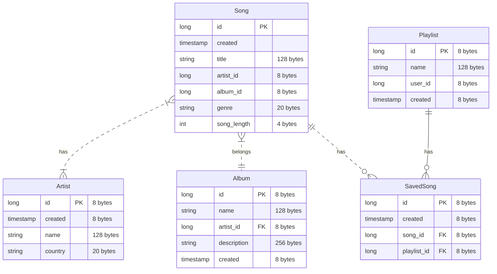
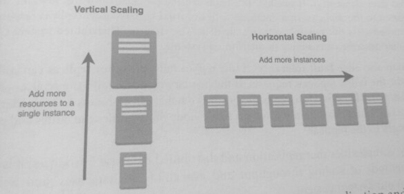
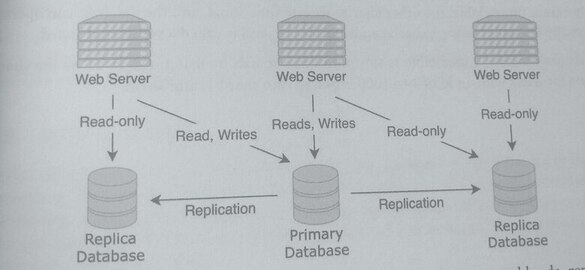
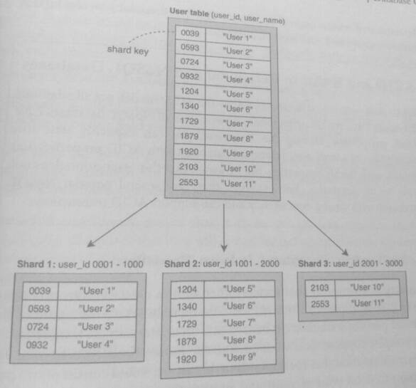

## 6. Database Concepts

```SQL
SELECT b.id, b.title, a.first_name, a.last_name
FROM books b
INNER JOIN authors a
ON b.author_id = a.id
ORDER BY b.id;
```

### 1. Database Terminology
Database and Managed Database

A database is a *structured collection of data* that is stored in a computer system. The
database management system (DBMS) is the software that is used by end-users and client-
side applications to access the data itself. Together they are referred to as a database.

A managed database is a database that a third-party provider maintains and operates on
behalf of a user. Cloud databases are an example of managed databases.

Each database has its advantages, limitations, and tradeoffs. Designing and choosing a
database that will best suit your application based on the use cases and throughput
requirements is a key part of the system design interview.

#### Database Model and Database Schema

A **database model (data model)** refers to how data is organized and the relationships that exist
within the data. A database model is an abstract model that is not related to a specific database
implementation.

Data modeling is the process of defining these data models and is an essential step in designing
a database. A database model may be represented by an entity-relationship diagram (ERD)

A database schema refers to the physical implementation of the database model to a specific
database platform. The design of the data models is the same regardless of the database
platform or type. In contrast, the design of database schemas is specific to a database platform

#### Transactions and Operations

A database transaction is a logical grouping of work performed on a database and may consist of
multiple operations. An operation is a unit of work that helps complete the transaction. 
A database transaction to transfer funds from one account to another could have two operations.

1. operation 1: subtract the transfer amount from the first account
2. operation 2: add the same amount to the second account.

The behavior of transactions differs depending on the database type and data model.

#### Availability, Reliability, and Persistence

**Availability** is the percentage of time that the users of the database can access it. For example.
* A db with a service level availability of 99.99%, means that in a year,
  a database is down for a max of 52 minutes where it cannot be accessed.

**Reliability** is the measure of the database's **integrity**, safety, and recoverability.
A database that has high reliability has low rates of *data corruption*, *secured authorization*, and
can *recover data* in the event of a failure.

**Persistence** means that after a piece of data is written to the database, it is stably stored on
non-volatile memory such as a hard drive or a solid-state drive.

Non-volatile memory refers to storage that will retain data even if it's not powered (such as hard
drives), while volatile memory refers to storage that will retain data only when it is powered
(such as RAM).

An "in-memory" database where the data is stored in RAM-typically has an order of magnitude
faster access latency than non-volatile-based databases. While this database lacks persistence.
it could be useful for applications where the past information becomes quickly irrelevant, such
as gaming or real-time services.

Such are database design tradeoffs, low latency is met by sacrificing persistence and reliability.

### 2. Data Modeling
Data modeling can be defined as the process of designing:
* data types used and stored within a system
* the relationship between data types
* the way data types are organized through attributes

An object represented in a database is called an entity. Its type is referred to as entity type
or entity class. An attribute is a property of the entity type. For example, an entity with an
entity type of "person" could have an attribute "name" with a value of Jon.

Data models by increasing technical specificity:
* Conceptual data model: a high-level data model that defines the product scope.
  business requirements, and major features
* Logical data model: a more specific data model that outlines the main entities and attributes
* Physical data model: a technical data model that includes specifics about data
  structure, including entities, attributes, and relationship

Although conceptual and logical data models are helpful in the product development
brainstorming stages, both are abstract and high-level designs.

For system design interviews, the physical date model is useful as it describes
the layout, associations, and structure of data used by services and stored in dbs.

It also illustrates the relations among entities and attributes. Note that a physical data model
is not a database platform specific model -- that is the term "database schema" that was defined
earlier. The physical data model is usually aligned to a specific platform and can be
used to generate the database scheme

#### Data Model Overload
"Data model" is an overloaded term to describe data used for both databases and services.

To disambiguate between the two,  one is "database model" and the other "message data
structure." Also, the terms "field" and "attribute" are often used interchangeably and often
mean the same thing. However, the term "attribute" will be used with db models and "field"
for messages.  The attributes of a db model overlap with message fields.

### 3. Entity Relationship Diagram

An ERD (Entity Relationship Diagram) or ER Diagram is a diagram that visualizes the
relationship of the entities and attributes used during database modeling.

ER diagrams are not tied to the physical structure of the database but are used to
design databases conceptually, their purpose is to illustrate a data model that can be
converted into a database schema. ERDs can help with design decisions before database
implementation, altering a database structure after implementation can be complicated.

#### Attributes and Relationships

Three main components in ERDs:
* Entities
  An entity is represented by a rectangle or a rounded rectangle, with its name at the top
  and its attributes listed below.
* Attributes
  In the list of attributes, the data type of the attribute and expected size are specified.
  Additionally, the attributes can be denoted as primary keys or foreign keys.

  Primary keys (PK) are used to uniquely identify an entity.
  A foreign key (FK) is used to uniquely identify another entity and is used to link
  two entities together. In a relational database, foreign keys link two tables together.

  A composite primary key (CPK) is a key that uses two or more attributes to uniquely identify
  the entity. They are usually used for child entities that can be uniquely identified by
  other entities.

* Relationships

  Relationships are represented by lines between entities.
  
  Relationships may be classified as either identifying or non-identifying and these are rendered with either solid or dashed lines respectively. This is relevant when one of the entities in question can not have independent existence without the other. For example a firm that insures people to drive cars might need to store data on NAMED-DRIVERs. In modelling this we might start out by observing that a CAR can be driven by many PERSON instances, and a PERSON can drive many CARs - both entities can exist without the other, so this is a non-identifying relationship that we might specify in Mermaid as: PERSON }|..|{ CAR : "driver". 
  
  Note the two dots in the middle of the relationship that will result in a dashed line being drawn between the two entities. But when this many-to-many relationship is resolved into two one-to-many relationships, we observe that a NAMED-DRIVER cannot exist without both a PERSON and a CAR - the relationships become identifying and would be specified using hyphens, which translate to a solid line:
  
  ```mermaid
  erDiagram
      CAR ||--o{ NAMED-DRIVER : allows
      PERSON ||--o{ NAMED-DRIVER : is
  ```
  
  * A solid line means a strong (identifying) relationship. This means that the child entity's
    primary key contains the parent entity's primary key.

  * A dashed line means a weak (non-identifying) relationship where neither entity contains the
    other's primary key in their primary key.

  * A strong entity can be uniquely identified by its own attributes.
    Therefore, the entity’s existence does not depend on any other entity
    * a Dormitory can be uniquely identified by its name and location.
    * a US Bank is uniquely identified by its bank number.

  * A weak entity cannot be uniquely identified by its own attributes.
    Thus, you must add attributes to the weak entity to uniquely identify it.

    This means you must extend the weak entity’s primary key to include one or more attributes 
    from the parent entity as a foreign key.
    * a Room in a Dormitory needs the Dormitory information as part of its identity.
    * an Account may be identified by an AccountNumber, but it is meaningless without being 
      associated with a Bank


#### Cardinality and Modality
Cardinality refers to the maximum number of elements of an entity that are associated with
the elements in another entity.

Modality refers to the minimum number of elements of an entity that are associated with
elements in another entity.

The relationship between two entities, Entity A and Entity B, can have the following types
of cardinalities:

* One-to-one: an element of Entity A is linked to only one element of Entity B, and vice
  versa.
  * a user can have one contact (one)
  * a contact can have one user (one)

* One-to-many: an element of Entity A is linked to multiple elements of Entity B, but
  an element of Entity B is linked to only one element of Entity A.
  * An album can have multiple songs (many)
  * but a song belongs to only one album (one)

* Many-to-many: an element of Entity A is linked to multiple elements of Entity B,
  an element of Entity B is linked to multiple elements of Entity A.
  * A song may be written by multiple artists (many)
  * an artist may write multiple songs (many)

The following diagram illustrates the drawing notation for the cardinality in ERDS:

* One-to-one
* One-to-many
* Many-to-many


    
#### Example ERD
The Song entity has a strong one-to-many relationship with the Album entity since a song
belongs to a single album, and an album can have multiple songs,

The Saved_Song entity represents a song that is added to a playlist.
* It has a weak (non-identifying) one to-many relationship with the Song entity since multiple users can save
  the same song to a playlist. Its existence depends on the existence of the Song entity.
  
* Saved_Song has a strong (identifying) one-to-many relationship with the Playlist since it
  must belong to a playlist, and a playlist can have multiple songs. A saved song can't
  exist on its own but must be in a playlist.

### 4. Relational vs. NoSQL Databases

A relational database is a type of database that represents data in tables, where each row of a
table is a record.  The columns of a table can refer to data in another table thus creating a
relationship between the tables.

SQL (Structured Query language) is the language used to communicate with a relational db.

Relational and SQL are tightly associated with one another and are often used synonymously.

In SQL tables, a primary key is a field that uniquely identifies each row (a record) of the
table. A foreign key is a field that refers to the primary key of another table and is used to
link rows from different tables together

A NoSQL database ("not only SQL") is a type of database that does not store data in tables

NoSQL is a catch-all category for databases that do not use a relational model and instead store
data in a **non-tabular format**. This non-tabular format is represented by a schema which
describes the organization and layout of data in the NoSQL database or non-relational database.

The diagram below illustrates how data for playlists and songs could be organised in relational
and non-relational database

#### Relational
Playlist (id, name)
* 23483, Smooth Jazz
* 49310, Classic 80s

Song (id, name, playlist_id)
* 8201, Kind of blue, 23483
* 8549, Rule the world, 49310
* 8756, Let's get physical, 49310

#### Non-relational
Playlist (id, name, song_ids)
* 23483, Smooth Jazz, [8201]
* 49310, Classic 80s, [8549, 8756]

The most common types of NoSQL databases are key-value, column-oriented, and graph.

In a key-value database, a data element is stored as a pair consisting of a key and a value.
Groups of key-values are stored in collections as opposed to tables in a relational database.
Given their simplicity and ease of use, key-value databases are the most common type of db.

Understanding the tradeoffs between relational and Nas databases is a common theme in
system design. Relational databases excel af storing transactional data and allow complex
queries across tabular relationships.

In contrast NoSQL databases use flexible schemas to store data and can easily scale to high
request throughput and large data sizes.

The table below outlines when relational or NoSQL databases should be used:

|Relational | NoSQL |
|---|---|
| Structured data | Unstructured or semi-structured data |
| Strict schema / fixed format | Flexible schema / unknown |
| Relational data | Non-relational data (no links) |
| Need for joins or nested lookup | Data can be denormalized |
| Transaction driven workloads | High Query-per-second workloads (no locking) |
| Known scaling behavior | Unlimited scaling |
| Multiple indexes or unknown lookup patterns | Key-value driven lookups |

Some of the real-world use cases for relational databases include:
* Online transaction processing (OLTP)
* Online analytical processing (OLAP)
* Logistics and inventory management
* Business intelligence (BI) and data warehouses
* Financial services and payments

Some of the real-world use cases for NoSQL databases inclue:
* Real time analytics
* Logging and click-driven data
* Fraud detection
* Recommendation and news feeds
* IoT - sensor data
* High throughput messaging
* Video and photo sharing

Data modeling is a process that is used to design both relational and NoSQL databases. While
ER diagramms are typically associated with relational databases, they can also be used for NoSQ
databases.

In NoSQL databases, relationships within the data are not enforced by the database,
but can still be visualised by ERDS. Such databases have a more flexible schema,
attributes and relationships can be added with greater ease than compared to relational databases
where designs of the database models are more fixed yet extendible. Relational database models use
a table based format, while NoSQL uses a schema.

Normalization is a database design technique that stores data in a non-redundant and
consistent scherna. In a normalized schema, there is no redundant data in a database, which
helps eliminate inconsistencies during write and modify operations. SQL, tables commonly
store data in a normalized format and *use table relationships to aggregate rows* through
SELECT and JOIN statements.

Denormalization is a database design technique that stores data in a redundant (repetitive)
and possibly grouped schema. Redundant copies of the data within a database increases the read
performance at the cost of write performance and consistency.

In the Song and Playlist tables, a denormalized approach stores two copies of song data:
1. in the song table
2. again in the Playlist table.

This denormalized schema reduces the number of JOINs needed and improves the latency of read
queries. Denormalization could also mean combining data by grouping or embedding it to avoid a JOIN.

> Normalized
> * Non redundant and consistent data
> * Uses a smaller amount of storage

> Denormalized
> * Combined and/or redundant data
> * Faster read queries

To fetch a playlist, the database no longer needs to perform a JOIN to get the titles of the songs.
Instead, the redundant copies of the song's title, artist, and album are already in the playlist
table. This denormalized schema improves the read efficiency of all Playlist reads as said before.

However, to update the song's name requires writes to both the Song and Playlist tables
instead of a single write to just the Song table. Furthermore, these operations are not guaranteed
to be executed simultaneously, meaning the song names in both tables are different at some point in
time, causing inconsistency.

The advantages of denormalization:

* Reduce the number of joins or lookups
  * JOINS are expensive operations that increase the query time
* Simpler and more performant queries
* Reduce relationships within the data
* Increases overall performance of the database, especially for read heavy workloads

The disadvantages of denormalization:
* Inconsistency within the db due to redundant data copies that can be separately modified
* Reduces performance of writes since multiple locations need to be written to
* Require more storage due to redundant data

While denormalization is a technique that can be used in both relational and NoSQL
databases, it is less likely used in relational databases that support ACID transactions. By
having redundant data, there is a possibility of inconsistent values at different parts of the
database, which could break the use cases for transactional data that require strong
consistency. However, denormalization is common in NoSQL databases with eventual
consistency; schemes can be designed to use redundant data to achieve higher performance.

> It is common that denormalization is associated with a NoSQL database due to performance
> leanings, and normalization is associated with a relational database due to consistency leanings.

### 7. Vertical and Horizontal Scaling
As a system serves more users, it receives more requests and has greater storage needs. There
are two ways to handle the additional workload demands: Vertical scaling or horizontal
scaling.

Vertical scaling means increasing the CPU, memory, or storage of a single machine
Horizontal scaling means increasing the number of machines and distributing the workload
among those machines.

Horizontal scaling allows nearly limitless amount of scalability: any number of machines can be
added to handle larger data and workloads. In contrast, vertical scaling is limited to how much a
single machine can be upgraded. These terms are not limited to dbs but any software system.

In databases, the two most common forms of horizontal scaling are replication and sharding,
which are described in the next sections. In horizontal scaling, a database becomes distributed,
and while this adds scalability, it also introduces more complexities. There is no longer a single
view of the data, communication between nodes can be unreliable, and there might be
simultaneous writes on the same key or row.



### 8. Replication
Replication is the process of copying data from a primary database to a secondary or replica
database. These replicas are often read-only versions of the primary database.

Replication results in a distributed database and increases the availability of data since
users can access the same data set from multiple nodes. While writes still need to be handled
by the primary database, read requests can be distributed to other nodes, reducing the load
on the primary database.



While being able to read data from multiple nodes is useful for read-heavy workloads, replication
means that each write needs to be propagated from the primary database to the replicas. This
adds complexity to the consistency model since data is no longer located in a single db.

> Will a read from a replica return data that is up-to-date or stale?

In a database with *strong consistency*, the database needs to verify that the response to
replicas reads contain the updated data element(s). If needed, the reads will be blocked until
the relevant writes are propagated to the replicas.

In a database with *eventual consistency*, replicas respond to reads immediately but possibly
return stale data. See distributed system concepts.

Replication also adds *fault tolerance*: if one replica fails, the other replicas can still respond
and handle the failed replica's requests.

If the primary database fails, the replicas choose one of the existing replicas to take over as
the primary database in a process called *leader-election*. This process ensures that there is
always a single node that handles the writes and propagates those changes to the replicas.

Despite the complexities that *replication* and *distributed* database introduces, it key for scaling
throughput and availability in databases.

### 9. Sharding

Sharding (horizontal partitioning) is a form of horizontal scaling in databases where
a dataset is split into smaller datasets by rows (horizontal) or keys, which can then be
distributed across multiple machines. This allows increased throughput, capacity, and availability,
as the workload is shared across multiple machines.

Vertical partitioning refers to horizontal scaling by splitting a dataset by columns. It is
a less common technique since this only applies to relational databases, and tables usually are
fewer columns than rows.

In sharding, a portion of the dataset, called a shard, is stored on a node. This increases potential
storage capacity since the dataset is no longer restricted to the capacity of a single machine.

Also, this increases the database system throughput, as each node can process requests.

Another benefit of sharding is that it increases availability: even if a single node or a single
shard becomes unavailable, the other shards are still functional, and the database can operate
in a partially degraded state. A shard can be replicated and is called a replicated shard.

In the diagram below, a user table is split into three shards by using user_id as the shar
key. Data for users with an id of 1 to 1000 is placed into shard 1, and so on.



Evenly splitting the range of an attribute is a simple method to shard a database, but it may
not be appropriate for all data. The shards should be created so that traffic is evenly distributed
between different shards.

Splitting the data based on the range of an attribute may result in unbalanced shards, where some
shards can hold more keys than other shards

Additionally, using a monotonically increasing shard key such as user id or timestamp may
result in a single shard that handles more writes than other shards.

For example, using user id as the shard key means that new users will fall into the same shard,
which becomes problematic if new users make more requests than existing users.

One option to mitigate uneven sharding is to use a **hashed shard key**. This approach uses a
hash function to compute a shard key based on multiple attributes providing a more even
distribution of data among shards.

### 10. ACID vs. BASE
Another difference between a relational and a NoSQL database is the behavior of db transactions.
As previously defined, a database transaction are units of work performed on a database that can consist
of multiple operations. The most common transaction types are read, write, and read-write.

The behavior of these transactions and how they are executed is called the database transaction model.

The two most common database transaction models are **ACID** and **BASE**, short for the properties
that they represent. The ACID model provides a consistent system and is commonly associated
with relation databases.  The BASE model provides high availability and is commonly associated
with NoSQL databases.

> There are several popular NoSQL dbs with strong consistency that support ACID transactions

ACID stands for:

* Atomicity (atomic / indivisible)
  * a property that means either all of a database transactions succeeds or
    none of it does. If part of a transaction fails, then the whole transaction fails.
    All parts of a transaction behave as if they were a single transaction (as an atomic unit)

  For example, suppose you want to transfer money from you to your friend .
  The database transaction that corresponds to this action would consist of two parts:
  1. A write operation to debit your account
  2. A write operation to credit your friend account.

  Atomicity ensures that both happen or neither does -- it won't be stuck in a state where only
  the first operation happens

* Consistency (Correctness)
  * a property that means the database is in a valid state at the start and end of a transaction.

  For example, the database that handles the money transfer from you to your friend
  may define that the data is in a valid state if the sum toral of both accounts before and
  after the transaction is the same.

  No transaction can create an invalid data state, ensuring data integrity and
  preventing corruption. Note that "consistensy" is an overloaded term, and this ACID
  consistency is a different concept from CAP consistency in a distributed system

* Isolation (Immunity from external / others)
  * means that a database transaction cannot be affected by any other transaction.
    The intermediate state of a transaction is not visible:
    * a read request can't read the result of a write request that has not been completed yet.

  For example, the database transaction of the money transfer from you to your friend
  can only be seen by one account or the other, but not both. There is no intermediate
  state where the transferred money is in both accounts of neither account

* Durability
  * means that once a database transaction completes, the changes from the transaction
    are stored permanently, even if there is a database failure immediately afterward.

  For example, the database transaction of the money transfer persists and is not
  reversed even if there is a database failure.


ACID databases are commonly used for transaction-oriented data, where a failure midway
through a non atomic transaction would result in catastrophic consequences.

Many organizations require ACID-compliant databases for transaction-driven workloads such
as financial operations, payments, and e-commerce.

**BASE** stands for Basically Available, Soft state, Eventual consistency:

* Basically Available means that the database has high availability. The database
  appears to be in a good state most of the time and accepts requests.

* Soft state means that the state of the data can change. Since data does not need
  immediate consistency in this transaction model, replicated data at different nodes
  could have different values and change without further transactions.

* Eventual consistency means that if there are no new updates to a data item,
  eventually, all reads of that item will return the last updated value. Updates and writes
  are propagated throughout the nodes of a system, but those changes will not be
  immediately reflected.

> A BASE database gives up consistency in return for availability.

Databases that have more BASE characteristics usually scale to higher throughput than those
that have ACID characteristics. The eventual consistency property of a BASE database allows
lower latency and better performance but at the cost of stale data. For this reason, BASE
databases are commonly used for performance-driven applications and use cases that don't
require consistency.

* E.g., it is not important to users of a social networking site if their posts are inconsistent
  (e.g., they don't have the latest tweets) for a short period of time. Instead, users want to
  be able to read and make posts most of the time (support high availability).

Modern databases don't necessarily fall into one category or the other but may have some
ACID and some BASE properties.
