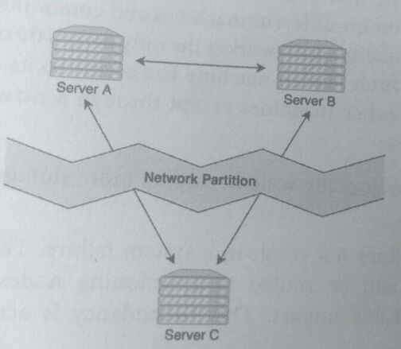
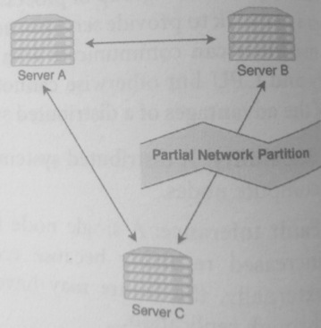
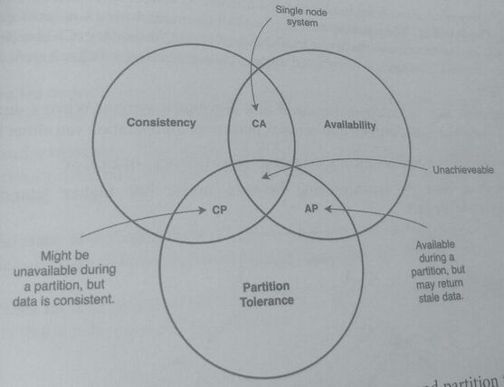
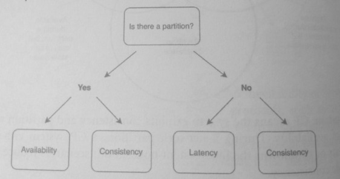
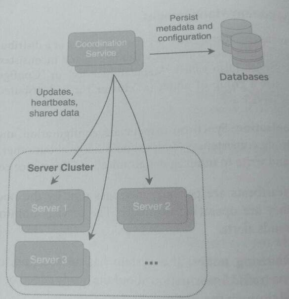

## 9. Distributed System Concepts

### 1. Definition
* A network is a group of connected machines that share data by sending and receiving data
* A node is a single machine within that network.
* A distributed system is a group of processes that run on different machines and
  communicate through a network to provide services and functionality.

A network is the only means through which machines can communicate with one another.
Each machine has access to its own memory and CPU but otherwise cannot access other
machines except through a network.

Distributed system advantages:
* Scalability: A distributed system can horizontally scale by adding more storage and
  compute nodes
* Fault tolerance: A single node failure does not result in a system failure because requests
  can be routed to functioning modes, and the failure may have no visible impact. Redundancy
  is achieved via replication.
* Performance: Distributed systems generally have lower latency and higher
  throughput. Nodes of a system can be geographically spread out so that storage and
  compute nodes are closer to users

Disadvantages:

* Unreliable network: Networks are inherently unreliable, and communication between different
  machines can be disrupted by network faults and partitions. No network has yet been designed
  that is 100% reliable and fault-proof
* Need for data replication: Replicating data across multiple nodes over an unreliable
* Loss of consistency: Different versions of the data are located at each node
  Reconciling data differences between different modes allow non-deterministic
  behavior to arise. The CAP theorem is useful for understanding the limitations of these systems
* Coordination: Additional components such as load balancers and replicas are needed
  to handle the distributed nature of the system. Strategies such as leader election and
  failover need to be devised during outages.

In an unreliable network, there are no guarantees that all data will be successfully delivered
over a network, and some of the causes of network unreliability are:

* Network fault; an event that causes a network to incorrectly function, usually
  preventing one machine from communicating with others, i.e.:
  hardware issues (e.g., a router malfunction), software errors, and wireless interference

* Network partition: a network partition is usually caused by a network fault, and
  during a partition, a network's nodes are split into multiple groups that cannot
  communicate with each other.

  Distributed systems should be designed to have partition tolerance. Such that even after a
  partition, the distributed system can still operate, even if at reduced capacity or partial
  availability.

* Network congestion: the amount of traffic on the network is more than what the
  hardware and software can handle. This results in reduced quality of service, delayed
  delivery of data packets, or packet loss.

* 
* 

Network faults, partitions, and congestion are considered an inevitability of networking, and
they must be tolerated. Distributed systems use reliable protocols, such as TCP and RPC
frameworks, that are built in the transport or application layers to ensure reliability.

A reliable protocol confirms with the sender if the delivery of data to the recipient was
successful. When a reliable protocol cannot confirm the delivery of a data packet, it has
the logic and mechanism to resend the data and manage the out-of-order data packet.

### 2. CAP Theorem
The CAP Theorem is a useful concept for understanding the limitations of a distributed
system. It states that a distributed system can only have two of these three characteristics
consistency, availability, and partition tolerance.

* Consistency: Also known as "CAP consistency," "strong consistency," or "strict
  consistency." CAP consistency means that simultaneous read requests at different
  nodes always return the same data. For clients accessing the distributed
  system, it appears as if there is only one copy of the data and that all operations are
  atomic. 
  
  When a write transaction has been completed, all read requests from all clients must reflect
  the changes from that write transaction. This consistency is different from ACID consistency.

* Availability: Every request to any node in the system receives a response

* Partition Tolerance: When a network's nodes are blocked from communicating during a network 
  partition, the system continues to operate despite the network failure.

For a distributed system on an unreliable network, partition tolerance is a necessary
characteristic, so the choice is between consistency and availability. The CAP theorem can be
rephrased as: during a network partition, a distributed system can provide either availability
or consistency, but not both. The possible types of systems are:

* CP system: CP means the system exhibits consistency and partition tolerance at the
  cost of availability.

  **During a network partition, a CP system either rejects write requests or shutdowns the
  inconsistent nodes. Both scenarios reduce availability but provide consistency.**

* AP system: AP means the system exhibits availability and partition tolerance at the
  cost of consistency.

  **During a network partition, an AP database continues to process write requests and allows
  inconsistent nodes to operate. However, the inconsistent nodes might have stale data, and the
  system needs to resync all nodes when the network partition is repaired.**

* CA system: CA means the system exhibits availability and consistency at the cost of
  Partition tolerance. However, because all distributed systems are susceptible to
  network partitions, using this type of system is not practical nor desirable. A CA
  system cannot tolerate any network faults or partitions, so they are effectively single
  node systems

Distributed databases are a type of distributed system, and the CAP theorem can be used
illustrate their characteristics. However, the CAP Theorem is purely theoretical, actual
systems and databases can operate with some aspects of CP or AP, depending
implementation and failure modes.

For example, distributed systems rarely have 100% availability, but instead, availability
is characterized by the percent of uptime (i.e., "Four 9s uptime is 99.99%, and
"Five 9's" uptime is 99,999%).

While systems and databases may not fall squarely into a CAP category, the theorem is useful
for understanding the limitations of a distributed system.

### 3. PACELC Theorem

The CAP Theorem dealt with the limitations of a distributed system when there is a network
partition. The PACELC Theorem expands on the CAP theorem: during a network partition
(P), a distributed system chooses between Availability (A) and Consistency (C). Else (E), when
there is no network partition, a distributed system chooses between either Latency (L)
Consistency (C).

This theorem sets forth an additional tradeoff of a distributed system. When a distributed
system is running normally, without any network partitions, an operation can either have
* Low latency but possibly inconsistent data ("Else Latency" or EL), or
* Consistent data by synchronizing between nodes but higher latency (E
Consistency" or EC).

Databases with AP characteristics are usually also EL systems and are known as AP/EL
systems. During a network partition, an AP/EL system gives up consistency for availability
and during normal operation, an AP/EL system gives up consistency for lower latency,

Databases with CP characteristics are usually also EC systems and are known as CP/EC
systems. These systems typically support ACID transactions and prioritize consistency.
During a network partition, a CP/EC system gives up availability for consistency, and during
normal operation, a CP/EC system gives up lower latency for consistency.

### 4. Distributed System Management

Coordinating operations and sharing data between the nodes of a distributed system can lead
to complex behaviors such as race conditions, deadlocks, and inconsistencies. Systems often
use a Coordination Service (also called "Metadata Service" or "Configuration Service") to
manage and synchronize a group of nodes (a cluster) in a distributed environment.

Typical roles:
* Data synchronization: Synchronize metadata, configuration, and other data between
  nodes with strong consistency. Nodes should know about other nodes in the system
  and can read and write to other nodes atomically without race conditions

* Heartbeats: Heartbeats are periodic messages sent by the nodes to the service to
  indicate that they are operating normally. The service monitors nodes that fail to
  heartbeat and sends alerts.

* Adding and removing nodes: If a system has autoscaling, nodes are added and
  removed based on traffic. Information about the newly added or removed nodes needs
  to be propagated through the system.

* Failed nodes: If a node fails, the service should remove it from the metadata and notify
  services that could be impacted.

* Leader-election: The service should have a mechanism for leader election. If a
  primary node fails, the remaining nodes should elect a new primary node using this
  service.

* Maintain distributed locks: If nodes need to access shared resources in a mutually
  exclusive way, distributed locks are used to synchronize their access

* Persist metadata: The cluster's metadata is a key-value mapping of node key to node
  data that can be persisted to a database.

Zookeeper, an open-source software maintained by the Apache Foundation, is an example of
a coordination service that can be used to manage clusters.

### 5. Consistency

> The rules that operations on data stored on a distributed system follow is called the data
> consistency model.

In a distributed system with strong consistency, any simultaneous read requests at different
nodes will get the same view of data.

In a system with weak consistency this isn't guaranteed, and clients making the same reads
could get different data.

The tradeoff between strong vs. weak consistency is a common decision made during system
design.

Such as distributed databases, a database with BASE characteristics makes transactions with
eventual consistency, which is a form of weak consistency. Eventual consistency states that if
no new writes are made, eventually, all read requests will return the same data from all nodes.

It takes time for the updated data to propagate to all nodes, but this propagation is not enforced.

Why not design a system that uses strong consistency all the time?
Achieving stron consistency in a distributed system has additional overhead and costs. There must
synchronization between the nodes and a mechanism where a node can verify that it has the most up
to date data.  If needed, requests at a node with stale data will be blocked until the new data is
propagated to the node.

The Many Flavors of Consistency

* CAP consistency (Strong Consistency, Strict Consistency, Immediate
Consistency) means that simultaneous reads at different nodes in a
distributed system always return the same date. This holds even if there is
a simultaneous write at one of the nodes.

* Weak Consistency means that simultaneous reads at different nodes
could yield different values. Nodes can diverge in state, and there is no
guarantee that they will converge.

* Eventual Consistency is a type of weak consistency. It means that if there
are no new writes, data at all nodes will eventually converge. Updates and
writes are propagated throughout the nodes of a system, but those changes
will not be immediately reflected. This is associated with BASE databases.

* Sequential Consistency means that the ordering of write requests at a
single node is preserved in a distributed system. Two sequential writes
cannot be applied out of order at another node in the system.

* ACID Consistency means that data stored by a database is in a correct and
valid state. If a transaction violates data integrity constraints, that
transaction is rejected, and the state is reverted. This is associated with
ACID databases.
