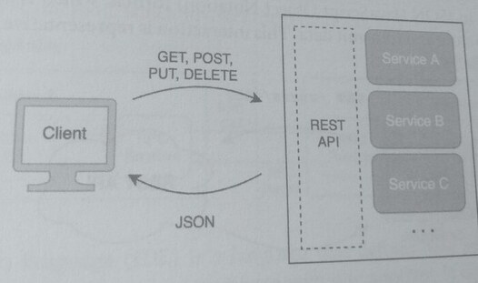
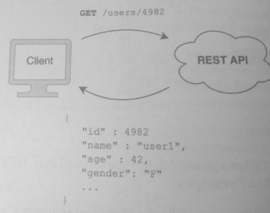
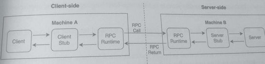
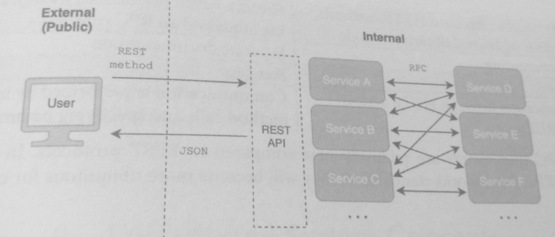

## 8. Integration

### 1. Definition
System integration (or simply integration) refers to the process through which system
components **communicate** and **share data**. It is how components are linked together through
compatible interfaces and messages.

Integrating a component such as a database or server builds on top of networking protocols and
establishes frameworks for components to share information.

### 2. Database Integration
Database integration means using a database as the primary form of sharing information
between different components of the system. Using database integration, system components
communicate with each other indirectly through a database; one component may write to the
database, and another component reads from it. Using database integration as the primary
form of sharing information runs into significant problems as the system grows larger and
more complex.

Continuing the music application example, Subscription Service shares data about
new subscriptions with other services by writing a data model to the database. Other services,
such as User Service, read from the database to access this subscription data.


While this might seem like a straightforward way to share data, multiple problems may arise
from database integration:

* External exposure of internal data models: The internal implementation of the
  database models is exposed and visible to external users. If there are schema changes,
  this could casily break the way services access the database, adding fragility and

* Brittleness to the design. Since there is no external interface, all services would need
  understand the data structures and schemas to use the database. In the example,
  Subscriptionservice makes a data model change, all other services would
  break or need to make the same change.

* Lack of Security and Controls: By exposing the data models externally, the systems
  unable to fully control how data structures are accessed, adding security a
  authorization problems. Malicious users can more easily perform attacks and prob

* Tight coupling: Each component is tied to the specific platform and implementation
  of the database. If there's a need to change the database platform, each of the servic
  would need to make corresponding code changes.

* Weak cohesion: The same logic to access the data needs to be repeated in every
  service, and different versions of this logic may arise.

  In the example, the logic to retrieve subscription information for a user would need
  to be implemented in both the SubscriptionService and UserService.

* Scalability problems: The responsibility for scaling now largely falls to the db
  platform. While there are effective horizontal scaling techniques for databases, the
  are limited to the specific database platform, and horizontally scaling a service syste
  would be more effective at handling large-scale throughput and bandwidth.

* Asynchronous problems: If a service makes a transaction to the database, it is difficult
  for other components to know when the transaction was reflected in the db. Instead,
  if services communicated directly with each other, it would allow for synchronous
  operations and eliminate possible race conditions.

> Due to these problems, databases should be avoided as the primary form of integrating system.

> Instead, access to databases should be controlled through services for both external
> clients (eg, websites and mobile applications) and other internal services.

### 3. REST
REST (Representational State Transfer) is a software architectural style that governs
design of communication between computers on a network. It states a set of standards &
constraints and is the foundation of how computers currently communicate on the Web

An API that follows the REST architectural style is called a REST API (of RESTful API) and
can be used for system integration. The REST architecture focuses on scalability, interfaces,
loose coupling, and encapsulation. Its philosophy is:

* Client-server pattern: Client and server should be separate components developed
  independently, and communicate through an interface. This approach improves
  portability across different platforms and separates the interface (client-side) from the
  logic and data (server-side).

* Resources representation: Data and content should be represented as resources. A
  REST server is responsible for managing these resources and allows clients to access
  and modify these resources through operations.

* Interface uniformity: Service interfaces should support the same set of operations.
  This allows for loose coupling, where services and clients can be developed separately
  without impacting each other. The downside is that this uniformity forces all clients
  and services on the same set of operations, and there cannot be specialized methods.

* Statelessness: Operations are stateless, meaning each request from the client should
  include all the required information needed to process the request. Requests cannot
  assume or require the server to have any stored context or data. Rather, the client is
  responsible for managing and storing all of the session's data and state.

  The client does not need to know what state the server is in and vice versa. This
  statelessness means that requests have greater visibility and reliability but at the cost
  of repeating data in requests. The opposite of stateless is stateful, where a client
  request uses context stored on a server.



HTTP is a protocol in the Application Layer. HTTP is an example of a protocol that follows
the REST principles:

* HTTP requests and responses follow a client-server pattern. Clients, such as web
  browsers and applications, send requests to web servers. Both client-side and server-
  side components can be developed separately and can operate on different technology stacks,

* HTTP treats content such as HTML, CSS, JavaScript, images, and video files as server-
  side resources. Each file is accessed as a resource with a unique URL. An album image for
  a product could have an URL of www.musicapp.com/images/album12345.png. Navigating to this URL allows
  access to this image, following the principle of resource representation.

* HTTP operations follow a uniform interface because they use the same request
  methods. The four main HTTP methods used to send and receive requests are POST,
  GET, PUT, and DELETE, which correspond to CRUD (create, read, update, delete)
  operations. These request methods are invoked by navigating to URL path.

CRUD actions for a "user":

| HTTP Method | URL Path | Description |
| ---| ---| --- | 
| POST | /users |  Create a new user |
| GET | /users/{user_id} | Get an existing user |
| GET | /users/ | Get all users |
| PUT | /users/{user_id} | Update an existing user |
| DELETE | /users/{user_id} | Delete an existing user |

> HTTP requests are stateless. Each of the CRUD operations contains all the information needed to
> process and form the response. The client manages all the state information and does not assume
> that the server has any stored context.

In the following diagram, a browser (the client) sends an HTTP request to a REST API and
receives a payload in JSON (JavaScript Object Notation) format, which is a human-readable
data format used to store and transmit data. This interaction is representative of a typical REST
request and response.



HTTP and REST are not the same; a system can be RESTful without using HTTP as the protocol.
Likewise, though HTTP communication does not need to follow REST principles,
most use cases do. Because HTTP is used ubiquitously for most web communication, it's a
good example of the main REST principles.

### 4. RPC
RPC (Remote Procedure Call) is a form of inter-process communication in which a process
invokes a local call that causes a routine to execute in another process that is running on a
remote machine over a network. A call (procedure call, function call, or subroutine call) is the
invoking of a function.

There are many IPC implementations and technology stacks used in system integration. They
are considered frameworks because they establish an integration structure that helps build and
link components.

For example, popular RPC frameworks include gRPC, Thrift, and JSON-RPC. Though RPC a style, each
RPC framework is tightly bundled with a specific underlying technology stack and does not work well
with other RPC frameworks,

RPC frameworks use stubs that are compiled with the client and server code to communicate
between the server and client.

A client stub receives the local call from the client and is
responsible for the conversion of parameters and data. It also performs serialization by
transforming the request into a transmittable form that can be sent over a network.

The server stub is responsible for the deserialization of the transmitted request and the
deconversion of the parameters and data into a remote call to the server. It is also responsible
for the conversion and serialization of the response back to the client.

An RPC runtime is the software that manages the transmission of the request and responses between
client and server. This runtime is typically built on top of the networking protocols and is
responsible for *retransmission* and *encryption*.

In the following figure, the main steps of an RPC mechanism are outlined. The client performs
a local call to the RPC method, which invokes the remote call and returns a response.



**Interface definition language (IDL)** is a language that defines how software components
written in different languages can communicate with one another. It establishes a common
interface that is language-independent.

For example, a client application written in Python can communicate with a server written in
C++ using an IDL. IDLs are commonly used in RPC implementations, allowing clients and servers
written in different languages and running on different operating systems to communicate.

In most RPC frameworks, there is a tight bundling between the RPC implementation and the IDL

In gRPC, the IDL is called Protocol Buffers (or "protobuf) and defines messages and RPC methods
that are language agnostic. The following code is written in a protobuf format and shows an
RPC method GetUser of the service UserService, which receives a GetUserRequest and returns a GetUserResponse.

Both server and client understand this interface and can interact with each other regardless of
the language they were implemented in..

```
service UserService (
// Retrieves a User
rpc GetUser (GetUserRequest) returns (GetUserResponse)
{}

// the request message sent from the client.
message GetUserRequest {
 int id = 1;
}

// The response message sent from the server
message GetUserResponse (
int id = 1
string name = 2
int age = 3
string gender = 4
...
}

```

Initially RPC was used as the primary means of communicating between computers, with the rise
of the internet, the usage of RPC fell.

However, as modern systems needed to scale and have better performance, RPC resurged and
became popular as a backend integration framework. Many companies developed their own RPC
frameworks and used them internally to communicate between services.

gRPC is an open source project that was originally developed by Google for internal use.

RPC benefits:
* Abstraction: applications and developers do not need to understand the inter-proses
  network call mechanism.
* RPC frameworks usually provide stubs in high-level languages, allowing applications
  to integrate with minimal effort.
* RPC method calls do not need to conform to a standard interface and can be highly optimized.
* RPC allows for serialization in binary and customized formats, which typically means
  tight data packing and smaller packet payloads.
* RPC APIs are typically self-documenting, providing high usability to external clients

The downside of these benefits is that there is no uniform standard for RPC, and each RPC
implementation is different.

### 5. REST vs, RPC

Both REST and RPC are popular approaches to integration, each having its advantages and
disadvantages.

A common design pattern in systems is that integration with external clients
uses a REST protocol (eg., HTTP), but integration behind the reverse proxy for internal
components uses an RPC framework.

REST calls have a standardized interface so that most client-side applications can be developed
without being tied to specific technologies.

However, RPCs are usually more performant than REST calls and a system where a single RPC
framework is enforced can achieve a more efficient integration.



Both REST and RPC are used to design APIs, REST APIs are centered around resources while RPC
APIs are centered around actions.

| RPC actions | equivalent REST Method + resource | 
| ---- | --- |
| createNewUser() | POST /users |
| getUser() | GET /users/{user_id} |
| updateUser() | PUT /users/{user_id} |
| deleteUser() | DELETE /users/{user_id} |

Besides the architectural design, RPC and REST are implemented with different technology stacks.
REST uses an existing internet protocol (e. HTTP) that has a common interface understood by most
systems. RPC frameworks add another application layer of protocol on top of existing Internet 
protocols. The result is that an RPC framework is tightly coupled with the underlying technology 
stack whereas REST implementations are more agnostic of the tech stack

A summary of the differences between REST and RPC:

REST

| REST | RPC |
| --- | --- |
| Resource representation of data | Actions-based view of data |
| Human-readable message formats (e.g. JSON) | Binary message format (e.g. protocol buffers) |
| Usually HTTP 1.1 protocol | Customized network communication protcols or rarely used protocols |
| Lower throughput and high latency | Higher throughput and low latency |
| Usually uses the standard HTTP methods | Custom developer defined methods that use stubs and RPC runtime |
| Self-documenting | Separate documenation |
| Stateless | Stateless |
| Communication via HTTP action verbs (CRUD) | Communication via invoking method calls with params |
