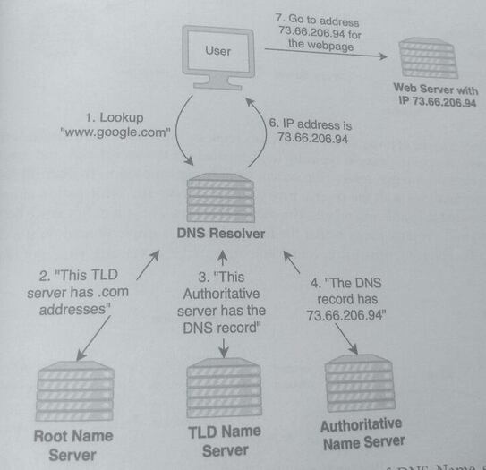
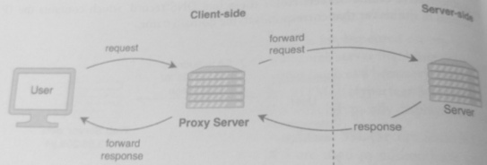
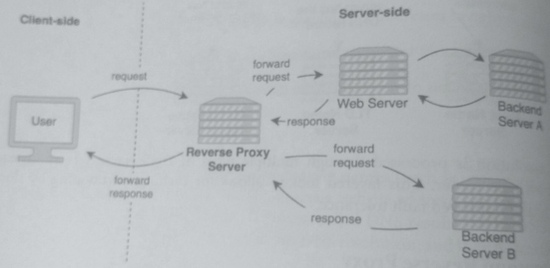

## 7 Protocols & Proxies

### 1. TCP/IP protocols

#### IP
IP stands for Internet Protocol and is a set of rules for routing packets of data across networks.
Under this protocol, each device on the network is assigned an IP address, which uniquely
identifies the device so that other devices on the internet can find it.

IPv4 is the fourth version of the IP protocol, and it defines an address as a set of four numbers
that range from 0.0.0.0 to 255.255.255.255. Under IPv6, the sixth version of the IP protocol, an
address is defined by a set of 8 groups of 16 bits each.

> Under IP, data is divided into smaller pieces, called packets, and sent through the internet.

Each packet contains the IP information, which directs routers and devices to send the packets
to the correct destination. After the packets reach the correct IP destination, a transport
protocol is then responsible for handling that data. The two most common transport protocols
are TCP and UDP.

#### TCP

TCP stands for Transmission Control Protocol and is implemented on top of IP. TCP is a
connection-oriented protocol and allows for reliable transmission of data on an unreliable
network. A network can become unreliable because packets can be dropped, corrupted, or
unordered.

> TCP solves these problems of data delivery through retransmission, check-sum, and order checking.

For example, if we load a website, and some of the data of the website is
lost in transmission, TCP will guarantee that the data is resent and valid.

#### UDP

UDP stands for User Datagram Protocol and is also implemented on top of IP but does not
have the reliability and guarantees of TCP. However, UDP typically has lower overhead and
latency compared to TCP.

> UDP is useful in applications where lost packets are not essential but low latency is.

For example, if packets are lost in the transmission for video playback
or streaming content, the result could be dropped frames or a blurry video. It is more important
for the application to continue playback than retransmit already stale data.

#### HTTP

HTTP stands for Hyper Text Transfer Protocol and is implemented on top of TCP. The purpose of the
HTTP protocol is to communicate with a web server and establish a connection with the server.

In HTTP, a client (such as a browser) sends requests to
a web server and receives HTML back as responses. HTML (Hyper Text Markup Language) defines the
structure and content of a web page and is what is typically displayed in a browser.

TLS (Transport Layer Security) is used for security and encryption. It can be used to secure connections
for many purposes (e.g. messaging and email), but the most recognizable use case is for securing HTTP
for websites. When TLS is used for securing HTTP communication, this variant of HTTP is called
HTTPS (HTTP over TLS).

Other protocols:
* ARP (Address Resolution Protocol) for resolving IP addresses to a physical machine name.
* FTP (File Transfer Protocol) for the transfer of computer files.
* SMTP (Simple Mail Transfer Protocol) for mail servers to send and receive email.

### 2. DNS
DNS (Domain Name System) is used to resolve domain names (such as www.google.com) to
IP addresses. When a client, such as a browser, enters a website address, the translation from
domain name to IP address occurs through a process called DNS resolution or DNS lookup.
There are four types of DNS Name Servers used for DNS resolution, and they process a lookup
request in the following order:

* Resolver Name Server (DNS Resolver): Interacts with clients such as web browsers
and is the initial server in a DNS lookup. The resolver either directs the request to the
root name server or returns cached data. Since there might be clients that request the
same domain name, the resolver caches the IP address of the domain and returns it
directly, without having to request any other name servers.

* Root Name Server: Responds to the resolver's request by directing the request to a
TLD server based on the extension of the domain name (.com, .org, .net).

* TLD Name Server: A TLD (top-level domain) server holds the information for all the
domain names that have the same extension.

For example, the .com TLD server holds the information about which authoritative name server
holds the DNS records for the domain name.

* Authoritative Name Server: Holds the actual DNS record, which contains the IP
address of the server that corresponds to the domain name.

A DNS resolution is processed through multiple types of DNS Name servers instead of
through a single server. This layered lookup allows for caching, partitioning by domain
extension, and improved fault tolerance.

### 4. Proxy and Reverse Proxy
A proxy (also called a proxy server or forward proxy) is a server that acts as an intermediary
between a client and a server. In other words, a proxy server acts on behalf of the client and
routes traffic to and from the client, usually external to the client's system. A proxy server can
regulate this traffic according to policies and security features and is typically implemented on
the client-side.

For example, companies often use a proxy on a shared network so that **security policies** can be
enforced on all clients through a single point. Another common use for a proxy server is to
**hide the origin** of a client's data packets and requests by masking a client's IP address from the
receiving server. The diagram illustrates a proxy server that forwards a request to a server.

A reverse proxy is a type of proxy server that accepts requests from clients and forwards them
to other servers. A reverse proxy is typically implemented on the server-side and acts as a
gateway to protect the internal server-side system from being exposed to the outside world.

Clients that communicate with the reverse proxy do not obtain any information about the
backend servers used to handle and process the client's requests. The main difference between
a forward proxy and a reverse proxy is that the forward proxy is implemented on the client-side
to route traffic, and the reverse proxy is implemented on the server-side to accept requests
from clients.

In a system design, a reverse proxy typically sits in front of web servers and forwards requests
to those web servers, which then subsequently process those requests or forward them to
backend servers.

Additionally, security policies and features can be implemented at this single point to protect all
web and backend servers, adding anonymity and security for the entire system without having to
implement policies at all servers. This additional layer before the web servers increases security and
reliability.

Most reverse proxy servers also perform load balancing, which is distributing traffic across
multiple servers.
