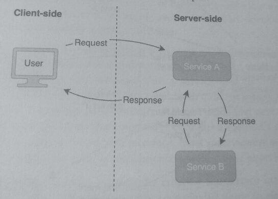
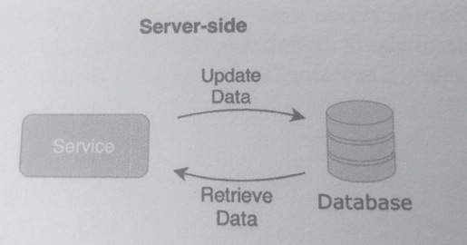
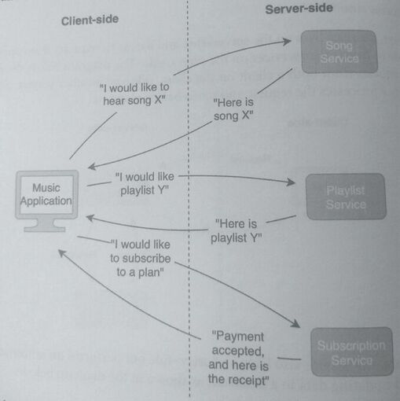
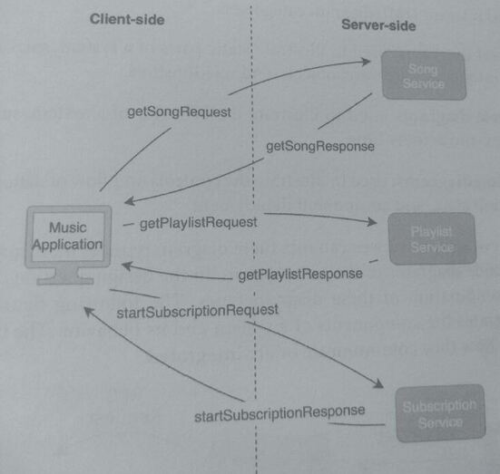
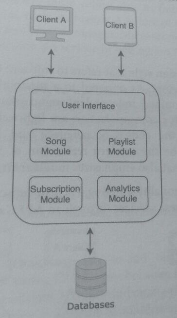
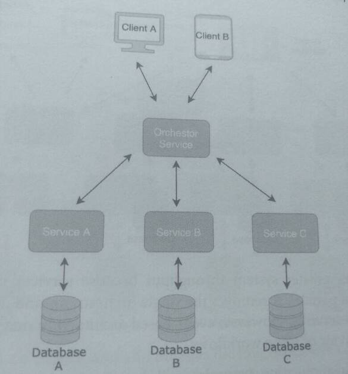
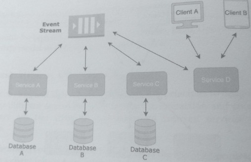
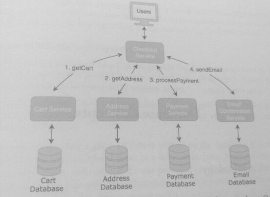
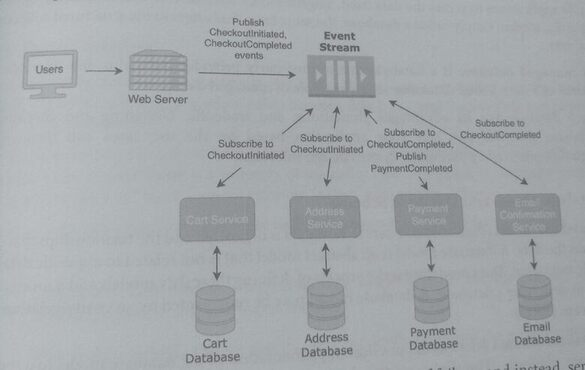

## 5. Designing Services

### 1. Services

A service is software that either:
* Listens to requests and/or sends back responses, or
* Performs automated tasks.

In the first case, a service lives on the server-side and listens to requests from applications on
the client-side or from other services on the server-side.

The diagram below shows Service A listening to requests from both a client on the client-side
and another service on the server-side. The service processes the request and sends back a response.



In the second case, the service also lives on server-side but performs an automated task, such
as retrieving and updating data in a database, as shown in the diagram below:



Music Application Example

To illustrate these terms, we'll use them in an example of a music application. To listen to
music, a user installs a music application on their device. This is an example of a client-side
application because the user installs it and directly interacts with it.

The application performs several functions:
* playing music
* getting playlists
* accepting payment

These operations are not in the same problem domain, e.g. playing music isn't related to payments.

To perform these three operations, the application makes requests to server-side services.
The services are "Song Service," "Playlist Service," and "Billing Service."
The diagram below shows the requests and responses between the application and the services.



Requests
* "I would like to hear song X"
* "I would like playlist Y"
* "I would like to subscribe to a plan"

Responses
* "Here is song X"
* "Here is playlist Y"
* "Payment accepted, and here is the receipt"

Each of these three services listens for requests and replies with responses. It is a good practice
to name a service after its functionality.

If a user wanted to listen to a song, "Song X," they
would send a request to "Song Service," and it would respond with the song. This process is
an example of the request-response model that describes how a client interacts with server-
side software.

The music application sends requests and receives responses. The request-
response model is a common way for services to interact with each other.

An example of a service that performs an automated task is the "Top Songs Service". At the start of each day the service scans a database for statistics about
users' listening behavior and creates lists of the most popular songs by genre.


The "Top Songs Service" does not listen to requests nor send responses but periodically
processes data and updates a database.

### 2. Writing Service Interfaces

A service interface is the published interface used to invoke the service methods, which are routines
that execute the logic of the service functionality.

A service implementation is platform, protocol, and/or framework-specific, so there is no
universally understood way to write a service interface.

A good approach is to write an outline of the service interface by including the message data structures
and method signatures. A message data structure describes the request and response messages that a
service uses to communicate over a network.

Messages are designed to be serialized (encoded in an efficient binary format), sent over a network,
and decoded.

A message data structure contains fields that describe the data types and values within the message.
A method signature contains a method's name, return type, and parameter list.

By outlining the service interface, most interviewers will understand the service behavior regardless
of the specific implementation they have experience with.

#### Playlist Service
When a user taps on a playlist name to view the songs within the playlist, this triggers a request
that is sent from the client application to the server aka "get me the songs within this playlist
for this user."

The message data structure for this request is represented by the following request:

```
GetPlaylistRequest
 int64 user_id
 int64 timestamp
 string playlist_name
```

It contains fields for the user id, timestamp, and playlist name, which are data that the service
needs to process the request. The service responds with a message that has the following
message data structure:

```
Get Playlist Response
 int64 user id
  repeated string song names
  int64 timestamp
```

The field song_names is a list of strings that are the song names of the playlist. The keyword
"repeated" is used to create a list.

Define the methods signatures of the service interface. These methods correspond to
API methods and describe how clients interact with this service.

Playlist Service has a method getPlaylist, which accepts the request message
Get Playlist Request and returns the response message GetPlaylist Response,

The service and its method are defined in the following interface:

```
PlaylistService
  GetPlaylistResponse getPlaylist (Get Playlist Request request)
```

The method accepts a single argument, the request, and returns a single object, the response.
The convention for naming the request and response is to use the name of the method with
the suffix "Request" or "Response" appended.

This example described a single service interface with a single method. However, a system
typically contains many services, each of which contains many methods. Expanding this
example, additional methods are added to Playlist Service, and other services,
Song Service and Billing Service:

```
# Examples

# Playlist Service
GetPlaylistResponse getPlaylist (GetPlaylistRequest request)
DeletePlaylistResponse deletePlaylist (DeletePlaylistRequest request)
AddSongToPlaylistResponse addSongToPlaylist (AddSongToPlaylistRequest request)
....

# SongService
GetSongResponse getSong (GetSongRequest request)
....

# BillingService
AddCreditCardResponse addCreditCard (AddCreditCardRequest request)
```

One of the benefits of writing service interfaces in this style is that the API method names are
descriptive and explain the functionality of the method in a self-documenting style. While not
all of the request and response message data structures are shown, this example illustrates
how to outline service definitions and API methods,

Returning to the request response music example, we now can replace the pseudo requests
and responses with actual request-response methods:



One of the challenges of system design is thinking about how services communicate,
cooperate, and scale together.

### 4. Monolith

A monolithic design refers to software that is built and deployed as a single unit, called a
monolith. A monolith usually consists of a user interface, a server-side application, and a
database. The concept behind monolithic software is that different parts of a system are
combined and launched as a single component. When multiple parts of a system are closely
tied together, such as in a monolith, this system is said to exhibit tight coupling.

In the diagram below of a monolith, the functionality for Song, Playlist, Subscription, and
Analytics are organized in modules that are built and deployed together. A user interface in
the same deployment unit handles the requests made from client applications.



Monolithic design advantages:
* Easy development and fast deployment.
* A limited number of components need integration or inter-communication, simplifying
  testing and monitoring.
* Performant and low latency. Requests are served from a single unit, which means the
  request path contains few network hops and components,

Monolithic design disadvantages:
* All modules are scaled together and resource allocation might be inefficient.
* System fragility: if one part of the monolith fails, the entire monolith could fail.

* Tight coupling: difficult to incorporate new technology and other components. It might be difficult to maintain tightly coupled code.

* Low agility: deployment becomes difficult on a large scale. If the monolith is maintained by multiple teams, release, rollout, bug fixes, and features iteration all need to be coordinated.

Some engineering teams see the monolith as an anti-design and migrate monolith systems to
microservices by gradually splitting off functionality and building them piecewise.

The monolith can, however, be appropriate for some use cases.

Microservices have increased complexity and overhead that may not be suitable for building
minimum viable products or systems that need low latency.

### 5. Microservices

Microservices is a software design style that refers to software that is built and deployed as a
collection of independent services. Unlike a monolithic design, these services are
* loosely coupled
* fine-grained
* independent
* communicate with each other over a network.

The protocols used for communication are lightweight and technology-agnostic,
allowing more flexibility in the choice of language and framework for each service.

Microservices can be said to be the modern realization of Service-Oriented Architecture
(SOA), a broader design style that also emphasizes modular component-based services.

In the diagram below, the functionality for Song, Playlist, Subscription, and Analytics are built
as services, and clients access these services through an API Gateway.


Each service in a microservice design deployed independently and communicates with
each other through a network.

Microservice advantages:

* Granular scalability: Since each service can be scaled independently (instead of
  being scaled in conjunction with other services) this granular scaling reduces
  bottlenecks but also allows for more efficient resource usage and cost savings.

* Reusability: microservices can be used across different applications and systems in
  the same business unit or even enterprise-wide.

* Reliability: microservices are more robust due to failure isolation; the failure is
  isolated to a single service, node, or region.

  A failure of a single node does not result in system-wide or even service-wide outages.
  Microservices allow for graceful failures and fallback to other servers: if a service
  in one region fails, traffic can be redirected to another region.

* Technology-agnostic: flexibility to use different technology stacks and frameworks
  and reduces vendor lock-in.

  Each service can change its technology stack without impacting other services. The
  communication protocols are decoupled from the service's language and implementation.

Microservice disadvantages:

* Increased complexity: independent services need to communicate and coordinate
  over a network, meaning additional code, communication protocols, and potential
  greater latency.

* Difficult testing and debugging: End-to-end testing means launching all services and
  testing interactions between them. Potential bugs may arise when services need to
  coordinate. Logging and debugging are spread around multiple files and executables,
  making it difficult to understand interaction and integration behavior.

* Increased design and deployment overhead: more services include more design and
  deployment work, which becomes challenging for smaller teams who need to iterate
  quickly with low overhead.

### 6. Monolith vs. Microservices

A recurring theme in system design is comparing monoliths to microservices. Based on the
advantages and disadvantages in the previous sections, it might seem like microservices is
the clear winner. However, choosing the optimal design depends on the purpose of the
application, and your design should be based on the following tradeoffs:

* **Simplicity vs. Scalability**
  Monoliths are simple to design and build, whereas microservices can be complex.
  Though microservices have better scalability compared to monoliths, many systems
  do not reach the scale where microservices yield a clear benchi compared to
  monolith.

* **Reusability and Robustness vs. Development Cost**
  A microservice can be used enterprise wide, allowing reuse across multiple
  engineers. However, the initial development cost is greater than a month
  of the need to build multiple services. The tight coupling of a manolith mean
  costs but greater fragility.

* **Speed of deployment vs. Ease of maintenance**
  Monoliths are faster to initially deploy compared to microservices, but as the code
  base grows, they become difficult to maintain.

Many modern applications-from social networking to ridesharing to e-commerce
designed as microservices. Designing microservices should be driven by the Ph
principles: loose coupling and high cohesion.

### 7. Loose Coupling

Loose coupling is the concept that different modules, components, and services should have
minimal dependency on each other. A change in one service should not significantly impact
another service. A service's implementation details are hidden from other services.

This obfuscation of the service's internal implementation creates greater security and
forces interactions to be request and response-driven.

All interactions must be through the service interface. Deprecating a method or access to a
resource can be achieved with only interface changes, minimizing the need to introduce large
breaking changes.

In a microservices-based design, services communicate through a network, which inherently
separates service functionality. While this provides an extent of decoupling, services can still
have dependencies on each other.

Two services that are tightly coupled can be redesigned so that they are loosely coupled.

Continuing with the music application, suppose that the company has decided to expand its website so
that it can sell concert tickets, band apparel, and music-related items. The software engineering
team is asked to add this functionality, and they decide to add two services, CartService
and Payment Service.


The two services are tightly coupled because Cart data model that should be logically used
in Cartservice and not Payment Service

Tightly coupled services become more difficult to maintain and use as the code base ages. In
this example, there is no reason that Checkout Service needs to know about the Cart.
Does the service need to know about a particular data model for its primary functioning?

If the following features needed to be added:
* Discount the cart price during a promotional sale.
* Add a buy-one-get-one feature to some items.
* Check actual inventory can fulfill the quantity in the cart.
* Limit the number of items a customer can purchase

This requires the engineering team to add similar logic to both the Cartservice and Checkout Service,
a sign that the services are tightly coupled.

An engineer on the teams reviews the design and recommends decoupling the Payment Service
from CartService, as it no longer depends on the Cart data structure. The primary function of
PaymentService is to process the payment; it does not need to understand CartService's business
logic but only needs to know the subtotal to charge.

One sign that services are tightly coupled is that updating one service requires you to change the
logic in another service, indicating dependency.

### 8. High Cohesion

High cohesion is the concept that the logic, methods, and classes of a single service should be
functionally related and support a single purpose.

The benefits of high cohesion are:

* The services are easier to maintain and deploy, as there are fewer components that change
  as the code change
* Code is easier to understand

Low cohesion means that
1) functionality that logically belongs to a single service is spread out around multiple places, and/or
2) unrelated methods and logic are grouped together.

While users may need to change their shipping address during the checkout process, it doesn't
mean that this method should be part of the Cartservice (alert: low cohesion)

updateShippingAddress doesn't have much in common with getCart and the other methods of Cart
Service that presumably have to do with the cart. One way to increase the cohesion is to simply move
the updateShippingAddress method to a separate service, Address Service, which would have methods
related to the create, read, update, and delete of addresses.

A rule of thumb for high cohesion is that CRUD (Create, Read, Update, Delete) operations
for a single data model should belong to a single service.

### 9. Orchestration vs. Choreography

While loose coupling and high cohesion are the guiding principles to designing microservices
there are also different approaches to designing the interaction and coordinating between
services.

Two styles of communication between services are synchronous and asynchronous.

* Asynchronous communication is typically associated with an event-based pattern,
  where a service emits an event that other services react to. Fire and forget

* Synchronous communication typically takes the form of a request/ response pattern,
  where a client initiates a request and waits for a response.

These two forms of communication are associated with two microservices design patterns:

* Synchronous request/response is associated with orchestration.
* Asynchronous event-based is associated with choreography, Choreography is also   commonly known as reactive design.

Orchestration is a design where one service acts as the "orchestrator" and handles the
communication between services such as when services are invoked in a serial order with
blocking calls. The orchestrator makes a call to each service and waits for a response
before calling the next service.

A web server/API gateway is not an orchestrator.

While it does stand between the client and services, it does not coordinate between services
but sends a message and goes back to doing other work like listening for messages, or
sending other messages.



In orchestration, the synchronous execution of service routines is well suited for request-
response driven workflows. However, this serial processing also makes services more
dependent on each other. The system can become a distributed monolith with a single point
of failure (SPOF) at the service controller/orchestrator service.

In contrast, a choreography design attempts to avoid dependencies between services. Each
service operates independently and reacts to events.

An event stream or message queue is used to hold events, and each service is a consumer and/or
producer of events. Multiple services can process the same events simultaneously.

Choreography moves the communication between services from a request/response paradigm to
an asynchronousproducer/consumer paradigm.

A distributed queue is used in systems with a choreography design, such as producer-consumer
messaging and publisher-subscriber systems. The services that are event producers don't need to know
the interface of the consumer services, nor if they are even processing the events.



Choreography enables greater system throughput because services can execute requests
asynchronously and in parallel. It removes the single orchestrator and distributes the control
logic to the individual services. However, event-based architecture may not be suited for the
request-response behavior of some workflows.

Returning to the music application example, the system can be designed
with orchestration and with choreography. Summarizing the existing services that have
been built and adding two others:

* Cart Service: manages customers' Carts.
* Address Service: manages the customers' addresses.
* Payment Service: processes the order and charges the payment method.
* Checkout Service: handles the entire checkout process workflow of the customer.
* EmailConfirmation Service: sends the email confirmation after the order has been processed

An orchestration design with the Checkout Service as the orchestrator:



The Checkout Service coordinates and initiates the four other services:
* Cart Service
* Address Service
* Payment Service
* EmailConfirmationService

are not called except through CheckoutService, indicating a dependency

Similar functionality using the choreography design:



This design removed the service controller as the single point of failure, and instead, services
independently and asynchronously react to events. Both orchestration and choreography are
useful for solving different problems and can be used together-this is called a hybrid
architecture.
