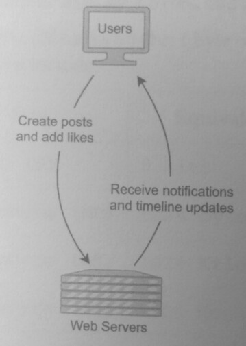
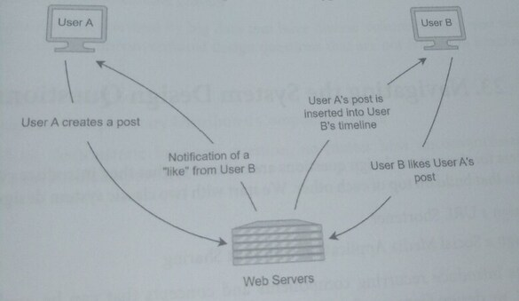

## System Design Tips

### 21. Background

The seven-step approach:
1. Clarify the problem and scope the use cases
2. Define the data models
3. Make back-of-the-envelope estimates
4. Propose a high-level system design
5. Design components in detail
6. Write out service definitions, APIs, interfaces, and/or classes
7. Identify and solve potential scaling problems and bottlenecks

### Step 1:

#### Clarify the problem and scope the use cases ####
Start by asking clarifying questions about the problem interactively.

*Even if you have seen this design question before*, the interviewer may want you to focus
on a different part of the system.

While the clarifying questions should be contextual to the question, some general questions
about scope and use cases that can apply to most problems are:

* How many users are expected to use the system?
* How are clients sending requests?
* Should integration be focused on readability or performance?
* What characteristics should the system exhibit in terms of availability, performance,
  and consistency?
* Should I write code for any algorithms or data structures?

Based on the interviewer's answer, the interview's direction might be to:
* Create a high-level design of components and discuss their behaviors and interactions.
* Create data models, service definitions, and APIs of components.
* Explain and/or write code about the critical algorithms and data structures of a system.
* Clarify with the interviewer how much code you are expected to write

### Step 2: Define the data models

* Message data models
* Database models

Defining the data models early in the interview will help with the next two steps since it is
easier to make back-of-the-envelope estimates using approximate sizes. Estimate the average size
of an element defined by that data model.

If there are optional fields, estimate how often a field is not empty
* 1 out of every 5 tweets has an image, and 1 out of every 10 tweets has a video

### Step 3: Make back-of-the-envelope estimates
* Users and Traffic
* QPS (Queries per second)
* Storage
* Memory
* Bandwidth Usage

> Size (bytes/access) * Users (user) * Frequency (access frequency/sec per user)

Using the data models from the previous step, estimate metrics by using the average element
size, the number of users, and the frequency of usage.

> 1KB * 100k daily users * 2 queries per second

An estimate could be "100k daily users with an average of 2 QPS per user and 1 KB of storage means a
monthly storage usage of approximately 525 TB."

### Step 4: Propose a high-level system design

Propose a high-level design by outlining the major components of the system.
Use this as a planning phase where you can iterate through your initial thoughts without committing
to a specific design.

A high-level design proposal can be made either verbally or by drawing a diagram.
It might be worthwhile to first draw a high-level design diagram and then draw another more
detailed scaled-up design.

During the high-level design, solicit feedback from the interviewer and get agreement on items:

* The goals and non-goals of the design.
* The major components of the system.
* The separation of functionality between different services.
* Types of databases that support queries for the use cases

Interviewers might guide you away from designs that they think will not be sufficient to solve
the problem. Once you've completed the high-level design, draw a more detailed system design
by including integration and components that were not included in the high-level design.

Add features that scale the system:
* load balancers
* caches
* database shards.

Walkthrough the use cases and requirements that were made in Step 1 to demonstrate that the
system sufficiently fulfills them.

#### Step 5: Design components in detail

Perform a deep dive into one or more of the components. This step might be prompted by the
interviewer if you're asked to explain more about how a component from Step 4 works. **Be
proactive about picking out components that you feel are important in your design** and
describe them in-depth. A detailed component design may include:

* Breakdown of logic and functionality of a single component.
* Load balancer and caches.
* Requests and responses for critical paths.
* Schemas and data models.

This step may be performed with Step 6: as you perform a deep dive into a specific component,
write out the corresponding service definitions, APIs, interfaces, and classes.

#### Step 6: Write out service definitions, APIs, interfaces, and/or classes

Write out the service definitions, API methods, interfaces, and classes that are relevant to the
components you have already designed.  Outline relevant data model, message data structures.
Clarify with the interviewer if you need to write any code for the detailed component.

If so, write out the main classes, algorithms, and data structures used in the component.

#### Step 7: Identify and solve potential scaling problems and bottlenecks

Identify components or layers that are more likely to break under heavy traffic and where
bottlenecks may form. Some possible solutions that can mitigate scaling problems include:

* Load balancing
* Caching
* Sharding
* Horizontal scaling

#### Summary
These 7 steps are flexible guidelines to help you drive the interview. The system design
interview is meant to be an **interactive process** that gauges how you would behave in a team
environment. Constantly solicit feedback from your interviewer and adjust your approach

## 22. Tips on Drawing System Diagrams

Generating an artifact, i.e.
* a diagram
* written summaries
* tables

provides the interviewer and the hiring committee a concrete reference of your understanding,

Two formal ways of drawing diagrams are:
* UML for services
* ERD for database models

### Tip 1. Draw generously, even if the component and its function are obvious.

Many tech companies tell interviewers to take pictures of system design diagrams and share
them with the hiring committee.

Even if it was clear during the interview that you understood a concept and explained it
verbally, the interviewer might not have documented your understanding. System design diagrams
can be used as objective evidence during hiring committee meetings.

### Tip 2. Think of system design as storytelling.

Start with the workloads and actions of each use case.
Writing out the main request/response interaction could help you add features and components.

### Tip 3. Create different request/response paths for different types of users.

When there are multiple types of users, consider separating the request/response interactions.

The following diagram separates User A, who creates the post, and User B, who is the
consumer of the post. **This separation will help clarify how other components, such as load
balancers, CDNs, and fan oul services, impact each user type.**

### Tip 4. Add load balancers, database sharding, and caches early in your design.
Adding load balancers, sharding, and other horizontal scaling techniques early on will let your
interviewer know that you consider scalability from the start.

### Tip 5. Incrementally add attributes and fields to the data models.
When you first start the design, you may not know all the attributes and fields of data models
and messages. As the interview progresses, incrementally add them.

## 23. Navigating the Hacking System Design Questions

The chapters for the hacking system design questions are ordered so that they introduce
concepts and components that build on top of each other.

Two classic system design questions:

* Design a URL Shortener
* Design a Social Media Application with Post Sharing

These designs introduce recurring components and concepts that can be applied to most systems.

Next, we design features of applications:

* Design a Newsfeed and Timeline
* Design a Search Service

Newsfeeds, timelines, and searches are components that are frequently used in homepages and
user profiles.

The next questions innvolve variants of chat systems: one that persists its messages
and another that deletes its messages after delivery:

* Design a Messaging Application with Persistent Storage
* Design a Messaging Application with Ephemeral Messages

The next question incorporates geolocation and introduces how spatial indexing
and searching are performed with R-trees:

* Design a Rideshare Application

The next questions involve algorithms and data structures:
* Design a Social Network Graph Search Algorithm
* Design an Autocomplete System

While most system design interviews do not involve much coding, writing code snippets of
core algorithms and data structures may help to clarify the behavior of components.

Next questions focus on commonly used components in distributed systems:

* Design a Distributed Cache
* Design a Distributed Message Queue

The next questions focus on systems that handle large volumes of real-time distributed data
* Design a Web Crawler
* Design a System that Tracks the Most Frequently Accessed Items
* Design a Distributed Rate Limiter

These designs are characterized by big data that have diverse volume, variety, and velocity

Lastly, two unconventional design questions that are not framed in a technology stack:
* Design a Parking Lot
* Design an Interplanetary Distributed Computing System

A methodical approach will ensure these questions are solvable
