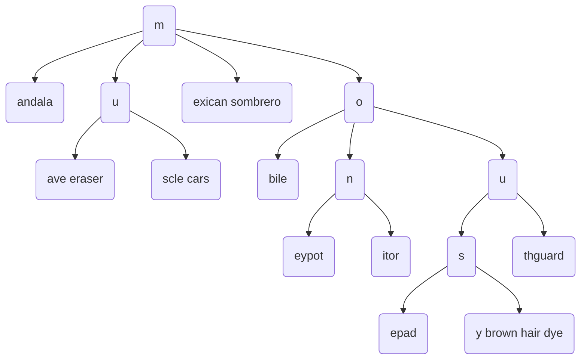

# Trie




| Operation  | Time Complexity |
|------------|-----------------|
| insert     | O(m)            |
| search     | O(m)            |
| startsWith | O(1)            |

* Time complexity is the length of the string e.g. "mobile" is length m or 6, so if search n keys, time complexity is O(n * m_avg)
* Space complexity may be the number of keys in the trie (n) * the avg length of keys (m_avg) * alphabet size
* Tries are efficient data structures to search for keys, starting with a certain prefix e.g. startsWith("mon") would give "moneypot" and "monitor", 
     * without a trie, given a list of say a million strings, you'd have to search each of the strings to see if they started with "mon".
     * startsWith("mon") would be O(len("mon")) or O(1) time


Example Code
- [Code 1](https://github.com/brpandey/leetcode/blob/9e0307e896995d7d2674a11465d265c02fb09204/rust/src/p0211_add_and_search_word.rs)
- [Code 2](https://github.com/brpandey/leetcode/blob/9e0307e896995d7d2674a11465d265c02fb09204/rust/src/p0208_implement_trie.rs)
- [Code 3](https://github.com/brpandey/radix_trie/blob/main/src/node.rs)

```rust
/*
        let mut trie = TrieNode::new();
        trie.add_word("bad".to_string());
        trie.add_word("dad".to_string());
        trie.add_word("mad".to_string());
        assert_eq!(false, trie.search("pad".to_string())); // return False
        assert_eq!(true, trie.search("bad".to_string())); // return True
        assert_eq!(true, trie.search(".ad".to_string())); // return True
        assert_eq!(true, trie.search("b..".to_string())); // return True
*/

pub struct TrieNode {
    pub children: HashMap<char, TrieNode>,
    pub terminal: bool,
}

impl TrieNode {
    pub fn new() -> Self {
        TrieNode {
            children: HashMap::new(),
            terminal: false,
        }
    }

    pub fn insert(&mut self, word: String) {
        self.add_word(word);
    }

    pub fn add_word(&mut self, word: String) {
        let mut node = self;

        for ch in word.chars() {
            node = node.children.entry(ch).or_insert_with(|| TrieNode::new())
        }

        node.terminal = true;
    }

    pub fn search_helper(&self, index: usize, len: usize, word: &[char]) -> bool {
        let mut current = self;
        let mut ch;

        for i in index..len {
            ch = word.get(i).unwrap();

            if let Some(tmp) = current.children.get(&ch) {
                current = tmp;
            } else if *ch == '.' {
                for v in current.children.values() {
                    if v.search_helper(i+1, len, word) { return true };
                }
            } else {
                return false
            }
        }

        if current.terminal { true } else { false } 
    }

    pub fn search(&self, word: String) -> bool {
        let list: Vec<char> = word.chars().collect();
        self.search_helper(0, list.len(), &list)
    }

    pub fn starts_with(&self, prefix: String) -> bool {
        let mut current = self;

        for ch in prefix.chars() {
            if let Some(tmp) = current.children.get(&ch) {
                 current = tmp;
            } else {
                 return false
            }
        }

        true
    }
}

```

```rust
// A radix trie or compressed trie also has a tag indicating whether it is a key 
// (containing end of word) or inner node (not contain end of word)
// and has either a vector or static array of edges to its children 
// -- could be alphabet size (a-z) big or whatever

pub struct Node<K, V> {
    label: Option<Vec<u8>>,
    value: Option<Box<V>>,
    tag: NodeType,
    edges: HashMap<u8, Box<Node<K, V>>>,
    key: PhantomData<fn() -> K>,  // from Empty Iterator
}

pub enum NodeType {
    Key,
    Inner,
}
```
